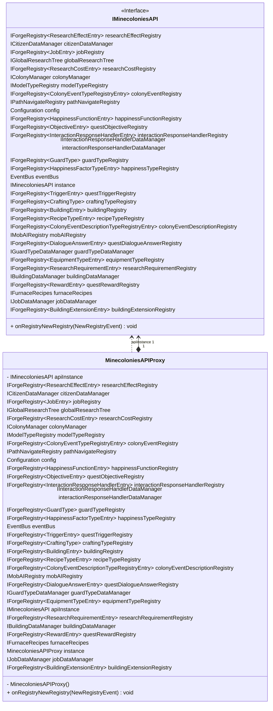

# api

2 classes, 2 internal relationships shown.

```mermaid
classDiagram
direction BT

class IMinecoloniesAPI {
<<Interface>>
  + onRegistryNewRegistry(NewRegistryEvent) void
   IForgeRegistry~ResearchEffectEntry~ researchEffectRegistry
   ICitizenDataManager citizenDataManager
   IForgeRegistry~JobEntry~ jobRegistry
   IGlobalResearchTree globalResearchTree
   IForgeRegistry~ResearchCostEntry~ researchCostRegistry
   IColonyManager colonyManager
   IModelTypeRegistry modelTypeRegistry
   IForgeRegistry~ColonyEventTypeRegistryEntry~ colonyEventRegistry
   IPathNavigateRegistry pathNavigateRegistry
   Configuration config
   IForgeRegistry~HappinessFunctionEntry~ happinessFunctionRegistry
   IForgeRegistry~ObjectiveEntry~ questObjectiveRegistry
   IForgeRegistry~InteractionResponseHandlerEntry~ interactionResponseHandlerRegistry
   IInteractionResponseHandlerDataManager interactionResponseHandlerDataManager
   IForgeRegistry~GuardType~ guardTypeRegistry
   IForgeRegistry~HappinessFactorTypeEntry~ happinessTypeRegistry
   EventBus eventBus
   IMinecoloniesAPI instance
   IForgeRegistry~TriggerEntry~ questTriggerRegistry
   IForgeRegistry~CraftingType~ craftingTypeRegistry
   IForgeRegistry~BuildingEntry~ buildingRegistry
   IForgeRegistry~RecipeTypeEntry~ recipeTypeRegistry
   IForgeRegistry~ColonyEventDescriptionTypeRegistryEntry~ colonyEventDescriptionRegistry
   IMobAIRegistry mobAIRegistry
   IForgeRegistry~DialogueAnswerEntry~ questDialogueAnswerRegistry
   IGuardTypeDataManager guardTypeDataManager
   IForgeRegistry~EquipmentTypeEntry~ equipmentTypeRegistry
   IForgeRegistry~ResearchRequirementEntry~ researchRequirementRegistry
   IBuildingDataManager buildingDataManager
   IForgeRegistry~RewardEntry~ questRewardRegistry
   IFurnaceRecipes furnaceRecipes
   IJobDataManager jobDataManager
   IForgeRegistry~BuildingExtensionEntry~ buildingExtensionRegistry
}
class MinecoloniesAPIProxy {
  - MinecoloniesAPIProxy() 
  - IMinecoloniesAPI apiInstance
  + onRegistryNewRegistry(NewRegistryEvent) void
   IForgeRegistry~ResearchEffectEntry~ researchEffectRegistry
   ICitizenDataManager citizenDataManager
   IForgeRegistry~JobEntry~ jobRegistry
   IGlobalResearchTree globalResearchTree
   IForgeRegistry~ResearchCostEntry~ researchCostRegistry
   IColonyManager colonyManager
   IModelTypeRegistry modelTypeRegistry
   IForgeRegistry~ColonyEventTypeRegistryEntry~ colonyEventRegistry
   IPathNavigateRegistry pathNavigateRegistry
   Configuration config
   IForgeRegistry~HappinessFunctionEntry~ happinessFunctionRegistry
   IForgeRegistry~ObjectiveEntry~ questObjectiveRegistry
   IForgeRegistry~InteractionResponseHandlerEntry~ interactionResponseHandlerRegistry
   IInteractionResponseHandlerDataManager interactionResponseHandlerDataManager
   IForgeRegistry~GuardType~ guardTypeRegistry
   IForgeRegistry~HappinessFactorTypeEntry~ happinessTypeRegistry
   EventBus eventBus
   IForgeRegistry~TriggerEntry~ questTriggerRegistry
   IForgeRegistry~CraftingType~ craftingTypeRegistry
   IForgeRegistry~BuildingEntry~ buildingRegistry
   IForgeRegistry~RecipeTypeEntry~ recipeTypeRegistry
   IForgeRegistry~ColonyEventDescriptionTypeRegistryEntry~ colonyEventDescriptionRegistry
   IMobAIRegistry mobAIRegistry
   IForgeRegistry~DialogueAnswerEntry~ questDialogueAnswerRegistry
   IGuardTypeDataManager guardTypeDataManager
   IForgeRegistry~EquipmentTypeEntry~ equipmentTypeRegistry
   IMinecoloniesAPI apiInstance
   IForgeRegistry~ResearchRequirementEntry~ researchRequirementRegistry
   IBuildingDataManager buildingDataManager
   IForgeRegistry~RewardEntry~ questRewardRegistry
   IFurnaceRecipes furnaceRecipes
   MinecoloniesAPIProxy instance
   IJobDataManager jobDataManager
   IForgeRegistry~BuildingExtensionEntry~ buildingExtensionRegistry
}

MinecoloniesAPIProxy  ..>  IMinecoloniesAPI 
MinecoloniesAPIProxy "1" *--> "apiInstance 1" IMinecoloniesAPI 
```
