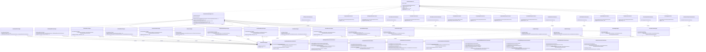

# api.advancements

45 classes, 66 internal relationships shown.

```mermaid
classDiagram
direction BT

class AbstractCriterionTrigger~T, U~ {
  # AbstractCriterionTrigger(ResourceLocation, Function~PlayerAdvancements, T~) 
  - ResourceLocation id
  # getListeners(PlayerAdvancements) T?
  + addPlayerListener(PlayerAdvancements, Listener~U~) void
  + removePlayerListeners(PlayerAdvancements) void
  + removePlayerListener(PlayerAdvancements, Listener~U~) void
   ResourceLocation id
}
class AdvancementTriggers {
  + AdvancementTriggers() 
  + preInit() void
}
class AllTowersCriterionInstance {
  + AllTowersCriterionInstance() 
}
class AllTowersTrigger {
  + AllTowersTrigger() 
  + createInstance(JsonObject, DeserializationContext) AllTowersCriterionInstance
  + trigger(ServerPlayer) void
}
class ArmyPopulationCriterionInstance {
  + ArmyPopulationCriterionInstance(int) 
  + deserializeFromJson(JsonObject, DeserializationContext) ArmyPopulationCriterionInstance
  + serializeToJson(SerializationContext) JsonObject
  + test(int) boolean
}
class ArmyPopulationListeners {
  + ArmyPopulationListeners(PlayerAdvancements) 
  + trigger(int) void
}
class ArmyPopulationTrigger {
  + ArmyPopulationTrigger() 
  + trigger(ServerPlayer, int) void
  + createInstance(JsonObject, DeserializationContext) ArmyPopulationCriterionInstance
}
class BuildingAddRecipeCriterionInstance {
  + BuildingAddRecipeCriterionInstance(ItemPredicate[]) 
  + BuildingAddRecipeCriterionInstance(ItemPredicate[], int) 
  + BuildingAddRecipeCriterionInstance() 
  + deserializeFromJson(JsonObject, DeserializationContext) BuildingAddRecipeCriterionInstance
  + serializeToJson(SerializationContext) JsonObject
  + test(IRecipeStorage) boolean
}
class BuildingAddRecipeListeners {
  + BuildingAddRecipeListeners(PlayerAdvancements) 
  + trigger(IRecipeStorage) void
}
class BuildingAddRecipeTrigger {
  + BuildingAddRecipeTrigger() 
  + createInstance(JsonObject, DeserializationContext) BuildingAddRecipeCriterionInstance
  + trigger(ServerPlayer, IRecipeStorage) void
}
class CitizenBuryCriterionInstance {
  + CitizenBuryCriterionInstance() 
}
class CitizenBuryTrigger {
  + CitizenBuryTrigger() 
  + trigger(ServerPlayer) void
  + createInstance(JsonObject, DeserializationContext) CitizenBuryCriterionInstance
}
class CitizenEatFoodCriterionInstance {
  + CitizenEatFoodCriterionInstance() 
  + CitizenEatFoodCriterionInstance(ItemPredicate[]) 
  + serializeToJson(SerializationContext) JsonObject
  + test(ItemStack) boolean
  + deserializeFromJson(JsonObject, DeserializationContext) CitizenEatFoodCriterionInstance
}
class CitizenEatFoodListeners {
  + CitizenEatFoodListeners(PlayerAdvancements) 
  + trigger(ItemStack) void
}
class CitizenEatFoodTrigger {
  + CitizenEatFoodTrigger() 
  + createInstance(JsonObject, DeserializationContext) CitizenEatFoodCriterionInstance
  + trigger(ServerPlayer, ItemStack) void
}
class CitizenResurrectCriterionInstance {
  + CitizenResurrectCriterionInstance() 
}
class CitizenResurrectTrigger {
  + CitizenResurrectTrigger() 
  + createInstance(JsonObject, DeserializationContext) CitizenResurrectCriterionInstance
  + trigger(ServerPlayer) void
}
class ClickGuiButtonCriterionInstance {
  + ClickGuiButtonCriterionInstance(String) 
  + ClickGuiButtonCriterionInstance(String, ResourceLocation) 
  + ClickGuiButtonCriterionInstance() 
  + test(String, ResourceLocation) boolean
  + deserializeFromJson(JsonObject, DeserializationContext) ClickGuiButtonCriterionInstance
  + serializeToJson(SerializationContext) JsonObject
}
class ClickGuiButtonListeners {
  + ClickGuiButtonListeners(PlayerAdvancements) 
  + trigger(String, ResourceLocation) void
}
class ClickGuiButtonTrigger {
  + ClickGuiButtonTrigger() 
  + trigger(ServerPlayer, String, ResourceLocation) void
  + createInstance(JsonObject, DeserializationContext) ClickGuiButtonCriterionInstance
}
class ColonyPopulationCriterionInstance {
  + ColonyPopulationCriterionInstance(int) 
  + deserializeFromJson(JsonObject, DeserializationContext) ColonyPopulationCriterionInstance
  + serializeToJson(SerializationContext) JsonObject
  + test(int) boolean
}
class ColonyPopulationListeners {
  + ColonyPopulationListeners(PlayerAdvancements) 
  + trigger(int) void
}
class ColonyPopulationTrigger {
  + ColonyPopulationTrigger() 
  + createInstance(JsonObject, DeserializationContext) ColonyPopulationCriterionInstance
  + trigger(ServerPlayer, int) void
}
class CompleteBuildRequestCriterionInstance {
  + CompleteBuildRequestCriterionInstance() 
  + CompleteBuildRequestCriterionInstance(String) 
  + CompleteBuildRequestCriterionInstance(String, int) 
  + serializeToJson(SerializationContext) JsonObject
  + test(String, int) boolean
  + deserializeFromJson(JsonObject, DeserializationContext) CompleteBuildRequestCriterionInstance
}
class CompleteBuildRequestListeners {
  + CompleteBuildRequestListeners(PlayerAdvancements) 
  + trigger(String, int) void
}
class CompleteBuildRequestTrigger {
  + CompleteBuildRequestTrigger() 
  + trigger(ServerPlayer, String, int) void
  + createInstance(JsonObject, DeserializationContext) CompleteBuildRequestCriterionInstance
}
class CreateBuildRequestCriterionInstance {
  + CreateBuildRequestCriterionInstance(String) 
  + CreateBuildRequestCriterionInstance() 
  + CreateBuildRequestCriterionInstance(String, int) 
  + test(String, int) boolean
  + serializeToJson(SerializationContext) JsonObject
  + deserializeFromJson(JsonObject, DeserializationContext) CreateBuildRequestCriterionInstance
}
class CreateBuildRequestListeners {
  + CreateBuildRequestListeners(PlayerAdvancements) 
  + trigger(String, int) void
}
class CreateBuildRequestTrigger {
  + CreateBuildRequestTrigger() 
  + createInstance(JsonObject, DeserializationContext) CreateBuildRequestCriterionInstance
  + trigger(ServerPlayer, String, int) void
}
class CriterionListeners~T~ {
  + CriterionListeners(PlayerAdvancements) 
  + trigger(Predicate~T~) void
  + trigger() void
  + remove(Listener~T~) void
  + add(Listener~T~) void
   boolean empty
}
class DeepMineCriterionInstance {
  + DeepMineCriterionInstance() 
}
class DeepMineTrigger {
  + DeepMineTrigger() 
  + trigger(ServerPlayer) void
  + createInstance(JsonObject, DeserializationContext) DeepMineCriterionInstance
}
class MaxFieldsCriterionInstance {
  + MaxFieldsCriterionInstance() 
}
class MaxFieldsTrigger {
  + MaxFieldsTrigger() 
  + trigger(ServerPlayer) void
  + createInstance(JsonObject, DeserializationContext) MaxFieldsCriterionInstance
}
class OpenGuiWindowCriterionInstance {
  + OpenGuiWindowCriterionInstance() 
  + OpenGuiWindowCriterionInstance(ResourceLocation) 
  + test(ResourceLocation) boolean
  + deserializeFromJson(JsonObject, DeserializationContext) OpenGuiWindowCriterionInstance
  + serializeToJson(SerializationContext) JsonObject
}
class OpenGuiWindowListeners {
  + OpenGuiWindowListeners(PlayerAdvancements) 
  + trigger(ResourceLocation) void
}
class OpenGuiWindowTrigger {
  + OpenGuiWindowTrigger() 
  + trigger(ServerPlayer, ResourceLocation) void
  + createInstance(JsonObject, DeserializationContext) OpenGuiWindowCriterionInstance
}
class PlaceStructureCriterionInstance {
  + PlaceStructureCriterionInstance() 
  + PlaceStructureCriterionInstance(String) 
  + deserializeFromJson(JsonObject, DeserializationContext) PlaceStructureCriterionInstance
  + test(String) boolean
  + serializeToJson(SerializationContext) JsonObject
}
class PlaceStructureListeners {
  + PlaceStructureListeners(PlayerAdvancements) 
  + trigger(String) void
}
class PlaceStructureTrigger {
  + PlaceStructureTrigger() 
  + trigger(ServerPlayer, String) void
  + createInstance(JsonObject, DeserializationContext) PlaceStructureCriterionInstance
}
class PlaceSupplyCriterionInstance {
  + PlaceSupplyCriterionInstance() 
}
class PlaceSupplyListeners {
  + PlaceSupplyListeners(PlayerAdvancements) 
  + trigger() void
}
class PlaceSupplyTrigger {
  + PlaceSupplyTrigger() 
  + trigger(ServerPlayer) void
  + createInstance(JsonObject, DeserializationContext) PlaceSupplyCriterionInstance
}
class UndertakerTotemCriterionInstance {
  + UndertakerTotemCriterionInstance() 
}
class UndertakerTotemTrigger {
  + UndertakerTotemTrigger() 
  + trigger(ServerPlayer) void
  + createInstance(JsonObject, DeserializationContext) UndertakerTotemCriterionInstance
}

AbstractCriterionTrigger~T, U~  ..>  CriterionListeners~T~ 
AdvancementTriggers  ..>  AllTowersTrigger : «create»
AdvancementTriggers  ..>  ArmyPopulationTrigger : «create»
AdvancementTriggers  ..>  BuildingAddRecipeTrigger : «create»
AdvancementTriggers  ..>  CitizenBuryTrigger : «create»
AdvancementTriggers  ..>  CitizenEatFoodTrigger : «create»
AdvancementTriggers  ..>  CitizenResurrectTrigger : «create»
AdvancementTriggers  ..>  ClickGuiButtonTrigger : «create»
AdvancementTriggers  ..>  ColonyPopulationTrigger : «create»
AdvancementTriggers  ..>  CompleteBuildRequestTrigger : «create»
AdvancementTriggers  ..>  CreateBuildRequestTrigger : «create»
AdvancementTriggers  ..>  DeepMineTrigger : «create»
AdvancementTriggers  ..>  MaxFieldsTrigger : «create»
AdvancementTriggers  ..>  OpenGuiWindowTrigger : «create»
AdvancementTriggers  ..>  PlaceStructureTrigger : «create»
AdvancementTriggers  ..>  PlaceSupplyTrigger : «create»
AdvancementTriggers  ..>  UndertakerTotemTrigger : «create»
AdvancementTriggers "1" *--> "ALL_TOWERS 1" AllTowersTrigger 
AdvancementTriggers "1" *--> "ARMY_POPULATION 1" ArmyPopulationTrigger 
AdvancementTriggers "1" *--> "BUILDING_ADD_RECIPE 1" BuildingAddRecipeTrigger 
AdvancementTriggers "1" *--> "CITIZEN_BURY 1" CitizenBuryTrigger 
AdvancementTriggers "1" *--> "CITIZEN_EAT_FOOD 1" CitizenEatFoodTrigger 
AdvancementTriggers "1" *--> "CITIZEN_RESURRECT 1" CitizenResurrectTrigger 
AdvancementTriggers "1" *--> "CLICK_GUI_BUTTON 1" ClickGuiButtonTrigger 
AdvancementTriggers "1" *--> "COLONY_POPULATION 1" ColonyPopulationTrigger 
AdvancementTriggers "1" *--> "COMPLETE_BUILD_REQUEST 1" CompleteBuildRequestTrigger 
AdvancementTriggers "1" *--> "CREATE_BUILD_REQUEST 1" CreateBuildRequestTrigger 
AdvancementTriggers "1" *--> "DEEP_MINE 1" DeepMineTrigger 
AdvancementTriggers "1" *--> "MAX_FIELDS 1" MaxFieldsTrigger 
AdvancementTriggers "1" *--> "OPEN_GUI_WINDOW 1" OpenGuiWindowTrigger 
AdvancementTriggers "1" *--> "PLACE_STRUCTURE 1" PlaceStructureTrigger 
AdvancementTriggers "1" *--> "PLACE_SUPPLY 1" PlaceSupplyTrigger 
AdvancementTriggers "1" *--> "UNDERTAKER_TOTEM 1" UndertakerTotemTrigger 
AllTowersTrigger  -->  AbstractCriterionTrigger~T, U~ 
AllTowersTrigger  ..>  AllTowersCriterionInstance : «create»
ArmyPopulationListeners  -->  CriterionListeners~T~ 
ArmyPopulationTrigger  -->  AbstractCriterionTrigger~T, U~ 
BuildingAddRecipeListeners  -->  CriterionListeners~T~ 
BuildingAddRecipeTrigger  -->  AbstractCriterionTrigger~T, U~ 
CitizenBuryTrigger  -->  AbstractCriterionTrigger~T, U~ 
CitizenBuryTrigger  ..>  CitizenBuryCriterionInstance : «create»
CitizenEatFoodListeners  -->  CriterionListeners~T~ 
CitizenEatFoodTrigger  -->  AbstractCriterionTrigger~T, U~ 
CitizenResurrectTrigger  -->  AbstractCriterionTrigger~T, U~ 
CitizenResurrectTrigger  ..>  CitizenResurrectCriterionInstance : «create»
ClickGuiButtonListeners  -->  CriterionListeners~T~ 
ClickGuiButtonTrigger  -->  AbstractCriterionTrigger~T, U~ 
ColonyPopulationListeners  -->  CriterionListeners~T~ 
ColonyPopulationTrigger  -->  AbstractCriterionTrigger~T, U~ 
CompleteBuildRequestListeners  -->  CriterionListeners~T~ 
CompleteBuildRequestTrigger  -->  AbstractCriterionTrigger~T, U~ 
CreateBuildRequestListeners  -->  CriterionListeners~T~ 
CreateBuildRequestTrigger  -->  AbstractCriterionTrigger~T, U~ 
DeepMineTrigger  -->  AbstractCriterionTrigger~T, U~ 
DeepMineTrigger  ..>  DeepMineCriterionInstance : «create»
MaxFieldsTrigger  -->  AbstractCriterionTrigger~T, U~ 
MaxFieldsTrigger  ..>  MaxFieldsCriterionInstance : «create»
OpenGuiWindowListeners  -->  CriterionListeners~T~ 
OpenGuiWindowTrigger  -->  AbstractCriterionTrigger~T, U~ 
PlaceStructureListeners  -->  CriterionListeners~T~ 
PlaceStructureTrigger  -->  AbstractCriterionTrigger~T, U~ 
PlaceSupplyListeners  -->  CriterionListeners~T~ 
PlaceSupplyTrigger  -->  AbstractCriterionTrigger~T, U~ 
PlaceSupplyTrigger  ..>  PlaceSupplyCriterionInstance : «create»
UndertakerTotemTrigger  -->  AbstractCriterionTrigger~T, U~ 
UndertakerTotemTrigger  ..>  UndertakerTotemCriterionInstance : «create»
```
