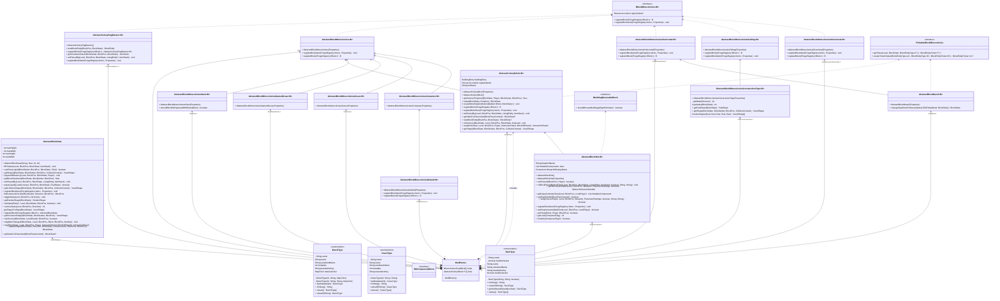

# api.blocks

23 classes, 31 internal relationships shown.

```mermaid
classDiagram
direction BT

class AbstractBlockBarrel~B~ {
  + AbstractBlockBarrel(Properties) 
  + changeStateOverFullness(AbstractTileEntityBarrel, BlockState) BlockState
}
class AbstractBlockGate {
  + AbstractBlockGate(String, float, int, int) 
  - int maxHeight
  - int maxWidth
  - fillYStates(Level, BlockPos, BlockState, ItemStack) void
  + canPlaceLiquid(BlockGetter, BlockPos, BlockState, Fluid) boolean
  + getShape(BlockState, BlockGetter, BlockPos, CollisionContext) VoxelShape
  + playerWillDestroy(Level, BlockPos, BlockState, Player) void
  + getBlockHardness(BlockState, BlockGetter, BlockPos) float
  + setPlacedBy(Level, BlockPos, BlockState, LivingEntity, ItemStack) void
  + placeLiquid(LevelAccessor, BlockPos, BlockState, FluidState) boolean
  + getCollisionShape(BlockState, BlockGetter, BlockPos, CollisionContext) VoxelShape
  + registerBlockItem(IForgeRegistry~Item~, Properties) void
  - findLowerLeftCorner(BlockGetter, Direction, BlockPos) BlockPos
  + toggleGate(Level, BlockPos, Direction) void
  + getRenderShape(BlockState) RenderShape
  + setOpen(Entity?, Level, BlockState, BlockPos, boolean) void
  + removeGate(Level, BlockPos, Direction) int
  - getShapeForState(BlockState) VoxelShape
  + registerBlock(IForgeRegistry~Block~) AbstractBlockGate
  + getOcclusionShape(BlockState, BlockGetter, BlockPos) VoxelShape
  + canSurvive(BlockState, LevelReader, BlockPos) boolean
  + neighborChanged(BlockState, Level, BlockPos, Block, BlockPos, boolean) void
  + use(BlockState, Level, BlockPos, Player, InteractionHand, BlockHitResult) InteractionResult
  + updateShape(BlockState, Direction, BlockState, LevelAccessor, BlockPos, BlockPos) BlockState
  + getStateForPlacement(BlockPlaceContext) BlockState?
   int maxHeight
   int maxWidth
}
class AbstractBlockHut~B~ {
  + AbstractBlockHut() 
  + AbstractBlockHut(Properties) 
  + canPlaceAt(BlockPos, Player) boolean
  + onBlockPlacedByBuildTool(Level, BlockPos, BlockState, LivingEntity, ItemStack, boolean, String, String) void
  + getStructureHandler(Level, BlockPos, Blueprint, PlacementSettings, boolean) AbstractStructureHandler
  + getRequirements(ClientLevel, BlockPos, LocalPlayer) List~MutableComponent~
  + canRightClickWithoutPermissions() boolean
  + setup(ServerPlayer, Level, BlockPos, Blueprint, PlacementSettings, boolean, String, String) boolean
  + registerBlockItem(IForgeRegistry~Item~, Properties) void
  + areRequirementsMet(ClientLevel, BlockPos, LocalPlayer) boolean
  - canPaste(Block, Player, BlockPos) boolean
  + getLevel(CompoundTag) int
  + isVisible(CompoundTag?) boolean
   String blueprintName
   List~MutableComponent~ desc
   Component blueprintDisplayName
}
class AbstractBlockMinecolonies~B~ {
  + AbstractBlockMinecolonies(Properties) 
  + registerBlockItem(IForgeRegistry~Item~, Properties) void
  + registerBlock(IForgeRegistry~Block~) B
}
class AbstractBlockMinecoloniesConstructionTape~B~ {
  + AbstractBlockMinecoloniesConstructionTape(Properties) 
  - getMask(Direction) int
  # getIndex(BlockState) int
  + getFluidState(BlockState) FluidState
  + getShape(BlockState, BlockGetter, BlockPos, CollisionContext) VoxelShape
  # makeShapes(float, float, float, float, float) VoxelShape[]
}
class AbstractBlockMinecoloniesContainer~B~ {
  + AbstractBlockMinecoloniesContainer(Properties) 
}
class AbstractBlockMinecoloniesDefault~B~ {
  + AbstractBlockMinecoloniesDefault(Properties) 
  + registerBlockItem(IForgeRegistry~Item~, Properties) void
  + registerBlock(IForgeRegistry~Block~) B
}
class AbstractBlockMinecoloniesDirectional~B~ {
  + AbstractBlockMinecoloniesDirectional(Properties) 
  + registerBlockItem(IForgeRegistry~Item~, Properties) void
  + registerBlock(IForgeRegistry~Block~) B
}
class AbstractBlockMinecoloniesFalling~B~ {
  + AbstractBlockMinecoloniesFalling(Properties) 
  + registerBlock(IForgeRegistry~Block~) B
  + registerBlockItem(IForgeRegistry~Item~, Properties) void
}
class AbstractBlockMinecoloniesGrave~B~ {
  + AbstractBlockMinecoloniesGrave(Properties) 
}
class AbstractBlockMinecoloniesHorizontal~B~ {
  + AbstractBlockMinecoloniesHorizontal(Properties) 
  + registerBlockItem(IForgeRegistry~Item~, Properties) void
  + registerBlock(IForgeRegistry~Block~) B
}
class AbstractBlockMinecoloniesNamedGrave~B~ {
  + AbstractBlockMinecoloniesNamedGrave(Properties) 
}
class AbstractBlockMinecoloniesRack~B~ {
  + AbstractBlockMinecoloniesRack(Properties) 
  + shouldBlockBeReplacedWithRack(Block) boolean
}
class AbstractColonyBlock~B~ {
  + AbstractColonyBlock(Properties) 
  + AbstractColonyBlock() 
  + getDestroyProgress(BlockState, Player, BlockGetter, BlockPos) float
  + rotate(BlockState, Rotation) BlockState
  # createBlockStateDefinition(Builder~Block, BlockState~) void
  + registerBlock(IForgeRegistry~Block~) B
  + registerBlockItem(IForgeRegistry~Item~, Properties) void
  + setPlacedBy(Level, BlockPos, BlockState, LivingEntity, ItemStack) void
  + getStateForPlacement(BlockPlaceContext) BlockState?
  + newBlockEntity(BlockPos, BlockState) BlockEntity?
  + onRemove(BlockState, Level, BlockPos, BlockState, boolean) void
  + use(BlockState, Level, BlockPos, Player, InteractionHand, BlockHitResult) InteractionResult
  + getShape(BlockState, BlockGetter, BlockPos, CollisionContext) VoxelShape
   BuildingEntry buildingEntry
   ResourceLocation registryName
   String hutName
}
class AbstractColonyFlagBanner~B~ {
  + AbstractColonyFlagBanner() 
  + newBlockEntity(BlockPos, BlockState) BlockEntity
  + registerBlock(IForgeRegistry~Block~) AbstractColonyFlagBanner~B~
  + getCloneItemStack(BlockGetter, BlockPos, BlockState) ItemStack
  + setPlacedBy(Level, BlockPos, BlockState, LivingEntity?, ItemStack) void
  + registerBlockItem(IForgeRegistry~Item~, Properties) void
}
class BarrelType {
<<enumeration>>
  - BarrelType(int, String, MapColor) 
  - BarrelType(int, String, String, MapColor) 
  - String name
  + byMetadata(int) BarrelType
  + toString() String
  + values() BarrelType[]
  + valueOf(String) BarrelType
   String name
   String serializedName
   int metadata
   String translationKey
   MapColor materialColor
}
class GraveType {
<<enumeration>>
  - GraveType(int, String, String) 
  - String name
  + byMetadata(int) GraveType
  + toString() String
  + valueOf(String) GraveType
  + values() GraveType[]
   String name
   String serializedName
   int metadata
   String translationKey
}
class IBlockMinecolonies~B~ {
<<Interface>>
  + registerBlock(IForgeRegistry~Block~) B
  + registerBlockItem(IForgeRegistry~Item~, Properties) void
   ResourceLocation registryName
}
class IBuildingBrowsableBlock {
<<Interface>>
  + shouldBrowseBuildings(RightClickItem) boolean
}
class IRSComponentBlock {
<<Interface>>

}
class ITickableBlockMinecolonies {
<<Interface>>
  + getTicker(Level, BlockState, BlockEntityType~T~) BlockEntityTicker~T~?
  + createTickerHelper(BlockEntityType~A~, BlockEntityType~E~, BlockEntityTicker~E~) BlockEntityTicker~A~?
}
class ModBlocks {
  - ModBlocks() 
   MinecoloniesCropBlock[] crops
   AbstractColonyBlock~?~[] huts
}
class RackType {
<<enumeration>>
  - RackType(String, String, boolean) 
  - String name
  - boolean doubleVariant
  + toString() String
  + valueOf(String) RackType
  + getInvBasedVariant(boolean) RackType
  + values() RackType[]
   String name
   String serializedName
   String translationKey
   boolean doubleVariant
}

AbstractBlockBarrel~B~  -->  AbstractBlockMinecoloniesHorizontal~B~ 
AbstractBlockBarrel~B~  ..>  ITickableBlockMinecolonies 
AbstractBlockHut~B~  -->  AbstractColonyBlock~B~ 
AbstractBlockHut~B~  ..>  IBuildingBrowsableBlock 
AbstractBlockMinecoloniesConstructionTape~B~  -->  AbstractBlockMinecoloniesFalling~B~ 
AbstractBlockMinecoloniesContainer~B~  -->  AbstractBlockMinecolonies~B~ 
AbstractBlockMinecoloniesDefault~B~  -->  AbstractBlockMinecoloniesContainer~B~ 
AbstractBlockMinecoloniesDirectional~B~  ..>  IBlockMinecolonies~B~ 
AbstractBlockMinecoloniesFalling~B~  ..>  IBlockMinecolonies~B~ 
AbstractBlockMinecoloniesGrave~B~  -->  AbstractBlockMinecolonies~B~ 
AbstractBlockMinecoloniesHorizontal~B~  ..>  IBlockMinecolonies~B~ 
AbstractBlockMinecoloniesNamedGrave~B~  -->  AbstractBlockMinecolonies~B~ 
AbstractBlockMinecoloniesRack~B~  -->  AbstractBlockMinecolonies~B~ 
AbstractBlockMinecolonies~B~  ..>  IBlockMinecolonies~B~ 
AbstractColonyBlock~B~  -->  AbstractBlockMinecolonies~B~ 
AbstractColonyBlock~B~  ..>  ITickableBlockMinecolonies 
AbstractColonyFlagBanner~B~  ..>  IBlockMinecolonies~B~ 
ModBlocks  ..>  AbstractColonyBlock~B~ : «create»
ModBlocks "1" *--> "blockBarrel 1" AbstractBlockBarrel~B~ 
ModBlocks "1" *--> "blockColonyBanner 1" AbstractColonyFlagBanner~B~ 
ModBlocks "1" *--> "blockConstructionTape 1" AbstractBlockMinecoloniesConstructionTape~B~ 
ModBlocks "1" *--> "blockDecorationPlaceholder 1" AbstractBlockMinecoloniesDirectional~B~ 
ModBlocks "1" *--> "blockGrave 1" AbstractBlockMinecoloniesGrave~B~ 
ModBlocks "1" *--> "blockHutTownHall 1" AbstractBlockHut~B~ 
ModBlocks "1" *--> "blockIronGate 1" AbstractBlockGate 
ModBlocks "1" *--> "blockNamedGrave 1" AbstractBlockMinecoloniesNamedGrave~B~ 
ModBlocks "1" *--> "blockPlantationField 1" AbstractBlockMinecoloniesHorizontal~B~ 
ModBlocks "1" *--> "blockRack 1" AbstractBlockMinecoloniesRack~B~ 
ModBlocks "1" *--> "blockScarecrow 1" AbstractBlockMinecoloniesDefault~B~ 
ModBlocks "1" *--> "blockStash 1" AbstractColonyBlock~B~ 
ModBlocks "1" *--> "blockWayPoint 1" AbstractBlockMinecolonies~B~ 
```
