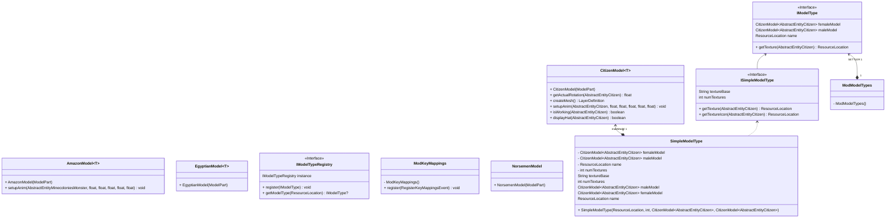

# api.client

10 classes, 4 internal relationships shown.

```mermaid
classDiagram
direction BT

class AmazonModel~T~ {
  + AmazonModel(ModelPart) 
  + setupAnim(AbstractEntityMinecoloniesMonster, float, float, float, float, float) void
}
class CitizenModel~T~ {
  + CitizenModel(ModelPart) 
  + getActualRotation(AbstractEntityCitizen) float
  + createMesh() LayerDefinition
  + setupAnim(AbstractEntityCitizen, float, float, float, float, float) void
  + isWorking(AbstractEntityCitizen) boolean
  + displayHat(AbstractEntityCitizen) boolean
}
class EgyptianModel~T~ {
  + EgyptianModel(ModelPart) 
}
class IModelType {
<<Interface>>
  + getTexture(AbstractEntityCitizen) ResourceLocation
   CitizenModel~AbstractEntityCitizen~ femaleModel
   CitizenModel~AbstractEntityCitizen~ maleModel
   ResourceLocation name
}
class IModelTypeRegistry {
<<Interface>>
  + register(IModelType) void
  + getModelType(ResourceLocation) IModelType?
   IModelTypeRegistry instance
}
class ISimpleModelType {
<<Interface>>
  + getTexture(AbstractEntityCitizen) ResourceLocation
  + getTextureIcon(AbstractEntityCitizen) ResourceLocation
   String textureBase
   int numTextures
}
class ModKeyMappings {
  - ModKeyMappings() 
  + register(RegisterKeyMappingsEvent) void
}
class ModModelTypes {
  - ModModelTypes() 
}
class NorsemenModel {
  + NorsemenModel(ModelPart) 
}
class SimpleModelType {
  + SimpleModelType(ResourceLocation, int, CitizenModel~AbstractEntityCitizen~, CitizenModel~AbstractEntityCitizen~) 
  - CitizenModel~AbstractEntityCitizen~ femaleModel
  - CitizenModel~AbstractEntityCitizen~ maleModel
  - ResourceLocation name
  - int numTextures
   String textureBase
   int numTextures
   CitizenModel~AbstractEntityCitizen~ maleModel
   CitizenModel~AbstractEntityCitizen~ femaleModel
   ResourceLocation name
}

ISimpleModelType  -->  IModelType 
ModModelTypes "1" *--> "SETTLER 1" IModelType 
SimpleModelType  ..>  ISimpleModelType 
SimpleModelType "1" *--> "maleModel 1" CitizenModel~T~ 
```
