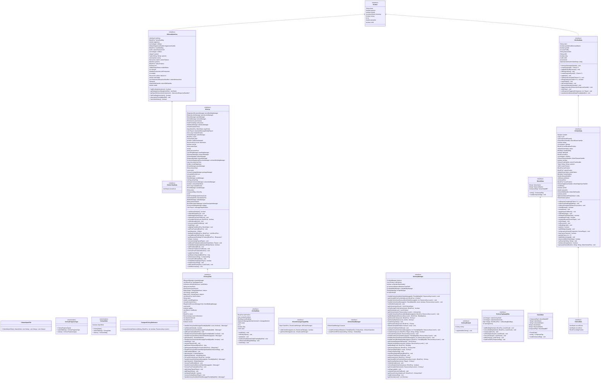

# api.colony (cont. 4)

20 classes, 7 internal relationships shown.

```mermaid
classDiagram
direction BT

class CitizenNameFile {
  + CitizenNameFile(int, NameOrder, List~String~, List~String~, List~String~) 
}
class ColonyProgressType {
<<enumeration>>
  + ColonyProgressType() 
  + valueOf(String) ColonyProgressType
  + values() ColonyProgressType[]
}
class ColonyState {
<<enumeration>>
  + ColonyState() 
  + valueOf(String) ColonyState
  + values() ColonyState[]
   boolean okayToEat
}
class CompactColonyReference {
  + CompactColonyReference(String, BlockPos, int, boolean, ResourceKey~Level~) 
}
class GraveData {
  + GraveData() 
  - CompoundTag? citizenDataNBT
  - String? citizenName
  - String? citizenJobName
  + write() CompoundTag
  + read(CompoundTag) void
   String? citizenName
   String? citizenJobName
   CompoundTag? citizenDataNBT
}
class IAnimalData {
<<Interface>>
  + markDirty() void
  + initEntityValues() void
  + update(int) void
  + serializeViewNetworkData(FriendlyByteBuf) void
  + onRemoveBuilding(IBuilding) void
  + clearDirty() void
   BlockPos lastPosition
   float combatCooldown
   IBuilding homeBuilding
   Optional~IManagedAnimal~Animal~~ managedAnimal
   UUID owner
   int id
   boolean dirty
   UUID UUID
}
class IChunkmanagerCapability {
<<Interface>>
  + addChunkStorage(int, int, ChunkLoadStorage) boolean
  + getChunkStorage(int, int) ChunkLoadStorage?
   Map~ChunkPos, ChunkLoadStorage~ allChunkStorages
}
class ICitizen {
<<Interface>>
   String name
   boolean paused
   boolean female
   InventoryCitizen inventory
   IColony colony
   int id
   double saturation
   boolean child
}
class ICitizenData {
<<Interface>>
  + onRequestCompleted(IToken~?~) void
  + onRemoveBuilding(IBuilding) void
  + onQuestCompletion(ResourceLocation) void
  + shouldRestart() boolean
  + restartDone() void
  + applyResearchEffects() void
  + onDeath(Integer) void
  + isRelatedTo(ICitizenData) boolean
  + needsBetterFood() boolean
  + scheduleRestart(ServerPlayer) void
  + onGoSleep() void
  + onResurrect() void
  + onBuildingLoad() void
  + justAte() boolean
  + addSiblings(Integer[]) void
  + onInteractionClosed(Component, ServerPlayer) void
  + hasCustomTexture() boolean
  + getJob(Class~J~) J?
  + addChildren(Integer[]) void
  + doesLiveWith(ICitizenData) boolean
  + setParents(String, String) void
  + hasQuestAssignment() boolean
  + generateName(Random, String, String, CitizenNameFile) void
   Random random
   IJob~?~ job
   UUID interactedRecently
   ICitizenMournHandler citizenMournHandler
   boolean asleep
   List~Integer~ siblings
   BlockPos nextRespawnPosition
   VisibleCitizenStatus status
   IBuilding? workBuilding
   boolean idleAtJob
   BlockPos bedPos
   List~Integer~ children
   ICitizenDiseaseHandler citizenDiseaseHandler
   boolean working
   ICitizenFoodHandler citizenFoodHandler
   Tuple~String, String~ parents
   UUID customTexture
   BlockPos lastPosition
   BlockPos? statusPosition
   VisibleCitizenStatus visibleStatus
   IBuilding? homeBuilding
   double diseaseModifier
   JobStatus jobStatus
   int leisureTime
   BlockPos? homePosition
   ICitizenHappinessHandler citizenHappinessHandler
   int idleDays
   boolean isChild
   double saturation
   ICitizenSkillHandler citizenSkillHandler
   boolean justAte
   Optional~AbstractEntityCitizen~ entity
   ICitizenData? partner
}
class ICitizenDataManager {
<<Interface>>
  + createFromNetworkData(int, FriendlyByteBuf, IColonyView) ICitizenDataView
  + createFromNBT(CompoundTag, IColony) ICitizenData
   ICitizenDataManager instance
}
class ICitizenDataView {
<<Interface>>
  + hasBlockingInteractions() boolean
  + getDisplayArmor(EquipmentSlot) ItemStack
  + getSpecificInteraction(Component) IInteractionResponseHandler?
  + hasPendingInteractions() boolean
  + deserialize(FriendlyByteBuf) void
  + hasVisibleStatus() boolean
   IJobView? jobView
   BlockPos? homeBuilding
   double happiness
   List~Integer~ siblings
   ICitizenHappinessHandler happinessHandler
   BlockPos? workBuilding
   UUID customTextureUUID
   List~Integer~ children
   Integer? partner
   Tuple~String, String~ parents
   IColonyView colony
   ResourceLocation customTexture
   BlockPos position
   BlockPos? statusPosition
   boolean sick
   VisibleCitizenStatus visibleStatus
   int colonyId
   MutableComponent jobComponent
   int entityId
   ResourceLocation statusIcon
   double maxHealth
   List~IInteractionResponseHandler~ orderedInteractions
   String job
   ICitizenSkillHandler citizenSkillHandler
   double health
}
class ICivilianData {
<<Interface>>
  + increaseSaturation(double) void
  + createRequest(R) IToken~?~
  + updateEntityIfNecessary() void
  + initEntityValues() void
  + createRequestAsync(R) IToken~?~
  + update(int) void
  + onRequestCancelled(IToken~?~) void
  + isRequestAsync(IToken~?~) boolean
  + markDirty(int) void
  + initForNewCivilian() void
  + decreaseSaturation(double) void
  + triggerInteraction(IInteractionResponseHandler) void
  + clearDirty() void
  + onResponseTriggered(Component, int, Player) void
  + serializeViewNetworkData(FriendlyByteBuf) void
   String name
   boolean genderAndGenerateName
   boolean gender
   int voiceProfile
   String textureSuffix
   String suffix
   boolean dirty
   UUID UUID
   int textureId
   Optional~AbstractCivilianEntity~ entity
}
class IColony {
<<Interface>>
  + canBeAutoDeleted() boolean
  + onWorldUnload(Level) void
  + addVisitingPlayer(Player) void
  + onWorldTick(LevelTickEvent) void
  + isCoordInColony(Level, BlockPos) boolean
  + onWorldLoad(Level) void
  + removeLoadedChunk(long) void
  + markDirty() void
  + addWayPoint(BlockPos, BlockState) void
  + addFreePosition(BlockPos) void
  + getCitizen(int) ICitizen
  + getWayPoints(BlockPos, BlockPos) List~BlockPos~
  + useAdditionalChildTime(int) boolean
  + getRequesterBuildingForPosition(BlockPos) IRequester?
  + isDay() boolean
  + removeVisitingPlayer(Player) void
  + addGuardToAttackers(AbstractEntityCitizen, Player) void
  + isValidAttackingGuard(AbstractEntityCitizen) boolean
  + addFreeBlock(Block) void
  + onServerTick(ServerTickEvent) void
  + removeFreePosition(BlockPos) void
  + updateHasChilds() void
  + getDistanceSquared(BlockPos) long
  + write(CompoundTag) CompoundTag
  + removeFreeBlock(Block) void
  + isValidAttackingPlayer(Player) boolean
  + read(CompoundTag) void
  + addLoadedChunk(long, LevelChunk) void
  + usedMercenaries() void
   IRegisteredStructureManager serverBuildingManager
   IReproductionManager reproductionManager
   IQuestManager questManager
   IAnimalManager animalManager
   IPermissions permissions
   ChatFormatting colonyColor
   IStatisticsManager statisticsManager
   int lastContactInHours
   Map~BlockPos, BlockState~ wayPoints
   List~Player~ importantMessageEntityPlayers
   Set~Long~ ticketedChunks
   IVisitorManager visitorManager
   BlockPos center
   ColonyState state
   boolean canBeAutoDeleted
   ResourceKey~Level~ dimension
   boolean remote
   String nameStyle
   int day
   String structurePack
   ITravellingManager travellingManager
   IResearchManager researchManager
   ICitizenManager citizenManager
   IRequestManager requestManager
   ICommonRegisteredStructureManager commonBuildingManager
   long mercenaryUseTime
   double overallHappiness
   IGraveManager graveManager
   String textureStyle
   Level world
   IColonyPackageManager packageManager
   int loadedChunkCount
   boolean active
   IWorkManager workManager
   ListTag colonyFlag
   IColonyConnectionManager connectionManager
   boolean colonyUnderAttack
   Set~Long~ loadedChunks
   IEventManager eventManager
   String name
   CompoundTag colonyTag
   int ID
   ChatFormatting teamColonyColor
   CitizenNameFile citizenNameFile
   IRaiderManager raiderManager
   String textureStyleId
   IEventDescriptionManager eventDescriptionManager
   ICommonSettingsModule settings
   List~Player~ messagePlayerEntities
}
class IColonyManager {
<<Interface>>
  + handleColonyViewWorkOrderMessage(int, FriendlyByteBuf, ResourceKey~Level~) void
  + getColonyByPosFromWorld(Level, BlockPos) IColony?
  + handleColonyViewRemoveWorkOrderMessage(int, int, ResourceKey~Level~) void
  + handleColonyViewMessage(int, FriendlyByteBuf, Level, boolean, ResourceKey~Level~) void
  + onWorldUnload(Level) void
  + getColonyViews(Level) List~IColonyView~
  + isFarEnoughFromColonies(Level, BlockPos) boolean
  + getIColonies(Level) List~IColony~
  + getColonyView(int, ResourceKey~Level~) IColonyView
  + handleColonyViewRemoveBuildingMessage(int, BlockPos, ResourceKey~Level~) void
  + getBuildingView(ResourceKey~Level~, BlockPos) IBuildingView
  + getClosestIColony(Level, BlockPos) IColony?
  + getIColonyByOwner(Level, UUID) IColony?
  + resetColonyViews() void
  + getClosestColony(Level, BlockPos) IColony
  + deleteColonyByWorld(int, boolean, Level) void
  + onClientTick(ClientTickEvent) void
  + handleColonyViewCitizensMessage(int, int, FriendlyByteBuf, ResourceKey~Level~) void
  + createColony(Level, BlockPos, Player, String, String) IColony?
  + removeColonyView(int, ResourceKey~Level~) void
  + handlePermissionsViewMessage(int, FriendlyByteBuf, ResourceKey~Level~) void
  + handleColonyViewRemoveCitizenMessage(int, int, ResourceKey~Level~) void
  + handleColonyBuildingViewMessage(int, BlockPos, FriendlyByteBuf, ResourceKey~Level~) void
  + getColoniesAbandonedSince(int) List~IColony~
  + deleteColonyByDimension(int, boolean, ResourceKey~Level~) void
  + getBuilding(Level, BlockPos) IBuilding
  + getColonyView(Level, BlockPos) IColonyView
  + getColonyByWorld(int, Level) IColony?
  + write(CompoundTag) void
  + openReactivationWindow(BlockPos) void
  + onServerTick(ServerTickEvent) void
  + getIColony(Level, BlockPos) IColony?
  + getColonyByPosFromDim(ResourceKey~Level~, BlockPos) IColony
  + getIColonyByOwner(Level, Player) IColony?
  + onWorldLoad(Level) void
  + isCoordinateInAnyColony(Level, BlockPos) boolean
  + getColonyByDimension(int, ResourceKey~Level~) IColony?
  + setCapLoaded() void
  + onWorldTick(LevelTickEvent) void
  + getClosestColonyView(Level?, BlockPos?) IColonyView?
  + read(CompoundTag) void
  + getColonies(Level) List~IColony~
   IColonyManager instance
   List~IColony~ allColonies
   boolean schematicDownloaded
   int minimumDistanceBetweenTownHalls
   ICompatibilityManager compatibilityManager
   IRecipeManager recipeManager
   int topColonyId
}
class IColonyRelated {
<<Interface>>
  + registerWithColony() void
   IColony colony
}
class IColonyTagCapability {
<<Interface>>
  + addBuildingClaim(int, BlockPos, LevelChunk) void
  + removeBuildingClaim(int, BlockPos, LevelChunk) void
  + reset(LevelChunk) void
  + setOwningColony(int, LevelChunk) void
  + removeColony(int, LevelChunk) void
  + addColony(int, LevelChunk) void
  + readFromNBT(CompoundTag) void
   List~Integer~ staticColonyClaim
   List~Integer~ staticClaimColonies
   Map~Integer, Set~BlockPos~~ allClaimingBuildings
   int owningColony
}
class IColonyView {
<<Interface>>
  + handleColonyViewMessage(FriendlyByteBuf, Level, boolean) IMessage?
  + canBeAutoDeleted() boolean
  + handlePermissionsViewMessage(FriendlyByteBuf) IMessage?
  + addFreePosition(BlockPos) void
  + handleColonyViewAnimalMessage(FriendlyByteBuf, boolean) void
  + handleColonyViewRemoveWorkOrderMessage(int) IMessage?
  + getAnimal(int) IAnimalDataView
  + handleColonyViewVisitorMessage(FriendlyByteBuf, boolean) void
  + markDirty() void
  + removePlayer(UUID) void
  + getDistanceSquared(BlockPos) long
  + getRequesterBuildingForPosition(BlockPos) IRequester?
  + handleColonyViewResearchManagerUpdate(CompoundTag) void
  + addFreeBlock(Block) void
  + getVisitor(int) ICitizenDataView
  + getWorkOrder(int) IWorkOrderView
  + isCoordInColony(Level, BlockPos) boolean
  + handleColonyViewCitizensMessage(int, FriendlyByteBuf) IMessage?
  + getCitizen(int) ICitizenDataView
  + removeFreeBlock(Block) void
  + handleColonyViewRemoveCitizenMessage(int) IMessage?
  + removeFreePosition(BlockPos) void
  + addVisitingPlayer(Player) void
  + addPlayer(String) void
  + areSpiesEnabled() boolean
  + removeVisitingPlayer(Player) void
  + handleColonyViewWorkOrderMessage(FriendlyByteBuf) IMessage?
   IRequestManager requestManager
   List~BlockPos~ lastSpawnPoints
   Collection~IWorkOrderView~ workOrders
   String structurePack
   IPermissions permissions
   Map~Integer, ICitizenDataView~ citizens
   List~String~ nameFileIds
   Map~UUID, ColonyPlayer~ players
   List~BlockPos~ freePositions
   String name
   double overallHappiness
   int lastContactInHours
   IRegisteredStructureManagerView clientBuildingManager
   Level world
   boolean raiding
   List~Block~ freeBlocks
   int ID
   BlockPos center
   ResourceKey~Level~ dimension
   int citizenCountLimit
   int citizenCount
   boolean remote
}
class IGraveData {
<<Interface>>
  + write() CompoundTag
  + read(CompoundTag) void
   String? citizenName
   String? citizenJobName
   CompoundTag? citizenDataNBT
}
class IVisitorData {
<<Interface>>
   ItemStack recruitCosts
   ItemStack recruitCost
   BlockPos sittingPosition
}
class IVisitorViewData {
<<Interface>>
   ItemStack recruitCost
}

GraveData  ..>  IGraveData 
ICitizenData  -->  ICivilianData 
ICitizenDataView  -->  ICitizen 
ICivilianData  -->  ICitizen 
IColonyView  -->  IColony 
IVisitorData  -->  ICitizenData 
IVisitorViewData  -->  ICitizenDataView 
```
