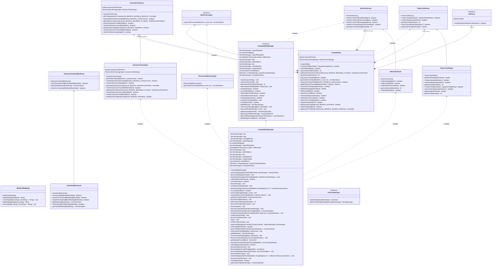

# api.compatibility

16 classes, 18 internal relationships shown.

```mermaid
classDiagram
direction BT

class AbstractChiselAndBitsProxy {
  + AbstractChiselAndBitsProxy() 
  + checkForChiselAndBitsTileEntity(BlockEntity) boolean
  + getChiseledStacks(BlockEntity) List~ItemStack~
  + checkForChiselAndBitsBlock(BlockState) boolean
}
class BlueprintMapping {
  + BlueprintMapping() 
  + getStyleMapping(String) String
  - runForStyle(Map~String, List~String~~, String) void
  + getPathMapping(String, String) String
  - runForAlt(Map~String, List~String~~, String) void
}
class ChiselAndBitsCheck {
  + ChiselAndBitsCheck() 
  + isChiselAndBitsBlock(BlockState) boolean
  + checkForChiselAndBitsBlock(BlockState) boolean
  + checkForChiselAndBitsTileEntity(BlockEntity) boolean
  + getBitStacks(BlockEntity) List~ItemStack~
  + isChiselAndBitsTileEntity(BlockEntity) boolean
  + getChiseledStacks(BlockEntity) List~ItemStack~
}
class Compatibility {
  - Compatibility() 
  + isTinkersTool(ItemStack?, EquipmentTypeEntry) boolean
  + isSlimeBlock(Block) boolean
  + getLeafVariant(BlockState) int
  + getDropsForDynamicLeaf(LevelAccessor, BlockPos, BlockState, int, Block) NonNullList~ItemStack~
  + getToolLevel(ItemStack) int
  + isDynamicTrunkShell(Block) boolean
  + getCombsFromHive(BlockPos, Level, int) List~ItemStack~
  + isDynamicFamilyFitting(BlockPos, BlockPos, LevelAccessor) boolean
  + getMiningLevelCompatibility(ItemStack?, String?) boolean
  + isDynamicTreeSapling(ItemStack) boolean
  + getAttackDamage(ItemStack) double
  + isSlimeLeaf(Block) boolean
  + isDynamicLeaf(Block) boolean
  + isTinkersWeapon(ItemStack) boolean
  + isSlimeDirtOrGrass(Block) boolean
  + isDynamicTreeSapling(Item) boolean
  + isDynamicBlock(Block) boolean
  + plantDynamicSapling(Level, BlockPos, ItemStack) boolean
  + isSlimeSapling(Block) boolean
  + getDynamicTreeBreakAction(Level, BlockPos, ItemStack, BlockPos) Runnable
   boolean dynTreePresent
   ResourceKey~DamageType~ dynamicTreeDamage
}
class CompatibilityManager {
  + CompatibilityManager() 
  - Set~ItemStorage~ fuel
  - Set~ItemStorage~ food
  - Set~ItemStorage~ smeltableOres
  - writeLeafSaplingEntryToNBT(BlockState, ItemStorage) CompoundTag
  - discoverSaplings(ItemStack) void
  - serializeItemStorageList(FriendlyByteBuf, Collection~ItemStorage~) void
  + isMineableOre(ItemStack) boolean
  + isOre(ItemStack) boolean
  - discoverFungi() void
  + serialize(FriendlyByteBuf) void
  - deserializeRegistryIds(FriendlyByteBuf, IForgeRegistry~T~) List~ResourceLocation~
  + isLuckyBlock(Block) boolean
  + discover(RecipeManager, Level) void
  - serializeBlockList(FriendlyByteBuf, Collection~Block~) void
  + getDyeColor(ItemStack) Optional~DyeColor~
  - discoverFood(ItemStack) void
  + getCreativeTabKey(ItemStorage) int
  - discoverPlantables(ItemStack) void
  - discoverMobs() void
  - discoverCompostRecipes(RecipeManager) void
  - deserializeItemStorageList(FriendlyByteBuf) List~ItemStorage~
  - serializeCompostRecipes(FriendlyByteBuf, Map~Item, CompostRecipe~) void
  + read(CompoundTag) void
  - discoverFuel(ItemStack) void
  - clear() void
  + write(CompoundTag) void
  - readLeafSaplingEntryFromNBT(CompoundTag) Tuple~BlockState, ItemStorage~
  + isPlantable(ItemStack) boolean
  + getListOfMatchingItems(Predicate~ItemStack~) List~ItemStack~
  + deserialize(FriendlyByteBuf, ClientLevel) void
  + getEdibles(int) Set~ItemStorage~
  + connectLeafToSapling(Block, ItemStack) void
  - discoverCompostRecipes(List~CompostRecipe~) void
  + getSaplingForLeaf(Block) ItemStack?
  - deserializeCompostRecipes(FriendlyByteBuf) List~CompostRecipe~
  + isBreakableOre(ItemStack) boolean
  - discoverAllItems(Level) void
  - deserializeBlockList(FriendlyByteBuf) List~Block~
  - discoverBeekeeperFlowers(ItemStack, Set~ItemStorage~) void
  - discoverModCompat() void
  - serializeRegistryIds(FriendlyByteBuf, IForgeRegistry~?~, Collection~ResourceLocation~) void
  - discoverOres(ItemStack) void
  + isOre(BlockState) boolean
  + getCreativeTab(ItemStorage) CreativeModeTab
   Set~ItemStorage~ copyOfSaplings
   int numberOfSaplings
   Set~ItemStorage~ copyOfPlantables
   ImmutableSet~ResourceLocation~ allMonsters
   Set~ItemStorage~ food
   Set~ItemStorage~ setOfAllItems
   Set~ItemStorage~ fuel
   Set~ItemStorage~ smeltableOres
   Set~ItemStorage~ compostInputs
   List~ItemStack~ listOfAllItems
   Map~Item, CompostRecipe~ copyOfCompostRecipes
   Set~ItemStorage~ immutableFlowers
}
class DynamicTreeCompat {
  + DynamicTreeCompat() 
  - getFamilyForBlock(BlockPos, LevelAccessor) Family?
  + hasFittingTreeFamilyCompat(BlockPos, BlockPos, LevelAccessor) boolean
  + checkForDynamicSapling(Item) boolean
  + getTreeBreakActionCompat(Level, BlockPos, ItemStack, BlockPos) Runnable
  + checkForDynamicTrunkShellBlock(Block) boolean
  + getDropsForLeaf(LevelAccessor, BlockPos, BlockState, int, Block) NonNullList~ItemStack~
  + checkForDynamicLeavesBlock(Block) boolean
  + checkForDynamicTreeBlock(Block) boolean
  + plantDynamicSaplingCompat(Level, BlockPos, ItemStack) boolean
   boolean dynamicTreePresent
   ResourceKey~DamageType~ dynamicTreeDamage
}
class DynamicTreeProxy {
  + DynamicTreeProxy() 
  + getTreeBreakActionCompat(Level, BlockPos, ItemStack, BlockPos) Runnable
  + hasFittingTreeFamilyCompat(BlockPos, BlockPos, LevelAccessor) boolean
  + getDropsForLeaf(LevelAccessor, BlockPos, BlockState, int, Block) NonNullList~ItemStack~
  + checkForDynamicTreeBlock(Block) boolean
  + checkForDynamicLeavesBlock(Block) boolean
  + plantDynamicSaplingCompat(Level, BlockPos, ItemStack) boolean
  + checkForDynamicTrunkShellBlock(Block) boolean
  + checkForDynamicSapling(Item) boolean
   boolean dynamicTreePresent
   ResourceKey~DamageType~ dynamicTreeDamage
}
class IBeehiveCompat {
<<Interface>>
  + getCombsFromHive(BlockPos, Level, int) List~ItemStack~
}
class ICompatibilityManager {
<<Interface>>
  + read(CompoundTag) void
  + write(CompoundTag) void
  + getCreativeTabKey(ItemStorage) int
  + deserialize(FriendlyByteBuf, ClientLevel) void
  + isOre(ItemStack) boolean
  + isLuckyBlock(Block) boolean
  + isBreakableOre(ItemStack) boolean
  + isMineableOre(ItemStack) boolean
  + isPlantable(ItemStack) boolean
  + serialize(FriendlyByteBuf) void
  + isOre(BlockState) boolean
  + getEdibles(int) Set~ItemStorage~
  + connectLeafToSapling(Block, ItemStack) void
  + discover(RecipeManager, Level) void
  + getDyeColor(ItemStack) Optional~DyeColor~
  + getCreativeTab(ItemStorage) CreativeModeTab
  + getListOfMatchingItems(Predicate~ItemStack~) List~ItemStack~
  + getSaplingForLeaf(Block) ItemStack?
   Set~ItemStorage~ copyOfSaplings
   int numberOfSaplings
   Set~ItemStorage~ copyOfPlantables
   ImmutableSet~ResourceLocation~ allMonsters
   Set~ItemStorage~ food
   Set~ItemStorage~ setOfAllItems
   Set~ItemStorage~ fuel
   Set~ItemStorage~ smeltableOres
   Set~ItemStorage~ compostInputs
   List~ItemStack~ listOfAllItems
   Map~Item, CompostRecipe~ copyOfCompostRecipes
   Set~ItemStorage~ immutableFlowers
}
class IFurnaceRecipes {
<<Interface>>
  + getSmeltingResult(ItemStack) ItemStack
  + getFirstSmeltingRecipeByResult(ItemStorage) IRecipeStorage
}
class IJeiProxy {
<<Interface>>
  + showRecipes(Collection~ItemStack~) boolean
   boolean loaded
}
class ResourcefulBeesCompat {
  + ResourcefulBeesCompat() 
  + getCombsFromHive(BlockPos, Level, int) List~ItemStack~
}
class SlimeTreeCheck {
  + SlimeTreeCheck() 
  + isSlimeSapling(Block) boolean
  + isSlimeLeaf(Block) boolean
  + isSlimeDirtOrGrass(Block) boolean
  + getLeafVariant(BlockState) int
  + isSlimeBlock(Block) boolean
}
class SlimeTreeProxy {
  + SlimeTreeProxy() 
  + checkForTinkersSlimeBlock(Block) boolean
  + checkForTinkersSlimeLeaves(Block) boolean
  + checkForTinkersSlimeSapling(Block) boolean
  + checkForTinkersSlimeDirtOrGrass(Block) boolean
  + getTinkersLeafVariant(BlockState) int
}
class TinkersToolHelper {
  + TinkersToolHelper() 
  + getAttackDamage(ItemStack) double
  + isTinkersSword(ItemStack) boolean
  + isTinkersWeapon(ItemStack) boolean
  + getToolLevel(ItemStack) int
  + isTinkersTool(ItemStack?, EquipmentTypeEntry) boolean
  + checkTinkersBroken(ItemStack?) boolean
  + getDamage(ItemStack) double
  + getToolLvl(ItemStack) int
}
class TinkersToolProxy {
  + TinkersToolProxy() 
  + isTinkersTool(ItemStack?, EquipmentTypeEntry) boolean
  + isTinkersWeapon(ItemStack) boolean
  + getToolLevel(ItemStack) int
  + checkTinkersBroken(ItemStack?) boolean
  + getAttackDamage(ItemStack) double
}

ChiselAndBitsCheck  -->  AbstractChiselAndBitsProxy 
Compatibility  ..>  DynamicTreeProxy : «create»
Compatibility  ..>  SlimeTreeProxy : «create»
Compatibility  ..>  TinkersToolProxy : «create»
Compatibility "1" *--> "beeHiveCompat 1" IBeehiveCompat 
Compatibility "1" *--> "dynamicTreesCompat 1" DynamicTreeProxy 
Compatibility "1" *--> "jeiProxy 1" IJeiProxy 
Compatibility "1" *--> "tinkersCompat 1" TinkersToolProxy 
Compatibility "1" *--> "tinkersSlimeCompat 1" SlimeTreeProxy 
CompatibilityManager  ..>  DynamicTreeCompat : «create»
CompatibilityManager  ..>  ICompatibilityManager 
CompatibilityManager  ..>  ResourcefulBeesCompat : «create»
CompatibilityManager  ..>  SlimeTreeCheck : «create»
CompatibilityManager  ..>  TinkersToolHelper : «create»
DynamicTreeCompat  -->  DynamicTreeProxy 
ResourcefulBeesCompat  ..>  IBeehiveCompat 
SlimeTreeCheck  -->  SlimeTreeProxy 
TinkersToolHelper  -->  TinkersToolProxy 
```
