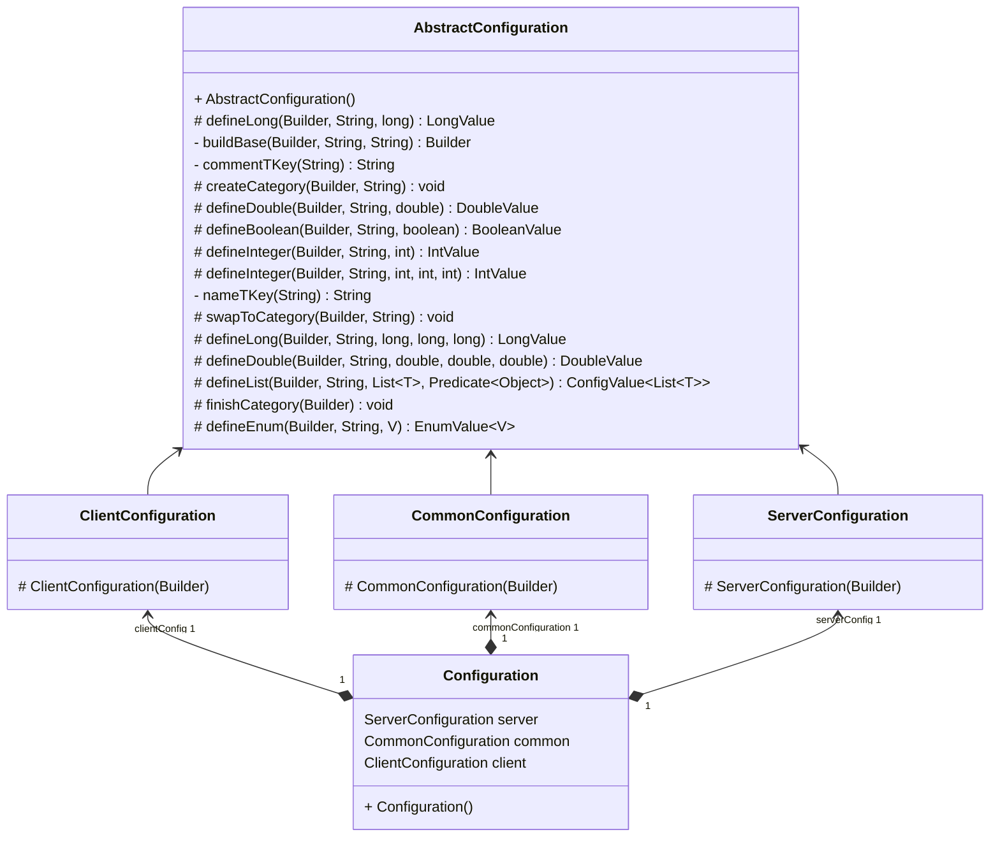

# api.configuration

5 classes, 6 internal relationships shown.

```mermaid
classDiagram
direction BT

class AbstractConfiguration {
  + AbstractConfiguration() 
  # defineLong(Builder, String, long) LongValue
  - buildBase(Builder, String, String) Builder
  - commentTKey(String) String
  # createCategory(Builder, String) void
  # defineDouble(Builder, String, double) DoubleValue
  # defineBoolean(Builder, String, boolean) BooleanValue
  # defineInteger(Builder, String, int) IntValue
  # defineInteger(Builder, String, int, int, int) IntValue
  - nameTKey(String) String
  # swapToCategory(Builder, String) void
  # defineLong(Builder, String, long, long, long) LongValue
  # defineDouble(Builder, String, double, double, double) DoubleValue
  # defineList(Builder, String, List~T~, Predicate~Object~) ConfigValue~List~T~~
  # finishCategory(Builder) void
  # defineEnum(Builder, String, V) EnumValue~V~
}
class ClientConfiguration {
  # ClientConfiguration(Builder) 
}
class CommonConfiguration {
  # CommonConfiguration(Builder) 
}
class Configuration {
  + Configuration() 
   ServerConfiguration server
   CommonConfiguration common
   ClientConfiguration client
}
class ServerConfiguration {
  # ServerConfiguration(Builder) 
}

ClientConfiguration  -->  AbstractConfiguration 
CommonConfiguration  -->  AbstractConfiguration 
Configuration "1" *--> "clientConfig 1" ClientConfiguration 
Configuration "1" *--> "commonConfiguration 1" CommonConfiguration 
Configuration "1" *--> "serverConfig 1" ServerConfiguration 
ServerConfiguration  -->  AbstractConfiguration 
```
