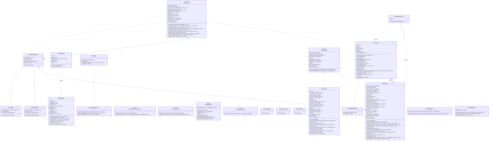

# api.crafting

23 classes, 15 internal relationships shown.

```mermaid
classDiagram
direction BT

class AbstractRecipeType~R~ {
  + AbstractRecipeType(R) 
  ~ IRecipeStorage recipe
  ~ ResourceLocation id
   ResourceLocation id
   List~ItemStack~ outputDisplayStacks
   IRecipeStorage recipe
}
class ClassicRecipe {
  + ClassicRecipe(IRecipeStorage) 
  - ArrayList~ItemStack~ outputDisplayStacks
   ResourceLocation id
   List~ItemStack~ outputDisplayStacks
}
class CompostRecipe {
  + CompostRecipe(ResourceLocation, Ingredient, int) 
  - int strength
  - ResourceLocation id
  - int FERMENT_TIME
  - Ingredient input
  + canCraftInDimensions(int, int) boolean
  + individualize(Item, CompostRecipe) CompostRecipe
  + assemble(Container, RegistryAccess) ItemStack
  + matches(Container, Level) boolean
  - calculateIngredientCount() int
  + getResultItem(RegistryAccess) ItemStack
   NonNullList~Ingredient~ ingredients
   Ingredient input
   RecipeType~?~ type
   int strength
   int FERMENT_TIME
   ResourceLocation id
   RecipeSerializer~?~ serializer
}
class CountedIngredient {
  + CountedIngredient(Ingredient, int) 
  - int count
  - Ingredient child
  + toJson() JsonElement
   IIngredientSerializer~Ingredient~ serializer
   Ingredient child
   ItemStack[] items
   int count
}
class CraftingType {
  # CraftingType(ResourceLocation) 
  + hashCode() int
  + findRecipes(RecipeManager, Level?) List~IGenericRecipe~
  + equals(Object) boolean
}
class ExactMatchItemStorage {
  + ExactMatchItemStorage(ItemStack) 
  + equals(Object) boolean
}
class GenericRecipe {
  - GenericRecipe(Builder) 
  - int levelSort
  - List~ItemStack~ additionalOutputs
  - List~List~ItemStack~~ inputs
  - ResourceLocation? lootTable
  - EquipmentTypeEntry requiredTool
  - EntityType~?~? requiredEntity
  - int gridSize
  - Block intermediate
  - Supplier~List~Component~~ restrictions
  + matchesOutput(OptionalPredicate~ItemStack~) Optional~Boolean~
  + toString() String
  - toItemStack(ItemStorage) ItemStack
  - calculateSecondaryOutputs(Recipe~?~, Level?) List~ItemStack~
  + builder() Builder
  + matchesInput(OptionalPredicate~ItemStack~) Optional~Boolean~
  + of(IToken~?~?) IGenericRecipe?
  + builder(IGenericRecipe) Builder
  - compactInputs(List~List~ItemStack~~) List~List~ItemStack~~
  + builder(IRecipeStorage) Builder
  + of(Recipe~?~?, Level) IGenericRecipe?
   ResourceLocation? lootTable
   List~ItemStack~ additionalOutputs
   Supplier~List~Component~~ restrictions
   List~ItemStack~ allMultiOutputs
   int levelSort
   ResourceLocation? recipeId
   EquipmentTypeEntry requiredTool
   EntityType~?~? requiredEntity
   int gridSize
   List~List~ItemStack~~ inputs
   Block intermediate
   ItemStack primaryOutput
}
class IGenericRecipe {
<<Interface>>
  + matchesOutput(OptionalPredicate~ItemStack~) Optional~Boolean~
  + matchesInput(OptionalPredicate~ItemStack~) Optional~Boolean~
   ResourceLocation? lootTable
   List~ItemStack~ additionalOutputs
   Supplier~List~Component~~ restrictions
   List~ItemStack~ allMultiOutputs
   int levelSort
   ResourceLocation? recipeId
   EquipmentTypeEntry requiredTool
   EntityType~?~? requiredEntity
   int gridSize
   List~List~ItemStack~~ inputs
   Block intermediate
   ItemStack primaryOutput
}
class IImmutableItemStorageFactory {
<<Interface>>
  + getNewInstance(ItemStack, int) ImmutableItemStorage
  + getNewInstance(IFactoryController, FactoryVoidInput, Object[]) ImmutableItemStorage
}
class IItemStorageFactory {
<<Interface>>
  + getNewInstance(ItemStack, int, boolean, boolean) ItemStorage
  + getNewInstance(IFactoryController, FactoryVoidInput, Object[]) ItemStorage
}
class IRecipeManager {
<<Interface>>
  + write(CompoundTag) void
  + getRecipe(IToken~?~) IRecipeStorage
  + registerUse(IToken~?~) void
  + reset() void
  + read(CompoundTag) void
  + addRecipe(IRecipeStorage) IToken~?~
  + checkOrAddRecipe(IRecipeStorage) IToken~?~
  + getRecipeId(IRecipeStorage) IToken~?~
   ImmutableMap~IToken~?~, IRecipeStorage~ recipes
}
class IRecipeStorage {
<<Interface>>
  + fullFillRecipe(LootParams, IItemHandler[]) boolean
  + fullfillRecipeAndCopy(Level, List~IItemHandler~, boolean) List~ItemStack~?
  + fullfillRecipe(LootParams, List~IItemHandler~) boolean
  + canFullFillRecipe(int, Map~ItemStorage, Integer~, List~IItemHandler~, IBuilding) boolean
  + getClassicForMultiOutput(ItemStack) RecipeStorage
  + canFullFillRecipe(int, Map~ItemStorage, Integer~, IItemHandler[]) boolean
  + fullFillRecipe(Level, IItemHandler[]) boolean
  + fullfillRecipeAndCopy(LootParams, List~IItemHandler~, boolean) List~ItemStack~?
  + getClassicForMultiOutput(Predicate~ItemStack~) RecipeStorage
  + fullfillRecipe(Level, List~IItemHandler~) boolean
   List~ItemStorage~ input
   ResourceLocation recipeSource
   List~ItemStack~ craftingToolsAndSecondaryOutputs
   EquipmentTypeEntry requiredTool
   AbstractRecipeType~IRecipeStorage~ recipeType
   List~ItemStorage~ cleanedInput
   int gridSize
   ResourceLocation lootTable
   List~ItemStack~ craftingTools
   IToken~?~ token
   List~ItemStack~ secondaryOutputs
   List~ItemStack~ alternateOutputs
   Block intermediate
   ItemStack primaryOutput
}
class IRecipeStorageFactory {
<<Interface>>
  + getNewInstance(IFactoryController, IToken~?~, Object[]) RecipeStorage
}
class ImmutableItemStorage {
  + ImmutableItemStorage(ItemStorage) 
   int amount
}
class ItemStorage {
  + ItemStorage(ItemStack, boolean, boolean) 
  + ItemStorage(ItemStack) 
  + ItemStorage(Item) 
  + ItemStorage(ItemStack, int, boolean) 
  + ItemStorage(ItemStack, int) 
  + ItemStorage(Item, int) 
  + ItemStorage(ItemStack, boolean) 
  + ItemStorage(JsonObject) 
  + ItemStorage(ItemStack, int, boolean, boolean) 
  - int amount
  + ignoreNBT() boolean
  + copy() ItemStorage
  + toString() String
  + getItemStackOfListMatchingPredicate(List~ItemStorage~, Predicate~ItemStack~) ItemStorage?
  + matchDefinitionEquals(ItemStorage) boolean
  + equals(Object) boolean
  + toImmutable() ImmutableItemStorage
  + hashCode() int
  + ignoreDamageValue() boolean
   Item item
   boolean empty
   ItemStack itemStack
   int amount
   int damageValue
   int remainingDurablityValue
}
class ModCraftingTypes {
  - ModCraftingTypes() 
}
class ModRecipeSerializer {
  + ModRecipeSerializer() 
}
class ModRecipeTypes {
  - ModRecipeTypes() 
}
class MultiOutputRecipe {
  + MultiOutputRecipe(IRecipeStorage) 
  - ArrayList~ItemStack~ outputDisplayStacks
   ResourceLocation id
   List~ItemStack~ outputDisplayStacks
}
class RecipeCraftingType~C, T~ {
  + RecipeCraftingType(ResourceLocation, RecipeType~T~, Predicate~T~?) 
  - tryAddingVanillaRecipe(List~IGenericRecipe~, Recipe~?~, Level) void
  + findRecipes(RecipeManager, Level) List~IGenericRecipe~
}
class RecipeStorage {
  - RecipeStorage(Builder) 
  - List~ItemStack~ alternateOutputs
  - ItemStack primaryOutput
  - EquipmentTypeEntry requiredTool
  - List~ItemStorage~ cleanedInput
  - ResourceLocation lootTable
  - List~ItemStack~ secondaryOutputs
  - Block intermediate
  - int gridSize
  - List~ItemStorage~ input
  - IToken~?~ token
  - ResourceLocation recipeSource
  - AbstractRecipeType~IRecipeStorage~ recipeType
  + getClassicForMultiOutput(ItemStack) RecipeStorage
  + fullfillRecipeAndCopy(LootParams, List~IItemHandler~, boolean) List~ItemStack~?
  - insertCraftedItems(List~IItemHandler~, ItemStack, LootParams, boolean) List~ItemStack~
  - canFulfillItemStorage(int, Map~ItemStorage, Integer~, int, ItemStorage) boolean
  + builder() Builder
  + builder(IRecipeStorage) Builder
  + getClassicForMultiOutput(Predicate~ItemStack~) RecipeStorage
  - checkForFreeSpace(List~IItemHandler~) boolean
  + canFullFillRecipe(int, Map~ItemStorage, Integer~, IItemHandler[]) boolean
  + hashCode() int
  - processInputsAndTools(List~ItemStack~?) void
  + equals(Object) boolean
  + canFullFillRecipe(int, Map~ItemStorage, Integer~, List~IItemHandler~, IBuilding) boolean
  - hashableItemStackList(List~ItemStack~) Map~Item, Integer~
   List~ItemStorage~ input
   ResourceLocation recipeSource
   List~ItemStack~ craftingToolsAndSecondaryOutputs
   EquipmentTypeEntry requiredTool
   AbstractRecipeType~IRecipeStorage~ recipeType
   List~ItemStorage~ cleanedInput
   int gridSize
   ResourceLocation lootTable
   List~ItemStack~ craftingTools
   IToken~?~ token
   List~ItemStack~ secondaryOutputs
   List~ItemStack~ alternateOutputs
   Block intermediate
   ItemStack primaryOutput
}
class RecipeTypeEntry {
  - RecipeTypeEntry(Function~IRecipeStorage, AbstractRecipeType~IRecipeStorage~~, ResourceLocation) 
   Function~IRecipeStorage, AbstractRecipeType~IRecipeStorage~~ handlerProducer
}
class ZeroWasteRecipe {
  + ZeroWasteRecipe(ResourceLocation, ItemStack, NonNullList~Ingredient~) 
  + getRemainingItems(CraftingContainer) NonNullList~ItemStack~
  + build(RecipeCategory, ItemLike, int) Builder
   RecipeSerializer~?~ serializer
}

AbstractRecipeType~R~  ..>  IRecipeStorage 
AbstractRecipeType~R~ "1" *--> "recipe 1" IRecipeStorage 
ClassicRecipe  -->  AbstractRecipeType~R~ 
CompostRecipe  ..>  CountedIngredient : «create»
ExactMatchItemStorage  -->  ItemStorage 
GenericRecipe  ..>  IGenericRecipe 
ImmutableItemStorage  -->  ItemStorage 
ItemStorage  ..>  ImmutableItemStorage : «create»
MultiOutputRecipe  -->  AbstractRecipeType~R~ 
RecipeCraftingType~C, T~  -->  CraftingType 
RecipeStorage  ..>  IRecipeStorage 
RecipeStorage  ..>  ImmutableItemStorage : «create»
RecipeStorage  ..>  ItemStorage : «create»
RecipeStorage "1" *--> "input *" ItemStorage 
RecipeStorage "1" *--> "recipeType 1" AbstractRecipeType~R~ 
```
