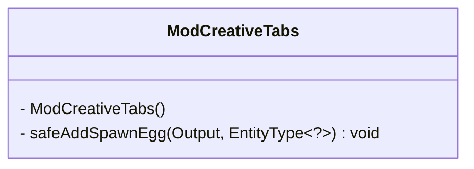

# api.creativetab

1 classes, 0 internal relationships shown.

```mermaid
classDiagram
direction BT

class ModCreativeTabs {
  - ModCreativeTabs() 
  - safeAddSpawnEgg(Output, EntityType~?~) void
}
```
