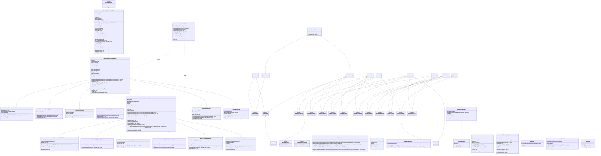

# api.entity (cont. 2)

54 classes, 50 internal relationships shown.

```mermaid
classDiagram
direction BT

class AbstractDrownedEntityPirate {
  + AbstractDrownedEntityPirate(EntityType~AbstractDrownedEntityPirate~, Level) 
  + checkSpawnRules(LevelAccessor, MobSpawnType) boolean
  # decreaseAirSupply(int) int
  + playAmbientSound() void
  + checkSpawnObstruction(LevelReader) boolean
   double swimSpeedFactor
   AbstractAdvancedPathNavigate navigation
   RaiderType raiderType
}
class AbstractDrownedEntityPirateRaider {
  + AbstractDrownedEntityPirateRaider(EntityType~AbstractDrownedEntityPirateRaider~, Level) 
  + playAmbientSound() void
  + checkSpawnObstruction(LevelReader) boolean
  + checkSpawnRules(LevelAccessor, MobSpawnType) boolean
  # decreaseAirSupply(int) int
   double swimSpeedFactor
   AbstractAdvancedPathNavigate navigation
   RaiderType raiderType
}
class AbstractEntityAmazon {
  + AbstractEntityAmazon(EntityType~AbstractEntityAmazon~, Level) 
  + checkSpawnRules(LevelAccessor, MobSpawnType) boolean
  + playAmbientSound() void
   double swimSpeedFactor
   RaiderType raiderType
}
class AbstractEntityAmazonRaider {
  + AbstractEntityAmazonRaider(EntityType~AbstractEntityAmazonRaider~, Level) 
  + playAmbientSound() void
  + checkSpawnRules(LevelAccessor, MobSpawnType) boolean
   double swimSpeedFactor
   RaiderType raiderType
}
class AbstractEntityBarbarian {
  + AbstractEntityBarbarian(EntityType~AbstractEntityBarbarian~, Level) 
  + playAmbientSound() void
   double swimSpeedFactor
   RaiderType raiderType
}
class AbstractEntityBarbarianRaider {
  + AbstractEntityBarbarianRaider(EntityType~AbstractEntityBarbarianRaider~, Level) 
  + playAmbientSound() void
   double swimSpeedFactor
   RaiderType raiderType
}
class AbstractEntityEgyptian {
  + AbstractEntityEgyptian(EntityType~AbstractEntityEgyptian~, Level) 
  + playAmbientSound() void
  + checkSpawnRules(LevelAccessor, MobSpawnType) boolean
   double swimSpeedFactor
   RaiderType raiderType
}
class AbstractEntityEgyptianRaider {
  + AbstractEntityEgyptianRaider(EntityType~AbstractEntityEgyptianRaider~, Level) 
  + playAmbientSound() void
  + checkSpawnRules(LevelAccessor, MobSpawnType) boolean
   double swimSpeedFactor
   RaiderType raiderType
}
class AbstractEntityMinecoloniesMonster {
  + AbstractEntityMinecoloniesMonster(EntityType~AbstractEntityMinecoloniesMonster~, Level, int) 
  + AbstractEntityMinecoloniesMonster(EntityType~AbstractEntityMinecoloniesMonster~, Level) 
  - int textureId
  - ThreatTable threatTable
  - BlockPos spawnPos
  + pushEntities() void
  # getHurtSound(DamageSource) SoundEvent?
  # shouldDespawnInPeaceful() boolean
  + initStatsFor(double, double, double) void
  + playAmbientSound() void
  + hurt(DamageSource, float) boolean
  + readAdditionalSaveData(CompoundTag) void
  + changeDimension(ServerLevel, ITeleporter) Entity?
  + push(Entity) void
  + aiStep() void
  + addAdditionalSaveData(CompoundTag) void
   double swimSpeedFactor
   double difficulty
   boolean pushedByFluid
   ThreatTable threatTable
   int teamId
   SoundEvent? ambientSound
   SoundEvent? deathSound
   BlockPos spawnPos
   RaiderType raiderType
   Builder defaultAttributes
   ITickRateStateMachine~IState~ AI
   AbstractAdvancedPathNavigate navigation
   int textureId
}
class AbstractEntityMinecoloniesRaider {
  + AbstractEntityMinecoloniesRaider(EntityType~AbstractEntityMinecoloniesRaider~, Level) 
  + AbstractEntityMinecoloniesRaider(EntityType~AbstractEntityMinecoloniesRaider~, Level, int) 
  - double difficulty
  - IColony colony
  - boolean tempEnvDamageImmunity
  - int eventID
  + initStatsFor(double, double, double) void
  # getMinRemainingHealthForEnvironmentalDamage(float) float
  + aiStep() void
  + addAdditionalSaveData(CompoundTag) void
  - shouldDespawn() boolean
  + registerWithColony() void
  + remove(RemovalReason) void
  - onEnterChunk(ChunkPos) void
  + hurt(DamageSource, float) boolean
  + changeDimension(ServerLevel, ITeleporter) Entity?
  + die(DamageSource) void
  + finalizeSpawn(ServerLevelAccessor, DifficultyInstance, MobSpawnType, SpawnGroupData?, CompoundTag?) SpawnGroupData?
  + readAdditionalSaveData(CompoundTag) void
  + removeWhenFarAway(double) boolean
   int eventID
   double difficulty
   boolean tempEnvDamageImmunity
   AbstractAdvancedPathNavigate navigation
   int teamId
   IColony colony
   RaiderType raiderType
}
class AbstractEntityNorsemen {
  + AbstractEntityNorsemen(EntityType~AbstractEntityNorsemen~, Level) 
  + checkSpawnRules(LevelAccessor, MobSpawnType) boolean
  + playAmbientSound() void
   AbstractAdvancedPathNavigate navigation
   float voicePitch
   double swimSpeedFactor
   RaiderType raiderType
}
class AbstractEntityNorsemenRaider {
  + AbstractEntityNorsemenRaider(EntityType~AbstractEntityNorsemenRaider~, Level) 
  + checkSpawnRules(LevelAccessor, MobSpawnType) boolean
  + playAmbientSound() void
   AbstractAdvancedPathNavigate navigation
   float voicePitch
   double swimSpeedFactor
   RaiderType raiderType
}
class AbstractEntityPirate {
  + AbstractEntityPirate(EntityType~AbstractEntityPirate~, Level) 
  + playAmbientSound() void
  + checkSpawnRules(LevelAccessor, MobSpawnType) boolean
   double swimSpeedFactor
   AbstractAdvancedPathNavigate navigation
   RaiderType raiderType
}
class AbstractEntityPirateRaider {
  + AbstractEntityPirateRaider(EntityType~AbstractEntityPirateRaider~, Level) 
  - int textureId
  + checkSpawnRules(LevelAccessor, MobSpawnType) boolean
  + playAmbientSound() void
   AbstractAdvancedPathNavigate navigation
   double swimSpeedFactor
   int textureId
   RaiderType raiderType
}
class AbstractFastMinecoloniesEntity {
  # AbstractFastMinecoloniesEntity(EntityType~PathfinderMob~, Level) 
  - boolean canBeStuck
  # removeSoulSpeed() void
  + pushEntities() void
  + checkBedExists() boolean
  # removeFrost() void
  + canBeStuck() boolean
  + updateFallFlying() void
  # tryAddFrost() void
  + updateSwimming() void
  # handleNetherPortal() void
  + canSpawnSoulSpeedParticle() boolean
  + knockback(double, double, double) void
  # isHorizontalCollisionMinor(Vec3) boolean
  + canSpawnSprintParticle() boolean
  + hurt(DamageSource, float) boolean
  # decreaseAirSupply(int) int
  # onChangedBlock(BlockPos) void
  + changeDimension(ServerLevel, ITeleporter) Entity?
  + onInsideBubbleColumn(boolean) void
  + updateFluidOnEyes() void
  + updateSwimAmount() void
  + canChangeDimensions() boolean
  + canBeLeashed(Player) boolean
  + hadHorizontalCollission() boolean
  # updateInWaterStateAndDoFluidPushing() boolean
  # increaseAirSupply(int) int
  # sendDebugPackets() void
  # tryAddSoulSpeed() void
   boolean inWall
   boolean shiftKeyDown
   int teamId
   int ticksFrozen
   boolean canBeStuck
   boolean sharedFlagOnFire
   boolean inWaterRainOrBubble
}
class CustomGoalSelector {
  + CustomGoalSelector(Supplier~ProfilerFiller~) 
  + CustomGoalSelector(GoalSelector) 
  + importFrom(GoalSelector) void
  - isPreemptedByAll(WrappedGoal) boolean
  + setControlFlag(Flag, boolean) void
  + disableControlFlag(Flag) void
  + addGoal(int, Goal) void
  + enableControlFlag(Flag) void
  + removeGoal(Goal) void
  - goalContainsDisabledFlag(WrappedGoal) boolean
  + tick() void
   Stream~WrappedGoal~ runningGoals
}
class IAmazonChief {
<<Interface>>

}
class IAmazonEntity {
<<Interface>>

}
class IAmazonSpearman {
<<Interface>>

}
class IArcherAmazon {
<<Interface>>

}
class IArcherBarbarianEntity {
<<Interface>>

}
class IArcherMobEntity {
<<Interface>>

}
class IArcherMummyEntity {
<<Interface>>

}
class IArcherNorsemenEntity {
<<Interface>>

}
class IArcherPirateEntity {
<<Interface>>

}
class IBarbarianEntity {
<<Interface>>

}
class ICaptainPirateEntity {
<<Interface>>

}
class IChiefBarbarianEntity {
<<Interface>>

}
class IChiefMobEntity {
<<Interface>>

}
class ICustomAttackSound {
<<Interface>>
   SoundEvent attackSound
}
class IDynamicHeuristicNavigator {
<<Interface>>
   double avgHeuristicModifier
}
class IEgyptianEntity {
<<Interface>>

}
class IMeleeBarbarianEntity {
<<Interface>>

}
class IMeleeMobEntity {
<<Interface>>

}
class IMeleeMummyEntity {
<<Interface>>

}
class IMeleeNorsemenEntity {
<<Interface>>

}
class IMeleePirateEntity {
<<Interface>>

}
class IMinecoloniesNavigator {
<<Interface>>
  + recalc() void
  + setPathJob(AbstractPathJob, BlockPos, double, boolean) PathResult~T~?
   BlockPos safeDestination
   IStuckHandler~MinecoloniesAdvancedPathNavigate~ stuckHandler
   int pauseTicks
   Mob ourEntity
   PathResult pathResult
}
class IMobAIRegistry {
<<Interface>>
  + registerNewStateAI(Function~AbstractEntityMinecoloniesMonster, IStateAI~, Predicate~AbstractEntityMinecoloniesMonster~) IMobAIRegistry
  + getEntityAiTasksForMobs(AbstractEntityMinecoloniesMonster) Multimap~Integer, Goal~
  + registerNewAiTaskForMobs(int, Function~AbstractEntityMinecoloniesMonster, Goal~, Predicate~AbstractEntityMinecoloniesMonster~) IMobAIRegistry
  + getEntityAiTargetTasksForMobs(AbstractEntityMinecoloniesMonster) Multimap~Integer, Goal~
  + registerNewAiTaskForMobs(int, Function~AbstractEntityMinecoloniesMonster, Goal~) IMobAIRegistry
  + registerNewAiTargetTaskForMobs(int, Function~AbstractEntityMinecoloniesMonster, Goal~) IMobAIRegistry
  + registerNewAiTargetTaskForMobs(int, Function~AbstractEntityMinecoloniesMonster, Goal~, Predicate~AbstractEntityMinecoloniesMonster~) IMobAIRegistry
  + applyToMob(AbstractEntityMinecoloniesMonster) void
   IMobAIRegistry instance
}
class INorsemenChiefEntity {
<<Interface>>

}
class INorsemenEntity {
<<Interface>>

}
class IPathJob {
<<Interface>>
   PathResult result
   Mob entity
   PathingOptions pathingOptions
   BlockPos start
   Level actualWorld
}
class IPathNavigateRegistry {
<<Interface>>
  + getNavigateFor(Mob) AbstractAdvancedPathNavigate
  + registerNewPathNavigate(Predicate~Mob~, Function~Mob, AbstractAdvancedPathNavigate~) IPathNavigateRegistry
   IPathNavigateRegistry instance
}
class IPharaoEntity {
<<Interface>>

}
class IPirateEntity {
<<Interface>>

}
class IRangedMobEntity {
<<Interface>>
  + penetrateFluids() boolean
   double attackDelayModifier
}
class ISpearmanMobEntity {
<<Interface>>

}
class IStuckHandler~NAV~ {
<<Interface>>
  + checkStuck(NAV) void
  + resetGlobalStuckTimers() void
   int stuckLevel
}
class IStuckHandlerEntity {
<<Interface>>
  + canBeStuck() boolean
}
class IWalkToProxy {
<<Interface>>
  + walkToBlock(BlockPos, int) boolean
  + addToProxyList(BlockPos) void
  + walkToBlock(BlockPos, int, boolean) boolean
  + isLivingAtSiteWithMove(Mob, int, int, int, int) boolean
  + reset() void
  + careAboutY() boolean
  + getSpecializedProxy(BlockPos, double) BlockPos?
   Set~BlockPos~ wayPoints
   List~BlockPos~ proxyList
   Mob entity
   BlockPos currentProxy
}
class MinecoloniesMinecart {
  + MinecoloniesMinecart(EntityType~?~, Level) 
  + push(Entity) void
  # moveAlongTrack(BlockPos, BlockState) void
  + interact(Player, InteractionHand) InteractionResult
  + tick() void
  - getShapeMatrix(RailShape) Pair~Vec3i, Vec3i~
  - isNormalCube(BlockPos) boolean
  + playerTouch(Player) void
  + destroy(DamageSource) void
  + canCollideWith(Entity) boolean
   boolean pushable
   Type minecartType
   boolean pickable
   Packet~ClientGamePacketListener~ addEntityPacket
}
class ModEntities {
  + ModEntities() 
   List~EntityType~AbstractEntityMinecoloniesRaider~~ raiders
}
class RaiderMobUtils {
  - RaiderMobUtils() 
  + setMobAttributes(AbstractEntityMinecoloniesRaider, IColony) void
  + getBarbariansCloseToEntity(Entity, double) List~AbstractEntityMinecoloniesRaider~
  + getHealthBasedOnRaidLevel(int) double
  + spawn(EntityType~?~, int, BlockPos, Level, IColony, int) void
   AbstractEntityMinecoloniesMonster equipment
}
class RaiderType {
<<enumeration>>
  + RaiderType() 
  + values() RaiderType[]
  + valueOf(String) RaiderType
}

AbstractDrownedEntityPirate  -->  AbstractEntityMinecoloniesMonster 
AbstractDrownedEntityPirateRaider  -->  AbstractEntityMinecoloniesRaider 
AbstractEntityAmazon  -->  AbstractEntityMinecoloniesMonster 
AbstractEntityAmazonRaider  -->  AbstractEntityMinecoloniesRaider 
AbstractEntityBarbarian  -->  AbstractEntityMinecoloniesMonster 
AbstractEntityBarbarianRaider  -->  AbstractEntityMinecoloniesRaider 
AbstractEntityEgyptian  -->  AbstractEntityMinecoloniesMonster 
AbstractEntityEgyptianRaider  -->  AbstractEntityMinecoloniesRaider 
AbstractEntityMinecoloniesMonster  -->  AbstractFastMinecoloniesEntity 
AbstractEntityMinecoloniesMonster  ..>  CustomGoalSelector : «create»
AbstractEntityMinecoloniesRaider  -->  AbstractEntityMinecoloniesMonster 
AbstractEntityMinecoloniesRaider  ..>  CustomGoalSelector : «create»
AbstractEntityNorsemen  -->  AbstractEntityMinecoloniesMonster 
AbstractEntityNorsemenRaider  -->  AbstractEntityMinecoloniesRaider 
AbstractEntityPirate  -->  AbstractEntityMinecoloniesMonster 
AbstractEntityPirateRaider  -->  AbstractEntityMinecoloniesRaider 
AbstractFastMinecoloniesEntity  ..>  IStuckHandlerEntity 
IAmazonChief  -->  IArcherAmazon 
IAmazonChief  -->  IChiefMobEntity 
IAmazonSpearman  -->  IAmazonEntity 
IAmazonSpearman  -->  ISpearmanMobEntity 
IArcherAmazon  -->  IAmazonEntity 
IArcherAmazon  -->  IArcherMobEntity 
IArcherBarbarianEntity  -->  IArcherMobEntity 
IArcherBarbarianEntity  -->  IBarbarianEntity 
IArcherMobEntity  -->  IRangedMobEntity 
IArcherMummyEntity  -->  IArcherMobEntity 
IArcherMummyEntity  -->  IEgyptianEntity 
IArcherNorsemenEntity  -->  IArcherMobEntity 
IArcherNorsemenEntity  -->  INorsemenEntity 
IArcherPirateEntity  -->  IArcherMobEntity 
IArcherPirateEntity  -->  IPirateEntity 
ICaptainPirateEntity  -->  IChiefMobEntity 
ICaptainPirateEntity  -->  IPirateEntity 
IChiefBarbarianEntity  -->  IBarbarianEntity 
IChiefBarbarianEntity  -->  IChiefMobEntity 
IMeleeBarbarianEntity  -->  IBarbarianEntity 
IMeleeBarbarianEntity  -->  IMeleeMobEntity 
IMeleeMummyEntity  -->  IEgyptianEntity 
IMeleeMummyEntity  -->  IMeleeMobEntity 
IMeleeNorsemenEntity  -->  IMeleeMobEntity 
IMeleeNorsemenEntity  -->  INorsemenEntity 
IMeleePirateEntity  -->  IMeleeMobEntity 
IMeleePirateEntity  -->  IPirateEntity 
INorsemenChiefEntity  -->  IChiefMobEntity 
INorsemenChiefEntity  -->  INorsemenEntity 
IPharaoEntity  -->  IArcherMummyEntity 
IPharaoEntity  -->  IChiefMobEntity 
ISpearmanMobEntity  -->  IRangedMobEntity 
IStuckHandler~NAV~  ..>  IMinecoloniesNavigator 
```
