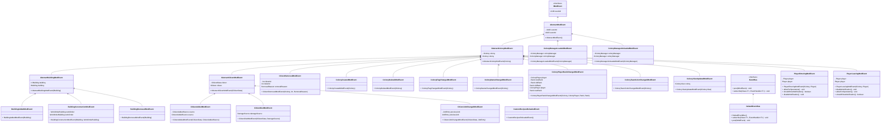

# api.eventbus

26 classes, 23 internal relationships shown.

```mermaid
classDiagram
direction BT

class AbstractBuildingModEvent {
  # AbstractBuildingModEvent(IBuilding) 
  # IBuilding building
   IBuilding building
}
class AbstractCitizenModEvent {
  # AbstractCitizenModEvent(ICitizenData) 
  - ICitizenData citizen
   ICitizen citizen
}
class AbstractColonyModEvent {
  # AbstractColonyModEvent(IColony) 
  - IColony colony
   IColony colony
}
class AbstractModEvent {
  # AbstractModEvent() 
  - UUID eventId
   UUID eventId
}
class BuildingAddedModEvent {
  + BuildingAddedModEvent(IBuilding) 
}
class BuildingConstructionModEvent {
  + BuildingConstructionModEvent(IBuilding, WorkOrderBuilding) 
  - WorkOrderBuilding workOrder
   WorkOrderBuilding workOrder
}
class BuildingRemovedModEvent {
  + BuildingRemovedModEvent(IBuilding) 
}
class CitizenAddedModEvent {
  + CitizenAddedModEvent(ICitizenData, CitizenAddedSource) 
  - CitizenAddedSource source
   CitizenAddedSource source
}
class CitizenDiedModEvent {
  + CitizenDiedModEvent(ICitizenData, DamageSource) 
   DamageSource damageSource
}
class CitizenJobChangedModEvent {
  + CitizenJobChangedModEvent(ICitizenData, JobEntry) 
  - JobEntry previousJob
   JobEntry previousJob
}
class CitizenRemovedModEvent {
  + CitizenRemovedModEvent(IColony, int, RemovalReason) 
  - int citizenId
   int citizenId
   RemovalReason removalReason
}
class ColonyCreatedModEvent {
  + ColonyCreatedModEvent(IColony) 
}
class ColonyDeletedModEvent {
  + ColonyDeletedModEvent(IColony) 
}
class ColonyFlagChangedModEvent {
  + ColonyFlagChangedModEvent(IColony) 
}
class ColonyManagerLoadedModEvent {
  + ColonyManagerLoadedModEvent(IColonyManager) 
  - IColonyManager colonyManager
   IColonyManager colonyManager
}
class ColonyManagerUnloadedModEvent {
  + ColonyManagerUnloadedModEvent(IColonyManager) 
  - IColonyManager colonyManager
   IColonyManager colonyManager
}
class ColonyNameChangedModEvent {
  + ColonyNameChangedModEvent(IColony) 
}
class ColonyPlayerRankChangedModEvent {
  + ColonyPlayerRankChangedModEvent(IColony, ColonyPlayer, Rank, Rank) 
  - ColonyPlayer player
  - Rank newRank
  - Rank oldRank
   Rank oldRank
   ColonyPlayer player
   Rank newRank
}
class ColonyTeamColorChangedModEvent {
  + ColonyTeamColorChangedModEvent(IColony) 
}
class ColonyViewUpdatedModEvent {
  + ColonyViewUpdatedModEvent(IColonyView) 
   IColonyView colony
}
class CustomRecipesReloadedEvent {
  + CustomRecipesReloadedEvent() 
}
class DefaultEventBus {
  + DefaultEventBus() 
  + subscribe(Class~T~, EventHandler~T~) void
  + post(IModEvent) void
}
class EventBus {
<<Interface>>
  + post(IModEvent) void
  + subscribe(Class~T~, EventHandler~T~) void
}
class IModEvent {
<<Interface>>
   UUID eventId
}
class PlayerEnteringModEvent {
  + PlayerEnteringModEvent(IColony, Player) 
  - Player player
  + allowForSpectators() void
  + shouldShowNotification() boolean
  + disableNotification() void
   Player player
}
class PlayerLeavingModEvent {
  + PlayerLeavingModEvent(IColony, Player) 
  - Player player
  + disableNotification() void
  + allowForSpectators() void
  + shouldShowNotification() boolean
   Player player
}

AbstractBuildingModEvent  -->  AbstractColonyModEvent 
AbstractCitizenModEvent  -->  AbstractColonyModEvent 
AbstractColonyModEvent  -->  AbstractModEvent 
AbstractModEvent  ..>  IModEvent 
BuildingAddedModEvent  -->  AbstractBuildingModEvent 
BuildingConstructionModEvent  -->  AbstractBuildingModEvent 
BuildingRemovedModEvent  -->  AbstractBuildingModEvent 
CitizenAddedModEvent  -->  AbstractCitizenModEvent 
CitizenDiedModEvent  -->  AbstractCitizenModEvent 
CitizenJobChangedModEvent  -->  AbstractCitizenModEvent 
CitizenRemovedModEvent  -->  AbstractColonyModEvent 
ColonyCreatedModEvent  -->  AbstractColonyModEvent 
ColonyDeletedModEvent  -->  AbstractColonyModEvent 
ColonyFlagChangedModEvent  -->  AbstractColonyModEvent 
ColonyManagerLoadedModEvent  -->  AbstractModEvent 
ColonyManagerUnloadedModEvent  -->  AbstractModEvent 
ColonyNameChangedModEvent  -->  AbstractColonyModEvent 
ColonyPlayerRankChangedModEvent  -->  AbstractColonyModEvent 
ColonyTeamColorChangedModEvent  -->  AbstractColonyModEvent 
ColonyViewUpdatedModEvent  -->  AbstractColonyModEvent 
DefaultEventBus  ..>  EventBus 
PlayerEnteringModEvent  -->  AbstractColonyModEvent 
PlayerLeavingModEvent  -->  AbstractColonyModEvent 
```
