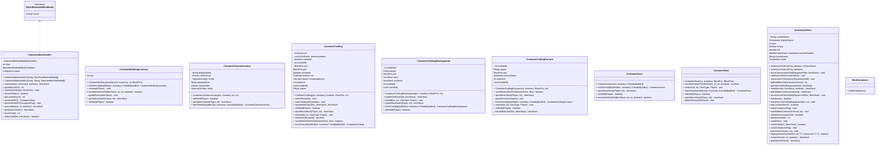

# api.inventory

12 classes, 1 internal relationships shown.

```mermaid
classDiagram
direction BT

class CombinedItemHandler {
  + CombinedItemHandler(String, IItemHandlerModifiable[]) 
  + CombinedItemHandler(String, String, IItemHandlerModifiable[]) 
  - IItemHandlerModifiable[] handlers
  + insertItem(int, ItemStack, boolean) ItemStack
  + getSlotLimit(int) int
  + setStackInSlot(int, ItemStack) void
  + equals(Object) boolean
  + getLastIndex(int) int
  + serializeNBT() CompoundTag
  + deserializeNBT(CompoundTag) void
  + extractItem(int, int, boolean) ItemStack
  + getStackInSlot(int) ItemStack
  + hashCode() int
  + isItemValid(int, ItemStack) boolean
   int slots
   IItemHandlerModifiable[] handlers
   Component name
}
class ContainerBuildingInventory {
  + ContainerBuildingInventory(int, Inventory, int, BlockPos) 
  + fromFriendlyByteBuf(int, Inventory, FriendlyByteBuf) ContainerBuildingInventory
  + removed(Player) void
  # moveItemStackTo(ItemStack, int, int, boolean) boolean
  - updateRacks(ItemStack) void
  + quickMoveStack(Player, int) ItemStack
  + stillValid(Player) boolean
   int size
}
class ContainerCitizenInventory {
  + ContainerCitizenInventory(int, Inventory, int, int) 
  - String displayName
  - ICitizen citizenData
  - Optional~Entity~ entity
  + stillValid(Player) boolean
  + quickMoveStack(Player, int) ItemStack
  + fromFriendlyByteBuf(int, Inventory, FriendlyByteBuf) ContainerCitizenInventory
   String displayName
   ICitizen citizenData
   Optional~Entity~ entity
}
class ContainerCrafting {
  + ContainerCrafting(int, Inventory, boolean, BlockPos, int) 
  - Inventory inv
  - List~ItemStack~ remainingItems
  - boolean complete
  - int moduleId
  - BlockPos pos
  + switchRecipes() void
  + slotsChanged(Container) void
  + handleSlotClick(Slot, ItemStack) ItemStack
  + stillValid(Player) boolean
  + quickMoveStack(Player, int) ItemStack
  + clicked(int, int, ClickType, Player) void
  + canSwitchRecipes() boolean
  + canTakeItemForPickAll(ItemStack, Slot) boolean
  + fromFriendlyByteBuf(int, Inventory, FriendlyByteBuf) ContainerCrafting
   BlockPos pos
   boolean complete
   CraftingContainer inv
   List~ItemStack~ remainingItems
   int moduleId
   Level worldObj
   Player player
}
class ContainerCraftingBrewingstand {
  + ContainerCraftingBrewingstand(int, Inventory, BlockPos, int) 
  - int moduleId
  - handleSlotClick(Slot, ItemStack) ItemStack
  + clicked(int, int, ClickType, Player) void
  + quickMoveStack(Player, int) ItemStack
  + fromFriendlyByteBuf(int, Inventory, FriendlyByteBuf) ContainerCraftingBrewingstand
  + stillValid(Player) boolean
   Player player
   BlockPos pos
   ItemStack input
   ItemStack container
   int moduleId
   Level worldObj
}
class ContainerCraftingFurnace {
  + ContainerCraftingFurnace(int, Inventory, BlockPos, int) 
  - int moduleId
  + canTakeItemForPickAll(ItemStack, Slot) boolean
  + quickMoveStack(Player, int) ItemStack
  - updateFurnaceOutput() void
  + fromFriendlyByteBuf(int, Inventory, FriendlyByteBuf) ContainerCraftingFurnace
  + clicked(int, int, ClickType, Player) void
  + stillValid(Player) boolean
  - handleSlotClick(Slot, ItemStack) ItemStack
   Player player
   BlockPos pos
   ItemStack furnaceInput
   int moduleId
   Level worldObj
}
class ContainerGrave {
  + ContainerGrave(int, Inventory, FriendlyByteBuf) 
  + fromFriendlyByteBuf(int, Inventory, FriendlyByteBuf) ContainerGrave
  + quickMoveStack(Player, int) ItemStack
  + stillValid(Player) boolean
  # moveItemStackTo(ItemStack, int, int, boolean) boolean
}
class ContainerRack {
  + ContainerRack(int, Inventory, BlockPos, BlockPos) 
  # moveItemStackTo(ItemStack, int, int, boolean) boolean
  + clicked(int, int, ClickType, Player) void
  + fromFriendlyByteBuf(int, Inventory, FriendlyByteBuf) ContainerRack
  + stillValid(Player) boolean
  + quickMoveStack(Player, int) ItemStack
  - updateRacks(ItemStack) void
}
class IWorldNameableModifiable {
<<Interface>>
   String? name
}
class InventoryCitizen {
  + InventoryCitizen(String, boolean, ICitizenData) 
  + InventoryCitizen(String, boolean) 
  - String customName
  + forceClearArmorInSlot(EquipmentSlot, ItemStack) void
  + setStackInSlot(int, ItemStack) void
  + moveArmorToInventory(EquipmentSlot) void
  + getHeldItemSlot(InteractionHand) int
  + getArmorInSlot(EquipmentSlot) ItemStack
  + insertItem(int, ItemStack, boolean) ItemStack
  + getHeldItem(InteractionHand) ItemStack
  + forceArmorStackToSlot(EquipmentSlot, ItemStack) void
  + hasSpace() boolean
  + transferArmorToSlot(EquipmentSlot, int) void
  + hasCustomName() boolean
  + read(CompoundTag) void
  + setHeldItem(InteractionHand, int) void
  + shrinkInventoryItem(int) boolean
  + getSlotLimit(int) int
  + markDirty() void
  + isItemValid(int, ItemStack) boolean
  + write(CompoundTag) void
  - resizeInventory(int, int) void
  + damageInventoryItem(int, int, T?, Consumer~T~?) boolean
  + extractItem(int, int, boolean) ItemStack
  + getStackInSlot(int) ItemStack
   Component displayName
   int slots
   boolean empty
   boolean full
   Iterable~ItemStack~ iterableArmorAndHandInv
   String customName
   Component name
}
class ModContainers {
  + ModContainers() 
}

CombinedItemHandler  ..>  IWorldNameableModifiable 
```
