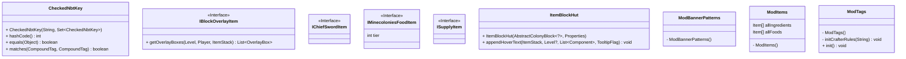

# api.items

9 classes, 0 internal relationships shown.

```mermaid
classDiagram
direction BT

class CheckedNbtKey {
  + CheckedNbtKey(String, Set~CheckedNbtKey~) 
  + hashCode() int
  + equals(Object) boolean
  + matches(CompoundTag, CompoundTag) boolean
}
class IBlockOverlayItem {
<<Interface>>
  + getOverlayBoxes(Level, Player, ItemStack) List~OverlayBox~
}
class IChiefSwordItem {
<<Interface>>

}
class IMinecoloniesFoodItem {
<<Interface>>
   int tier
}
class ISupplyItem {
<<Interface>>

}
class ItemBlockHut {
  + ItemBlockHut(AbstractColonyBlock~?~, Properties) 
  + appendHoverText(ItemStack, Level?, List~Component~, TooltipFlag) void
}
class ModBannerPatterns {
  - ModBannerPatterns() 
}
class ModItems {
  - ModItems() 
   Item[] allIngredients
   Item[] allFoods
}
class ModTags {
  - ModTags() 
  - initCrafterRules(String) void
  + init() void
}
```
