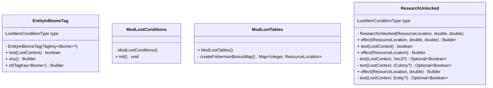

# api.loot

4 classes, 0 internal relationships shown.

```mermaid
classDiagram
direction BT

class EntityInBiomeTag {
  - EntityInBiomeTag(TagKey~Biome~?) 
  + test(LootContext) boolean
  + any() Builder
  + of(TagKey~Biome~) Builder
   LootItemConditionType type
}
class ModLootConditions {
  - ModLootConditions() 
  + init() void
}
class ModLootTables {
  + ModLootTables() 
  - createFishermanBonusMap() Map~Integer, ResourceLocation~
}
class ResearchUnlocked {
  - ResearchUnlocked(ResourceLocation, double, double) 
  + effect(ResourceLocation, double, double) Builder
  + test(LootContext) boolean
  + effect(ResourceLocation) Builder
  - test(LootContext, Vec3?) Optional~Boolean~
  - test(LootContext, IColony?) Optional~Boolean~
  + effect(ResourceLocation, double) Builder
  - test(LootContext, Entity?) Optional~Boolean~
   LootItemConditionType type
}
```
