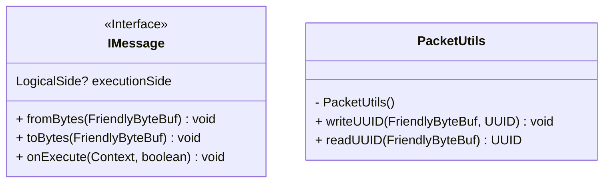

# api.network

2 classes, 0 internal relationships shown.

```mermaid
classDiagram
direction BT

class IMessage {
<<Interface>>
  + fromBytes(FriendlyByteBuf) void
  + toBytes(FriendlyByteBuf) void
  + onExecute(Context, boolean) void
   LogicalSide? executionSide
}
class PacketUtils {
  - PacketUtils() 
  + writeUUID(FriendlyByteBuf, UUID) void
  + readUUID(FriendlyByteBuf) UUID
}
```
