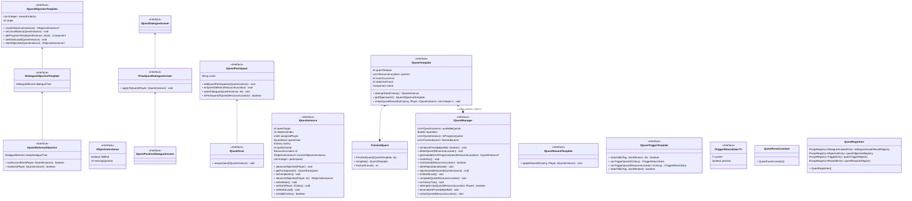

# api.quests

18 classes, 7 internal relationships shown.

```mermaid
classDiagram
direction BT

class FinishedQuest {
  + FinishedQuest(IQuestTemplate, int) 
  + template() IQuestTemplate
  + finishedCount() int
}
class IDialogueObjectiveTemplate {
<<Interface>>
   DialogueElement dialogueTree
}
class IFinalQuestDialogueAnswer {
<<Interface>>
  + applyToQuest(Player, IQuestInstance) void
}
class IObjectiveInstance {
<<Interface>>
   boolean fulfilled
   int missingQuantity
}
class IQuestDeliveryObjective {
<<Interface>>
  + tryDiscountItem(Player, IQuestInstance) boolean
  + hasItem(Player, IQuestInstance) boolean
   DialogueElement readyDialogueTree
}
class IQuestDialogueAnswer {
<<Interface>>

}
class IQuestGiver {
<<Interface>>
  + assignQuest(IQuestInstance) void
}
class IQuestInstance {
<<Interface>>
  + advanceObjective(Player) void
  + getParticipant(int) IQuestParticipant
  + onCompletion() void
  + advanceObjective(Player, int) IObjectiveInstance
  + onDeletion() void
  + onStart(Player, IColony) void
  + onWorldLoad() void
  + isValid(IColony) boolean
   int questTarget
   int objectiveIndex
   UUID assignedPlayer
   IQuestGiver questGiver
   IColony colony
   int questGiverId
   ResourceLocation id
   IObjectiveInstance? currentObjectiveInstance
   List~Integer~ participants
}
class IQuestManager {
<<Interface>>
  + serialize(FriendlyByteBuf, boolean) void
  + deleteQuest(ResourceLocation) void
  + getAvailableOrInProgressQuest(ResourceLocation) IQuestInstance?
  + markDirty() void
  + isUnlocked(ResourceLocation) boolean
  + alterReputation(double) void
  + injectAvailableQuest(IQuestInstance) void
  + onWorldLoad() void
  + completeQuest(ResourceLocation) void
  + onColonyTick() void
  + attemptAcceptQuest(ResourceLocation, Player) boolean
  + deserialize(FriendlyByteBuf) void
  + unlockQuest(ResourceLocation) void
   List~IQuestInstance~ availableQuests
   double reputation
   List~IQuestInstance~ inProgressQuests
   List~FinishedQuest~ finishedQuests
}
class IQuestObjectiveTemplate {
<<Interface>>
  + createObjectiveInstance() IObjectiveInstance?
  + onCancellation(IQuestInstance) void
  + getProgressText(IQuestInstance, Style) Component
  + onWorldLoad(IQuestInstance) void
  + startObjective(IQuestInstance) IObjectiveInstance?
   List~Integer~ rewardUnlocks
   int target
}
class IQuestParticipant {
<<Interface>>
  + addQuestParticipation(IQuestInstance) void
  + onQuestDeletion(ResourceLocation) void
  + openDialogue(IQuestInstance, int) void
  + isParticipantOfQuest(ResourceLocation) boolean
   String name
}
class IQuestPositiveDialogueAnswer {
<<Interface>>

}
class IQuestRewardTemplate {
<<Interface>>
  + applyReward(IColony, Player, IQuestInstance) void
}
class IQuestTemplate {
<<Interface>>
  + attemptStart(IColony) IQuestInstance
  + getObjective(int) IQuestObjectiveTemplate
  + unlockQuestRewards(IColony, Player, IQuestInstance, List~Integer~) void
   int questTimeout
   List~ResourceLocation~ parents
   int maxOccurrence
   int objectiveCount
   Component name
}
class IQuestTriggerTemplate {
<<Interface>>
  + matchNbt(Tag, JsonElement, int) boolean
  + canTriggerQuest(IColony) ITriggerReturnData
  + canTriggerQuest(ResourceLocation, IColony) ITriggerReturnData
  + matchNbt(Tag, JsonElement) boolean
}
class ITriggerReturnData~T~ {
<<Interface>>
   T content
   boolean positive
}
class QuestParseConstant {
  + QuestParseConstant() 
}
class QuestRegistries {
  + QuestRegistries() 
   IForgeRegistry~DialogueAnswerEntry~ dialogueAnswerResultRegistry
   IForgeRegistry~ObjectiveEntry~ questObjectiveRegistry
   IForgeRegistry~TriggerEntry~ questTriggerRegistry
   IForgeRegistry~RewardEntry~ questRewardsRegistry
}

FinishedQuest "1" *--> "template 1" IQuestTemplate 
IDialogueObjectiveTemplate  -->  IQuestObjectiveTemplate 
IFinalQuestDialogueAnswer  -->  IQuestDialogueAnswer 
IQuestDeliveryObjective  -->  IDialogueObjectiveTemplate 
IQuestGiver  -->  IQuestParticipant 
IQuestManager "1" *--> "GLOBAL_SERVER_QUESTS *" IQuestTemplate 
IQuestPositiveDialogueAnswer  -->  IFinalQuestDialogueAnswer 
```
