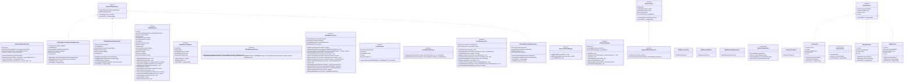

# api.research

27 classes, 7 internal relationships shown.

```mermaid
classDiagram
direction BT

class AbstractResearchProvider {
  + AbstractResearchProvider(PackOutput) 
  # generateAll(CachedOutput, JsonObject) CompletableFuture~?~
  + run(CachedOutput) CompletableFuture~?~
  - addLanguageKeySafe(JsonElement, String, String) void
   String name
   Collection~ResearchBranch~ researchBranchCollection
   Collection~ResearchEffect~ researchEffectCollection
   Collection~Research~ researchCollection
}
class BuildingAlternatesResearchRequirement {
  + BuildingAlternatesResearchRequirement(CompoundTag) 
  + BuildingAlternatesResearchRequirement(JsonObject) 
  - Set~ResourceLocation~ buildings
  - int buildingLevel
  + isFulfilled(IColony) boolean
  + writeToNBT() CompoundTag
   ResearchRequirementEntry registryEntry
   Set~ResourceLocation~ buildings
   MutableComponent desc
   int buildingLevel
}
class BuildingResearchRequirement {
  + BuildingResearchRequirement(JsonObject) 
  + BuildingResearchRequirement(CompoundTag) 
  - ResourceLocation building
  - int buildingLevel
  + isFulfilled(IColony) boolean
  + parseFallbackBuildingKey(String) ResourceLocation
  + writeToNBT() CompoundTag
   ResearchRequirementEntry registryEntry
   MutableComponent desc
   ResourceLocation building
   int buildingLevel
}
class IGlobalResearch {
<<Interface>>
  + addChild(IGlobalResearch) void
  + addEffect(IResearchEffect) void
  + canResearch(IBuilding, ILocalResearchTree) boolean
  + isPlayerResearchMatch(ItemStack, Item) boolean
  + addRequirement(IResearchRequirement) void
  + canDisplay(int) boolean
  + hasEnoughResources(Player, BlockPos) boolean
  + addChild(ResourceLocation) void
  + isUniversityResearchMatch(ItemStack, Item) boolean
  + hasResearchedChild(ILocalResearchTree) boolean
  + startResearch(ILocalResearchTree) void
  + hasOnlyChild() boolean
  + addCost(IResearchCost) void
   int depth
   List~IResearchRequirement~ researchRequirements
   ResourceLocation branch
   boolean hidden
   TranslatableContents subtitle
   List~IResearchCost~ costList
   int sortOrder
   ResourceLocation? parent
   boolean autostart
   boolean instant
   List~ResourceLocation~ children
   TranslatableContents name
   boolean immutable
   ResourceLocation id
   List~IResearchEffect~ effects
}
class IGlobalResearchBranch {
<<Interface>>
  + getHoursTime(int) double
  + getBaseTime(int) int
  + writeToNBT() CompoundTag
   int sortOrder
   boolean hidden
   TranslatableContents subtitle
   TranslatableContents name
   ResearchBranchType type
}
class IGlobalResearchFactory {
<<Interface>>
  + getNewInstance(IFactoryController, FactoryVoidInput, Object[]) IGlobalResearch
  + getNewInstance(ResourceLocation, ResourceLocation, ResourceLocation, TranslatableContents, TranslatableContents, int, int, boolean, boolean, boolean, boolean, boolean) IGlobalResearch
}
class IGlobalResearchTree {
<<Interface>>
  + hasResearch(ResourceLocation) boolean
  + addBranchData(ResourceLocation, IGlobalResearchBranch) void
  + isResearchRequirementsFulfilled(List~IResearchRequirement~, IColony) boolean
  + getResearch(ResourceLocation) IGlobalResearch?
  + sendGlobalResearchTreePackets(ServerPlayer) void
  + hasResearch(ResourceLocation, ResourceLocation) boolean
  + addResearch(ResourceLocation, IGlobalResearch, boolean) void
  + getResearch(ResourceLocation, ResourceLocation) IGlobalResearch?
  + getResearchForEffect(ResourceLocation) Set~IGlobalResearch~?
  + reset() void
  + getPrimaryResearch(ResourceLocation) List~ResourceLocation~
  + handleGlobalResearchTreeMessage(FriendlyByteBuf) IMessage
  + getEffectsForResearch(ResourceLocation) List~IResearchEffect~
  + hasResearchEffect(ResourceLocation) boolean
  + getBranchData(ResourceLocation) IGlobalResearchBranch
   List~ItemStorage~ researchResetCosts
   List~ResourceLocation~ branches
   Set~IGlobalResearch~ autostartResearches
   IGlobalResearchTree instance
}
class ILocalResearch {
<<Interface>>
  + research(IResearchEffectManager, ILocalResearchTree) boolean
   ResourceLocation branch
   int progress
   ResearchState state
   int depth
   ResourceLocation id
}
class ILocalResearchFactory {
<<Interface>>
  + getNewInstance(ResourceLocation, ResourceLocation, int) ILocalResearch
  + getNewInstance(IFactoryController, FactoryVoidInput, Object[]) ILocalResearch
}
class ILocalResearchTree {
<<Interface>>
  + writeToNBT(CompoundTag) void
  + getResearch(ResourceLocation, ResourceLocation) ILocalResearch
  + isComplete(ResourceLocation) boolean
  + addResearch(ResourceLocation, ILocalResearch) void
  + attemptResetResearch(Player, IColony?, ILocalResearch) void
  + branchFinishedHighestLevel(ResourceLocation) boolean
  + finishResearch(ResourceLocation) void
  + readFromNBT(CompoundTag, IResearchEffectManager) void
  + attemptBeginResearch(Player, IColony, BuildingUniversity, IGlobalResearch) void
  + hasCompletedResearch(ResourceLocation) boolean
   List~ResourceLocation~ completedList
   List~ILocalResearch~ researchInProgress
}
class IResearchCost {
<<Interface>>
  + writeToNBT() CompoundTag
   Component translatedName
   ResearchCostEntry type
   List~Item~ items
   int count
}
class IResearchEffect {
<<Interface>>
  + overrides(IResearchEffect) boolean
  + writeToNBT() CompoundTag
   double effect
   TranslatableContents subtitle
   TranslatableContents name
   ResourceLocation id
   ResearchEffectEntry registryEntry
}
class IResearchEffectFactory~T~ {
<<Interface>>
  + getNewInstance(String, Object) T
  + getNewInstance(IFactoryController, FactoryVoidInput, Object[]) T
}
class IResearchEffectManager {
<<Interface>>
  + applyEffect(IResearchEffect) void
  + getEffectStrength(ResourceLocation) double
  + removeAllEffects() void
}
class IResearchManager {
<<Interface>>
  + markDirty() void
  + sendPackets(Set~ServerPlayer~, Set~ServerPlayer~) void
  + clearDirty() void
  + readFromNBT(CompoundTag) void
  + checkAutoStartResearch() void
  + getResearchEffectIdFrom(Block) ResourceLocation
  + writeToNBT(CompoundTag) void
   boolean dirty
   ILocalResearchTree researchTree
   IResearchEffectManager researchEffects
}
class IResearchRequirement {
<<Interface>>
  + isFulfilled(IColony) boolean
  + writeToNBT() CompoundTag
   ResearchRequirementEntry registryEntry
   MutableComponent desc
}
class ListItemCost {
  + ListItemCost(CompoundTag) 
  + ListItemCost(JsonObject) 
  - List~Item~ items
  - int count
  + writeToNBT() CompoundTag
   ResearchCostEntry type
   List~Item~ items
   int count
}
class ModResearchCosts {
  - ModResearchCosts() 
}
class ModResearchEffects {
  + ModResearchEffects() 
}
class ModResearchRequirements {
  - ModResearchRequirements() 
}
class ResearchBranchType {
<<enumeration>>
  - ResearchBranchType(String) 
  + values() ResearchBranchType[]
  + valueOfTag(String) ResearchBranchType
  + valueOf(String) ResearchBranchType
}
class ResearchConstants {
  - ResearchConstants() 
}
class ResearchResearchRequirement {
  + ResearchResearchRequirement(JsonObject) 
  + ResearchResearchRequirement(CompoundTag) 
  - ResourceLocation researchId
  + writeToNBT() CompoundTag
  + isFulfilled(IColony) boolean
   ResearchRequirementEntry registryEntry
   MutableComponent desc
   ResourceLocation researchId
}
class ResearchState {
<<enumeration>>
  + ResearchState() 
  + values() ResearchState[]
  + valueOf(String) ResearchState
}
class SimpleItemCost {
  + SimpleItemCost(JsonObject) 
  + SimpleItemCost(CompoundTag) 
  - int count
  + writeToNBT() CompoundTag
   ResearchCostEntry type
   List~Item~ items
   int count
}
class TagItemCost {
  + TagItemCost(JsonObject) 
  + TagItemCost(CompoundTag) 
  - int count
  + writeToNBT() CompoundTag
   Component translatedName
   ResearchCostEntry type
   List~Item~ items
   int count
}

BuildingAlternatesResearchRequirement  ..>  IResearchRequirement 
BuildingResearchRequirement  ..>  IResearchRequirement 
IResearchEffectFactory~T~  ..>  IResearchEffect 
ListItemCost  ..>  IResearchCost 
ResearchResearchRequirement  ..>  IResearchRequirement 
SimpleItemCost  ..>  IResearchCost 
TagItemCost  ..>  IResearchCost 
```
