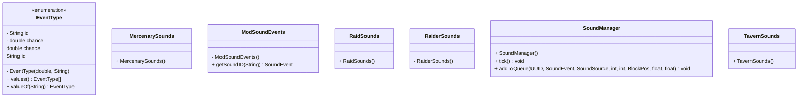

# api.sounds

7 classes, 0 internal relationships shown.

```mermaid
classDiagram
direction BT

class EventType {
<<enumeration>>
  - EventType(double, String) 
  - String id
  - double chance
  + values() EventType[]
  + valueOf(String) EventType
   double chance
   String id
}
class MercenarySounds {
  + MercenarySounds() 
}
class ModSoundEvents {
  - ModSoundEvents() 
  + getSoundID(String) SoundEvent
}
class RaidSounds {
  + RaidSounds() 
}
class RaiderSounds {
  - RaiderSounds() 
}
class SoundManager {
  + SoundManager() 
  + tick() void
  + addToQueue(UUID, SoundEvent, SoundSource, int, int, BlockPos, float, float) void
}
class TavernSounds {
  + TavernSounds() 
}
```
