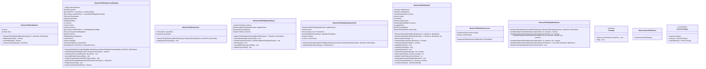

# api.tileentities

11 classes, 0 internal relationships shown.

```mermaid
classDiagram
direction BT

class AbstractTileEntityBarrel {
  + AbstractTileEntityBarrel(BlockEntityType~?~, BlockPos, BlockState) 
  + addItem(ItemStack) boolean
  + checkIfWorking() boolean
  + retrieveCompost(double) ItemStack
   int items
   boolean done
}
class AbstractTileEntityColonyBuilding {
  + AbstractTileEntityColonyBuilding(BlockEntityType~AbstractTileEntityColonyBuilding~, BlockPos, BlockState) 
  - String schematicName
  + isInTileEntity(ICapabilityProvider, Predicate~ItemStack~) boolean
  + setSchematicCorners(BlockPos, BlockPos) void
  + saveAdditional(CompoundTag) void
  + readSchematicDataFromNBT(CompoundTag) void
  + getPositionOfChestWithItemStack(Predicate~ItemStack~) BlockPos?
  + load(CompoundTag) void
  + hasAccessPermission(Player) boolean
   BlockPos position
   Map~BlockPos, List~String~~ positionedTags
   Map~String, List~BlockPos~~ cachedWorldTagNamePosMap
   String schematicName
   String blueprintPath
   IBuilding building
   int colonyId
   IColony colony
   boolean mirrored
   Map~String, Set~BlockPos~~ worldTagNamePosMap
   ResourceLocation buildingName
   BlockPos tilePos
   IBuildingView buildingView
   boolean mirror
   boolean outdated
   StructurePackMeta structurePack
   Tuple~BlockPos, BlockPos~ schematicCorners
}
class AbstractTileEntityGrave {
  + AbstractTileEntityGrave(BlockEntityType~AbstractTileEntityGrave~, BlockPos, BlockState) 
  # IGraveData? graveData
  + delayDecayTimer(double) void
   IGraveData graveData
}
class AbstractTileEntityNamedGrave {
  + AbstractTileEntityNamedGrave(BlockEntityType~?~, BlockPos, BlockState) 
  - ArrayList~String~ textLines
  + handleUpdateTag(CompoundTag) void
  + onDataPacket(Connection, ClientboundBlockEntityDataPacket) void
  + setChanged() void
  + saveAdditional(CompoundTag) void
  + load(CompoundTag) void
   ClientboundBlockEntityDataPacket? updatePacket
   CompoundTag updateTag
   ArrayList~String~ textLines
}
class AbstractTileEntityPlantationField {
  # AbstractTileEntityPlantationField(BlockEntityType~AbstractTileEntityPlantationField~, BlockPos, BlockState) 
  + getWorkingPositions(String) List~BlockPos~
   ClientboundBlockEntityDataPacket? updatePacket
   boolean mirror
   ResourceKey~Level~? dimension
   Set~BuildingExtensionEntry~ plantationFieldTypes
   Rotation rotation
   IColony currentColony
}
class AbstractTileEntityRack {
  + AbstractTileEntityRack(BlockEntityType~?~, BlockPos, BlockState) 
  + AbstractTileEntityRack(BlockEntityType~?~, BlockPos, BlockState, int) 
  # boolean inWarehouse
  # BlockPos buildingPos
  # ItemStackHandler inventory
  + getCount(ItemStorage) int
  + hasItemStack(Predicate~ItemStack~) boolean
  + hasSimilarStack(ItemStack) boolean
  # updateBlockState() void
  + updateItemStorage() void
  + upgradeRackSize() void
  + hasItemStorage(ItemStorage, int) boolean
  + getCount(ItemStack, boolean, boolean) int
  + getItemCount(Predicate~ItemStack~) int
  + updateWarehouseIfAvailable(ItemStack) void
  + hasItemStack(ItemStack, int, boolean) boolean
  + createInventory(int) ItemStackHandler
   boolean empty
   int freeSlots
   Boolean inWarehouse
   IItemHandlerModifiable inventory
   int upgradeSize
   BlockPos buildingPos
   AbstractTileEntityRack otherChest
}
class AbstractTileEntityScarecrow {
  # AbstractTileEntityScarecrow(BlockPos, BlockState) 
   ScareCrowType scarecrowType
   IColony currentColony
}
class AbstractTileEntityWareHouse {
  + AbstractTileEntityWareHouse(BlockEntityType~AbstractTileEntityWareHouse~, BlockPos, BlockState) 
  + hasMatchingItemStackInWarehouse(ItemStack, int, boolean) boolean
  + hasMatchingItemStackInWarehouse(Predicate~ItemStack~, int) boolean
  + hasMatchingItemStackInWarehouse(ItemStack, int, boolean, boolean, int) boolean
  + hasMatchingItemStackInWarehouse(ItemStack, int, boolean, int) boolean
  + getMatchingItemStacksInWarehouse(Predicate~ItemStack~) List~Tuple~ItemStack, BlockPos~~
  + dumpInventoryIntoWareHouse(InventoryCitizen) void
}
class ITickable {
<<Interface>>
  + tick(Level, BlockState, BlockPos) void
  + tick() void
}
class MinecoloniesTileEntities {
  + MinecoloniesTileEntities() 
}
class ScareCrowType {
<<enumeration>>
  + ScareCrowType() 
  + values() ScareCrowType[]
  + valueOf(String) ScareCrowType
}
```
