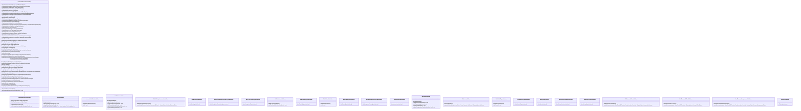

# apiimp

26 classes, 1 internal relationships shown.

```mermaid
classDiagram
direction BT

class ClientMinecoloniesAPIImpl {
  + ClientMinecoloniesAPIImpl() 
  - IModelTypeRegistry modelTypeRegistry
  + onRegistryNewRegistry(NewRegistryEvent) void
   IModelTypeRegistry modelTypeRegistry
}
class CommonMinecoloniesAPIImpl {
  + CommonMinecoloniesAPIImpl() 
  - IForgeRegistry~ObjectiveEntry~ questObjectiveRegistry
  - IForgeRegistry~BuildingExtensionEntry~ buildingExtensionRegistry
  - IForgeRegistry~TriggerEntry~ questTriggerRegistry
  - IForgeRegistry~RewardEntry~ questRewardRegistry
  - IForgeRegistry~JobEntry~ jobRegistry
  - IForgeRegistry~ResearchEffectEntry~ researchEffectRegistry
  - IForgeRegistry~ResearchRequirementEntry~ researchRequirementRegistry
  - IForgeRegistry~ColonyEventTypeRegistryEntry~ colonyEventRegistry
  - IColonyManager colonyManager
  - IMobAIRegistry mobAIRegistry
  - IPathNavigateRegistry pathNavigateRegistry
  - IForgeRegistry~EquipmentTypeEntry~ equipmentTypeRegistry
  - ICitizenDataManager citizenDataManager
  - IForgeRegistry~BuildingEntry~ buildingRegistry
  - IForgeRegistry~ColonyEventDescriptionTypeRegistryEntry~ colonyEventDescriptionRegistry
  - IForgeRegistry~CraftingType~ craftingTypeRegistry
  - IJobDataManager jobDataManager
  - IGuardTypeDataManager guardTypeDataManager
  - IForgeRegistry~GuardType~ guardTypeRegistry
  - IBuildingDataManager buildingDataManager
  - IForgeRegistry~ResearchCostEntry~ researchCostRegistry
  - IGlobalResearchTree globalResearchTree
  - IForgeRegistry~DialogueAnswerEntry~ questDialogueAnswerRegistry
  - IForgeRegistry~HappinessFunctionEntry~ happinessFunctionRegistry
  - EventBus eventBus
  + onRegistryNewRegistry(NewRegistryEvent) void
   IForgeRegistry~ResearchEffectEntry~ researchEffectRegistry
   ICitizenDataManager citizenDataManager
   IForgeRegistry~JobEntry~ jobRegistry
   IGlobalResearchTree globalResearchTree
   IForgeRegistry~ResearchCostEntry~ researchCostRegistry
   IColonyManager colonyManager
   IModelTypeRegistry modelTypeRegistry
   IForgeRegistry~ColonyEventTypeRegistryEntry~ colonyEventRegistry
   IPathNavigateRegistry pathNavigateRegistry
   Configuration config
   IForgeRegistry~HappinessFunctionEntry~ happinessFunctionRegistry
   IForgeRegistry~ObjectiveEntry~ questObjectiveRegistry
   IForgeRegistry~InteractionResponseHandlerEntry~ interactionResponseHandlerRegistry
   IInteractionResponseHandlerDataManager interactionResponseHandlerDataManager
   IForgeRegistry~GuardType~ guardTypeRegistry
   IForgeRegistry~HappinessFactorTypeEntry~ happinessTypeRegistry
   EventBus eventBus
   IForgeRegistry~TriggerEntry~ questTriggerRegistry
   IForgeRegistry~CraftingType~ craftingTypeRegistry
   IForgeRegistry~BuildingEntry~ buildingRegistry
   IForgeRegistry~RecipeTypeEntry~ recipeTypeRegistry
   IForgeRegistry~ColonyEventDescriptionTypeRegistryEntry~ colonyEventDescriptionRegistry
   IMobAIRegistry mobAIRegistry
   IForgeRegistry~DialogueAnswerEntry~ questDialogueAnswerRegistry
   IGuardTypeDataManager guardTypeDataManager
   IForgeRegistry~EquipmentTypeEntry~ equipmentTypeRegistry
   IForgeRegistry~ResearchRequirementEntry~ researchRequirementRegistry
   IBuildingDataManager buildingDataManager
   IForgeRegistry~RewardEntry~ questRewardRegistry
   IFurnaceRecipes furnaceRecipes
   IJobDataManager jobDataManager
   IForgeRegistry~BuildingExtensionEntry~ buildingExtensionRegistry
}
class EntityInitializer {
  + EntityInitializer() 
  + registerEntities(RegisterEvent) void
  + setupEntities(RegisterEvent) void
  - build(IForgeRegistry~EntityType~?~~, String, Builder~T~) EntityType~T~
}
class InteractionValidatorInitializer {
  + InteractionValidatorInitializer() 
  + init() void
}
class ModBlocksInitializer {
  - ModBlocksInitializer() 
  - registerCompostItems() void
  + registerBlocks(RegisterEvent) void
  + init(IForgeRegistry~Block~) void
  + registerBlockItem(IForgeRegistry~Item~) void
  + registerItems(RegisterEvent) void
}
class ModBuildingExtensionsInitializer {
  - ModBuildingExtensionsInitializer() 
  - createEntry(ResourceLocation, Consumer~Builder~) RegistryObject~BuildingExtensionEntry~
}
class ModBuildingsInitializer {
  - ModBuildingsInitializer() 
}
class ModColonyEventDescriptionTypeInitializer {
  - ModColonyEventDescriptionTypeInitializer() 
}
class ModColonyEventTypeInitializer {
  - ModColonyEventTypeInitializer() 
}
class ModContainerInitializers {
  + ModContainerInitializers() 
  + doClientStuff(FMLClientSetupEvent) void
}
class ModCraftingTypesInitializer {
  - ModCraftingTypesInitializer() 
}
class ModEnchantInitializer {
  + ModEnchantInitializer() 
  + init() void
}
class ModGuardTypesInitializer {
  - ModGuardTypesInitializer() 
}
class ModHappinessFactorTypeInitializer {
  - ModHappinessFactorTypeInitializer() 
}
class ModInteractionsInitializer {
  - ModInteractionsInitializer() 
}
class ModItemsInitializer {
  - ModItemsInitializer() 
  + registerItems(RegisterEvent) void
  + init(IForgeRegistry~Item~) void
  - registerCompostItems() void
  - registerCompostItemFromNutrition(Item, float) void
}
class ModJobsInitializer {
  - ModJobsInitializer() 
  - register(DeferredRegister~JobEntry~, String, Supplier~JobEntry~) RegistryObject~JobEntry~
}
class ModModelTypeInitializer {
  - ModModelTypeInitializer() 
  + init(Context) void
}
class ModParticleTypesInitializer {
  + ModParticleTypesInitializer() 
}
class ModQuestInitializer {
  - ModQuestInitializer() 
}
class ModRecipeSerializerInitializer {
  - ModRecipeSerializerInitializer() 
}
class ModRecipeTypesInitializer {
  - ModRecipeTypesInitializer() 
}
class ModResearchCostInitializer {
  - ModResearchCostInitializer() 
  - create(ResourceLocation, ReadFromNBTFunction, ReadFromJsonFunction) RegistryObject~ResearchCostEntry~
}
class ModResearchEffectInitializer {
  - ModResearchEffectInitializer() 
  - create(ResourceLocation, ReadFromNBTFunction) RegistryObject~ResearchEffectEntry~
}
class ModResearchRequirementInitializer {
  - ModResearchRequirementInitializer() 
  - create(ResourceLocation, ReadFromNBTFunction, ReadFromJsonFunction) RegistryObject~ResearchRequirementEntry~
}
class TileEntityInitializer {
  + TileEntityInitializer() 
}

ClientMinecoloniesAPIImpl  -->  CommonMinecoloniesAPIImpl 
```
