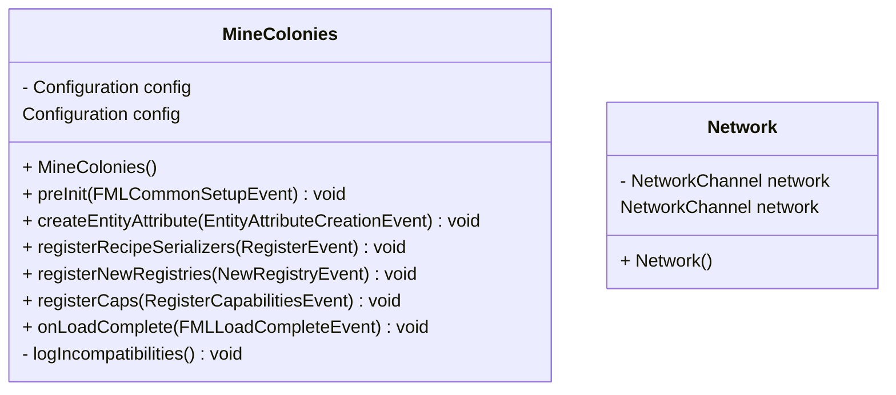

# core

2 classes, 0 internal relationships shown.

```mermaid
classDiagram
direction BT

class MineColonies {
  + MineColonies() 
  - Configuration config
  + preInit(FMLCommonSetupEvent) void
  + createEntityAttribute(EntityAttributeCreationEvent) void
  + registerRecipeSerializers(RegisterEvent) void
  + registerNewRegistries(NewRegistryEvent) void
  + registerCaps(RegisterCapabilitiesEvent) void
  + onLoadComplete(FMLLoadCompleteEvent) void
  - logIncompatibilities() void
   Configuration config
}
class Network {
  + Network() 
  - NetworkChannel network
   NetworkChannel network
}
```
