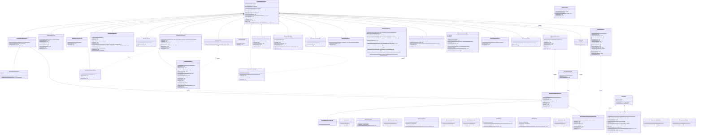

# core.client (cont. 2)

43 classes, 38 internal relationships shown.

```mermaid
classDiagram
direction BT

class AbstractBuildingMainWindow~B~ {
  + AbstractBuildingMainWindow(B, ResourceLocation) 
  + onOpened() void
  - inventoryClicked() void
  - updateButtonBuild(IBuildingView) void
  - buildClicked() void
  - infoClicked() void
  - editName() void
  - allInventoryClicked() void
  + onUpdate() void
}
class AbstractBuildingWindow~B~ {
  + AbstractBuildingWindow(BOWindow, B, ResourceLocation) 
  + AbstractBuildingWindow(B, ResourceLocation) 
  + setPage(boolean, int) void
  # shouldRenderDefaultSidebar() boolean
}
class AbstractModuleWindow~T~ {
  + AbstractModuleWindow(T, ResourceLocation) 
  + AbstractModuleWindow(BOWindow, T, ResourceLocation) 
   MutableComponent? header
}
class AbstractWindowSkeleton {
  + AbstractWindowSkeleton(ResourceLocation) 
  + AbstractWindowSkeleton(BOWindow?, ResourceLocation) 
  - List~IWindowModule~ modules
  + onClosed() void
  + registerButton(String, Runnable) void
  + onOpened() void
  + onButtonClicked(Button) void
  + registerModule(BiFunction~AbstractWindowSkeleton, A, T~, A) T
  + doNothing(Button) void
  + registerButton(String, Consumer~Button~) void
  + onUpdate() void
  + setPage(boolean, int) void
  + close() void
  + registerLayoutModule(BiFunction~AbstractWindowSkeleton, A, T~, A, int, int) T
   List~IWindowModule~ modules
   Class~IWindowModule~ classType
}
class AbstractWindowWorkerModuleBuilding~B~ {
  # AbstractWindowWorkerModuleBuilding(B, ResourceLocation) 
  - forcePickup() void
  + onOpened() void
  - updatePriorityLabel() void
  - deliveryPriorityUp() void
  - deliveryPriorityDown() void
  # hireClicked(Button) void
  - recallClicked() void
}
class ColorPalette {
  + ColorPalette(int, int, int, IWidgetAdder) 
  + ColorPalette(Screen, IWidgetAdder) 
  # DyeColor selected
   DyeColor selected
}
class ModelAmazon {
  + ModelAmazon(ModelPart) 
  + createMesh() LayerDefinition
}
class ModelAmazonChief {
  + ModelAmazonChief(ModelPart) 
  + createMesh() LayerDefinition
  + setRotationAngle(ModelPart, float, float, float) void
}
class ModelAmazonSpearman {
  + ModelAmazonSpearman(ModelPart) 
  + createMesh() LayerDefinition
}
class ModelArcherMummy {
  + ModelArcherMummy(ModelPart) 
  + createMesh() LayerDefinition
  + setRotateAngle(ModelPart, float, float, float) void
  + setupAnim(AbstractEntityMinecoloniesMonster, float, float, float, float, float) void
}
class ModelArcherNorsemen {
  + ModelArcherNorsemen(ModelPart) 
  + createMesh() LayerDefinition
}
class ModelChiefNorsemen {
  + ModelChiefNorsemen(ModelPart) 
  + createMesh() LayerDefinition
}
class ModelMummy {
  + ModelMummy(ModelPart) 
  + setupAnim(AbstractEntityMinecoloniesMonster, float, float, float, float, float) void
  + createMesh() LayerDefinition
  + setRotateAngle(ModelPart, float, float, float) void
}
class ModelPharaoh {
  + ModelPharaoh(ModelPart) 
  + createMesh() LayerDefinition
  - sinPi(float) float
  + setupAnim(AbstractEntityMinecoloniesMonster, float, float, float, float, float) void
}
class ModelShieldmaiden {
  + ModelShieldmaiden(ModelPart) 
  + createMesh() LayerDefinition
}
class WindowAssignCitizen {
  + WindowAssignCitizen(IColonyView, LivingBuildingView) 
  - setupSettings(Button) void
  - fireClicked(Button) void
  - modeClicked(Button) void
  - cancelClicked(Button) void
  - hireClicked(Button) void
  - switchHiringMode(Button) void
  + onOpened() void
  - updateCitizens() void
}
class WindowBannerPicker {
  + WindowBannerPicker(IColonyView, AbstractWindowTownHall, AtomicBoolean) 
  - drawBannerPattern(Holder~BannerPattern~, int, int) void
  # createPatternButtons() void
  # createLayerButtons() void
  + mouseScrolled(double, double, double) boolean
  - drawFlag() void
  + mouseDragged(double, double, int, double, double) boolean
  + setLayer(Holder~BannerPattern~?, DyeColor) void
  # init() void
  + render(GuiGraphics, int, int, float) void
  + renderBanner(PoseStack, List~Pair~Holder~BannerPattern~, DyeColor~~) void
  # createCloseButtons() void
  + mouseClicked(double, double, int) boolean
  + center(int, int, int, int, int) int
}
class WindowBannerRallyGuards {
  + WindowBannerRallyGuards(ItemStack) 
  - rallyClicked(Button) void
  + onOpened() void
  - removeClicked(Button) void
}
class WindowBuildBuilding {
  + WindowBuildBuilding(IColonyView, IBuildingView) 
  - updateStyles() void
  - updateResources() void
  + onUpdate() void
  - triggerConfirmAction(BlockPos) void
  - initBuilderNavigation() void
  - cancelClicked() void
  + addNeededResource(ItemStack?, int) void
  - confirmClicked() void
  - deconstructBuildingClicked() void
  - initStyleNavigation() void
  - pickUpBuilding() void
  - previousStyle() void
  - nextStyle() void
  - repairClicked() void
  + canBeUpgraded() boolean
  - updateBuilders() void
  - onStyleDropDownChanged(DropDownList) void
  + onOpened() void
  + updateResourceList() void
}
class WindowBuildDecoration {
  + WindowBuildDecoration(BlockPos, String, String, Rotation, boolean, Function~BlockPos, IMessage~) 
  + onOpened() void
  + onUpdate() void
  - initBuilderNavigation() void
  - updateResources() void
  + addNeededResource(ItemStack?, int) void
  - updateBuilders() void
  + updateResourceList() void
  - confirmedBuild() void
}
class WindowBuildingBrowser {
  + WindowBuildingBrowser(Block) 
  + onClosed() void
  + onUpdate() void
  - formatLevels(Set~Integer~) Component
  + onOpened() void
  + clearCache() void
  - discoverBuildings(StructurePackMeta, List~Block~) Map~Block, List~BuildingInfo~~
  - classifyBlueprint(StructurePackMeta, Map~Block, List~BuildingInfo~~, Blueprint, BlockState, Block) void
  - displayBuildings() void
  - discoverBuildings() List~BuildingInfo~
  - rebuildCache() void
  - findBrowsableBlocks() List~Block~
}
class WindowClipBoard {
  + WindowClipBoard(IColonyView, boolean) 
  - paintButtonState() void
  - toggleImportant() void
}
class WindowConfirm {
  + WindowConfirm(AbstractWindowSkeleton, Runnable, String, String) 
}
class WindowDecorationController {
  + WindowDecorationController(BlockPos) 
  - cancelClicked() void
  - buildClicked() void
  - repairClicked() void
}
class WindowHireWorker {
  + WindowHireWorker(IColonyView, BlockPos) 
  # updateCitizens() void
  - switchHiringMode(Button) void
  # showEmployedToggled(Button) void
  # getCitizenPriority(ICitizenDataView) int
  - fireClicked(Button) void
  + setupJobButtons() void
  - pauseClicked(Button) void
  - cancelClicked(Button) void
  - setupShowEmployed() void
  - setupSettings(Button) void
  - modeClicked(Button) void
  # createColor(Skill, Skill, Skill) Style
  - canAssign(ICitizenDataView) boolean
  - restartClicked(Button) void
  - doneClicked(Button) void
  + onOpened() void
  - setupDescription(boolean) void
  - jobClicked(Button) void
}
class WindowHutAllInventory {
  + WindowHutAllInventory(IBuildingView, BOWindow) 
  + onUpdate() void
  - locate(Button) void
  - updateResourceList() void
  - updateResources() void
  - getString(ItemStack) String
  - back() void
  - setSortFlag() void
}
class WindowHutGuide {
  + WindowHutGuide(View) 
  - closeGuide() void
}
class WindowHutMinPlaceholder~B~ {
  + WindowHutMinPlaceholder(B) 
}
class WindowHutNameEntry {
  + WindowHutNameEntry(IBuildingView) 
  + onOpened() void
  + onButtonClicked(Button) void
}
class WindowInfo {
  + WindowInfo(IBuildingView) 
}
class WindowInteraction {
  + WindowInteraction(ICitizenDataView) 
  + onClosed() void
  + onButtonClicked(Button) void
  - setupInteraction() void
  - cancelClicked() void
  + onOpened() void
}
class WindowPlantationField {
  + WindowPlantationField(AbstractTileEntityPlantationField) 
  + onOpened() void
  - repairField() void
  - updateElementStates() void
  + onUpdate() void
   IColonyView? currentColony
}
class WindowPostBoxMain {
  + WindowPostBoxMain(View) 
  - updateResources() void
  + onUpdate() void
  - deliverPartialClicked(Button) void
  - inventoryClicked() void
  - requestClicked(Button) void
  + registerPostboxTabs(AbstractWindowSkeleton, IBuildingView) void
  + onOpened() void
}
class WindowPostBoxMinStock {
  + WindowPostBoxMinStock(IMinimumStockModuleView) 
  # shouldRenderDefaultSidebar() boolean
}
class WindowReactivateBuilding {
  + WindowReactivateBuilding(BlockPos) 
  - reactivateClicked() void
  - cancelClicked() void
}
class WindowRequestDetail {
  + WindowRequestDetail(BOWindow?, IRequest~?~, int, RequestTreeWindowModule) 
  + onButtonClicked(Button) void
  + onOpened() void
  + onUpdate() void
}
class WindowResearchTree {
  + WindowResearchTree(ResourceLocation, IBuildingView, UniversityModuleWindow) 
  - drawUndoProgressButton(Button) void
  - drawTreeBackground(ZoomDragView, int) void
  - drawResearchItem(ZoomDragView, int, int, IGlobalResearch, boolean) boolean
  - drawUndoCompleteButton(Button) void
  - drawResearchTexts(ZoomDragView, int, int, IGlobalResearch, ResearchButtonState, int) void
  + onButtonClicked(Button) void
  - drawTree(int, int, ZoomDragView, List~ResourceLocation~, boolean) int
  - drawArrows(ZoomDragView, int, int, int, ResourceLocation, int, int, int) void
  - drawResearchIcons(ZoomDragView, int, int, IGlobalResearch, ResearchButtonState) void
  - drawResearchBoxes(ZoomDragView, int, int, IGlobalResearch, ResearchButtonState, int) void
  - drawProgressBar(ZoomDragView, int, int, IGlobalResearch, int, Image) void
  - generateResearchTooltips(Button, IGlobalResearch, ResearchButtonState) void
  - drawResearchReqsAndCosts(ZoomDragView, int, int, IGlobalResearch, ResearchButtonState) void
  - getResearchButtonState(boolean, boolean, IGlobalResearch, ResearchState) ResearchButtonState
}
class WindowResourceList {
  + WindowResourceList(View, Map~String, Integer~) 
  - updateResourcePane(int, Pane) void
  - addDeliveryRequestsToList(List~Delivery~, ImmutableCollection~IToken~?~~) void
  + onOpened() void
  - pullResourcesFromHut() void
  + onUpdate() void
}
class WindowSchematicAnalyzer {
  + WindowSchematicAnalyzer() 
  - showResourcesFor(Button) void
  - getPrevFor(SchematicAnalyzationResult) SchematicAnalyzationResult
  + onClosed() void
  - sortAnalyzationResults() void
  - getBoxForSide(Pane) Box
  - getCurrentSelectionData(Pane) SchematicAnalyzationResult
  - isLeft(Pane) boolean
  - switchSelectionTo(Box, SchematicAnalyzationResult) void
  - getNextFor(SchematicAnalyzationResult) SchematicAnalyzationResult
  - switchSelection(Button, boolean) void
   Box rightSide
   Box leftSide
}
class WindowSuggestBuildTool {
  + WindowSuggestBuildTool(BlockPos, BlockState, ItemStack) 
  - buildToolClicked() void
  - cancelClicked() void
  - directClicked() void
}
class WindowSupplies {
  + WindowSupplies(BlockPos?, String) 
  - switchPackClicked() void
  # handlePlacement(HandlerType, String) void
  - loadBlueprint() void
  # confirmClicked() void
  # cancelClicked() void
}
class WindowSupplyStory {
  + WindowSupplyStory(BlockPos, String, ItemStack, InteractionHand) 
  - place() void
  - switchPack() void
}
class WindowsBarracksSpies {
  + WindowsBarracksSpies(IBuildingView, BlockPos) 
  + onButtonClicked(Button) void
}

AbstractBuildingMainWindow~B~  -->  AbstractBuildingWindow~B~ 
AbstractBuildingMainWindow~B~  ..>  WindowBuildBuilding : «create»
AbstractBuildingMainWindow~B~  ..>  WindowHutAllInventory : «create»
AbstractBuildingMainWindow~B~  ..>  WindowHutNameEntry : «create»
AbstractBuildingMainWindow~B~  ..>  WindowInfo : «create»
AbstractBuildingWindow~B~  -->  AbstractWindowSkeleton 
AbstractModuleWindow~T~  -->  AbstractBuildingWindow~B~ 
AbstractWindowWorkerModuleBuilding~B~  -->  AbstractBuildingMainWindow~B~ 
AbstractWindowWorkerModuleBuilding~B~  ..>  WindowHireWorker : «create»
WindowAssignCitizen  -->  AbstractWindowSkeleton 
WindowBannerPicker  ..>  ColorPalette : «create»
WindowBannerPicker "1" *--> "colors 1" ColorPalette 
WindowBannerRallyGuards  -->  AbstractWindowSkeleton 
WindowBuildBuilding  -->  AbstractWindowSkeleton 
WindowBuildBuilding  ..>  WindowConfirm : «create»
WindowBuildDecoration  -->  AbstractWindowSkeleton 
WindowBuildingBrowser  -->  AbstractWindowSkeleton 
WindowClipBoard  -->  AbstractWindowSkeleton 
WindowConfirm  -->  AbstractWindowSkeleton 
WindowDecorationController  -->  AbstractWindowSkeleton 
WindowDecorationController  ..>  WindowBuildDecoration : «create»
WindowHireWorker  -->  AbstractWindowSkeleton 
WindowHutAllInventory  -->  AbstractWindowSkeleton 
WindowHutGuide  -->  AbstractWindowSkeleton 
WindowHutMinPlaceholder~B~  -->  AbstractBuildingMainWindow~B~ 
WindowInfo  -->  AbstractWindowSkeleton 
WindowInteraction  -->  AbstractWindowSkeleton 
WindowPlantationField  -->  AbstractWindowSkeleton 
WindowPlantationField  ..>  WindowBuildDecoration : «create»
WindowPostBoxMain  -->  AbstractWindowSkeleton 
WindowReactivateBuilding  -->  AbstractWindowSkeleton 
WindowRequestDetail  -->  AbstractWindowSkeleton 
WindowResearchTree  -->  AbstractWindowSkeleton 
WindowResourceList  -->  AbstractWindowSkeleton 
WindowSchematicAnalyzer  -->  AbstractWindowSkeleton 
WindowSuggestBuildTool  -->  AbstractWindowSkeleton 
WindowSupplyStory  -->  AbstractWindowSkeleton 
WindowSupplyStory  ..>  WindowSupplies : «create»
```
