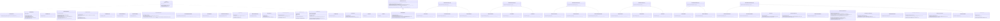

# core.client (cont. 5)

57 classes, 20 internal relationships shown.

```mermaid
classDiagram
direction BT

class AbstractRendererAmazon~T, M~ {
  + AbstractRendererAmazon(Context, M, float) 
  + render(T, float, float, PoseStack, MultiBufferSource, int) void
}
class AbstractRendererBarbarian~T, M~ {
  + AbstractRendererBarbarian(Context, M, float) 
  + render(T, float, float, PoseStack, MultiBufferSource, int) void
}
class AbstractRendererDrownedPirate~T, M~ {
  + AbstractRendererDrownedPirate(Context, M, float) 
  + render(T, float, float, PoseStack, MultiBufferSource, int) void
}
class AbstractRendererEgyptian~T, M~ {
  + AbstractRendererEgyptian(Context, M, float) 
  + render(T, float, float, PoseStack, MultiBufferSource, int) void
}
class AbstractRendererNorsemen~T, M~ {
  + AbstractRendererNorsemen(Context, M, float) 
  + render(T, float, float, PoseStack, MultiBufferSource, int) void
}
class AbstractRendererPirate~T, M~ {
  + AbstractRendererPirate(Context, M, float) 
  + render(T, float, float, PoseStack, MultiBufferSource, int) void
}
class CavalryOverlayLayer {
  + CavalryOverlayLayer(RenderLayerParent~Horse, HorseModel~Horse~~) 
  + render(PoseStack, MultiBufferSource, int, Horse, float, float, float, float, float, float) void
}
class CitizenArmorLayer~T, M, A~ {
  + CitizenArmorLayer(RenderLayerParent~T, M~, A, A, ModelManager, EntityModelSet) 
  - renderGlint(PoseStack, MultiBufferSource, int, Model) void
  - renderTrim(ArmorMaterial, PoseStack, MultiBufferSource, int, ArmorTrim, Model, boolean) void
  + render(PoseStack, MultiBufferSource, int, T, float, float, float, float, float, float) void
  - renderModel(PoseStack, MultiBufferSource, int, ArmorItem, Model, boolean, float, float, float, ResourceLocation) void
  - renderArmorPiece(PoseStack, MultiBufferSource, T, EquipmentSlot, int, A, ICitizenDataView) void
}
class CitizenRenderData {
  + CitizenRenderData(int, Duration) 
  - Duration duration
  + stopRender(WorldEventContext) void
  + startRender(WorldEventContext) void
  - getCitizenEntity(WorldEventContext) EntityCitizen?
  + render(WorldEventContext) void
   Duration? duration
}
class ClipBoardDecorator {
  + ClipBoardDecorator() 
  + render(GuiGraphics, Font, ItemStack, int, int) boolean
}
class ColonyBlueprintRenderer {
  + ColonyBlueprintRenderer() 
  ~ renderBoxes(WorldEventContext) void
  - tryLoadBox(PendingRenderData) BoxRenderData?
  + willRenderBlueprints() boolean
  - rebuildCache(WorldEventContext, List~IRenderBlueprintRule~) void
  - processPendingBlueprints() void
  ~ renderBlueprints(WorldEventContext) void
  - makeBlueprintPreview(BlueprintCacheKey) BlueprintPreviewData
  + invalidateCache() void
}
class ColonyBorderRenderer {
  + ColonyBorderRenderer() 
  - draw(BufferBuilder, Map~ChunkPos, Integer~, int, ChunkPos, int) VertexBuffer?
  - popShaderMVstack() void
  + cleanup() void
  ~ render(WorldEventContext) void
  - pushShaderMVstack(PoseStack) void
}
class ColonyMapDecorator {
  + ColonyMapDecorator() 
  + render(GuiGraphics, Font, ItemStack, int, int) boolean
}
class ColonyPatrolPointRenderer {
  + ColonyPatrolPointRenderer() 
  ~ render(WorldEventContext) void
}
class ColonyWaypointRenderer {
  + ColonyWaypointRenderer() 
  ~ render(WorldEventContext) void
}
class ColonyWorldRenderMacros {
  + ColonyWorldRenderMacros() 
  + renderLineBox(PoseStack, BufferSource, AABB, float, int, boolean) void
  + endRenderLineBox(BufferSource) void
  - renderLineBox(PoseStack, VertexConsumer, float, float, float, float, float, float, float, float, float, float, float, float, int, int, int, int) void
}
class EmptyTileEntitySpecialRenderer {
  + EmptyTileEntitySpecialRenderer(Context) 
  + render(AbstractTileEntityColonyBuilding, float, PoseStack, MultiBufferSource, int, int) void
}
class FireArrowRenderer {
  + FireArrowRenderer(Context) 
  + getTextureLocation(AbstractArrow) ResourceLocation
}
class GuardTowerRallyBannerRenderer {
  + GuardTowerRallyBannerRenderer() 
  ~ render(WorldEventContext) void
}
class HighlightManager {
  + HighlightManager() 
  + addHighlight(String, String, IHighlightRenderData) void
  ~ render(WorldEventContext) void
  + clearHighlightsForKey(String) void
}
class IHighlightRenderData {
<<Interface>>
  + startRender(WorldEventContext) void
  + stopRender(WorldEventContext) void
  + render(WorldEventContext) void
   Duration? duration
}
class ItemOverlayBoxesRenderer {
  + ItemOverlayBoxesRenderer() 
  ~ render(WorldEventContext) void
}
class ModelTypeRegistry {
  + ModelTypeRegistry() 
  + register(IModelType) void
  + getModelType(ResourceLocation) IModelType?
}
class PathfindingDebugRenderer {
  + PathfindingDebugRenderer() 
  - debugDrawNode(MNode, int, WorldEventContext) void
  - renderDebugText(MNode, WorldEventContext) void
  ~ render(WorldEventContext) void
}
class RenderBipedCitizen {
  + RenderBipedCitizen(Context) 
  - setupMainModelFrom(AbstractEntityCitizen) void
  # renderNameTag(AbstractEntityCitizen, Component, PoseStack, MultiBufferSource, int) void
  + render(AbstractEntityCitizen, float, float, PoseStack, MultiBufferSource, int) void
  + getTextureLocation(AbstractEntityCitizen) ResourceLocation
}
class RenderFishHook {
  + RenderFishHook(Context) 
  - ResourceLocation TEXTURE
  - fraction(int, int) float
  - stringVertex(float, float, float, VertexConsumer, Pose, float, float) void
  + render(Entity, float, float, PoseStack, MultiBufferSource, int) void
  - vertex(VertexConsumer, Matrix4f, Matrix3f, int, float, int, int, int) void
  + getTextureLocation(Entity) ResourceLocation
   ResourceLocation TEXTURE
}
class RenderMercenary {
  + RenderMercenary(Context) 
  + getTextureLocation(PathfinderMob) ResourceLocation
}
class RenderSitting~T~ {
  + RenderSitting(Context) 
  + getTextureLocation(T) ResourceLocation
  + shouldRender(T, Frustum, double, double, double) boolean
}
class RenderTypes {
  + RenderTypes() 
  + worldEntityIcon(ResourceLocation) RenderType
}
class RenderUtils {
  + RenderUtils() 
  + getArmPose(Mob, InteractionHand) ArmPose
}
class RendererAmazon {
  + RendererAmazon(Context) 
  + getTextureLocation(AbstractEntityMinecoloniesMonster) ResourceLocation
}
class RendererAmazonSpearman {
  + RendererAmazonSpearman(Context) 
  + getTextureLocation(AbstractEntityMinecoloniesMonster) ResourceLocation
}
class RendererArcherMummy {
  + RendererArcherMummy(Context) 
  + getTextureLocation(AbstractEntityMinecoloniesMonster) ResourceLocation
}
class RendererArcherNorsemen {
  + RendererArcherNorsemen(Context) 
  + getTextureLocation(AbstractEntityMinecoloniesMonster) ResourceLocation
}
class RendererArcherPirate {
  + RendererArcherPirate(Context) 
  + getTextureLocation(AbstractEntityMinecoloniesMonster) ResourceLocation
}
class RendererBarbarian {
  + RendererBarbarian(Context) 
  + getTextureLocation(AbstractEntityMinecoloniesMonster) ResourceLocation
}
class RendererChiefAmazon {
  + RendererChiefAmazon(Context) 
  + getTextureLocation(AbstractEntityMinecoloniesMonster) ResourceLocation
}
class RendererChiefBarbarian {
  + RendererChiefBarbarian(Context) 
  + getTextureLocation(AbstractEntityMinecoloniesMonster) ResourceLocation
}
class RendererChiefNorsemen {
  + RendererChiefNorsemen(Context) 
  + getTextureLocation(AbstractEntityMinecoloniesMonster) ResourceLocation
}
class RendererChiefPirate {
  + RendererChiefPirate(Context) 
  + getTextureLocation(AbstractEntityMinecoloniesMonster) ResourceLocation
}
class RendererDrownedArcherPirate {
  + RendererDrownedArcherPirate(Context) 
  + getTextureLocation(AbstractEntityMinecoloniesMonster) ResourceLocation
}
class RendererDrownedChiefPirate {
  + RendererDrownedChiefPirate(Context) 
  + getTextureLocation(AbstractEntityMinecoloniesMonster) ResourceLocation
}
class RendererDrownedPirate {
  + RendererDrownedPirate(Context) 
  + getTextureLocation(AbstractEntityMinecoloniesMonster) ResourceLocation
}
class RendererMummy {
  + RendererMummy(Context) 
  + getTextureLocation(AbstractEntityMinecoloniesMonster) ResourceLocation
}
class RendererPharao {
  + RendererPharao(Context) 
  + getTextureLocation(AbstractEntityMinecoloniesMonster) ResourceLocation
}
class RendererPirate {
  + RendererPirate(Context) 
  + getTextureLocation(AbstractEntityMinecoloniesMonster) ResourceLocation
}
class RendererShieldmaidenNorsemen {
  + RendererShieldmaidenNorsemen(Context) 
  + getTextureLocation(AbstractEntityMinecoloniesMonster) ResourceLocation
}
class RendererSpear {
  + RendererSpear(Context) 
  + render(ThrownTrident, float, float, PoseStack, MultiBufferSource, int) void
  + getTextureLocation(ThrownTrident) ResourceLocation
}
class SpearItemTileEntityRenderer {
  + SpearItemTileEntityRenderer() 
  + renderByItem(ItemStack, ItemDisplayContext, PoseStack, MultiBufferSource, int, int) void
  + onResourceManagerReload(ResourceManager) void
}
class TileEntityColonyFlagRenderer {
  + TileEntityColonyFlagRenderer(Context) 
  + render(TileEntityColonyFlag, float, PoseStack, MultiBufferSource, int, int) void
}
class TileEntityColonySignRenderer {
  + TileEntityColonySignRenderer(Context) 
  - renderColonyNameOnSign(String, PoseStack, MultiBufferSource, int, int, int) void
  + renderDebugText(BlockPos, List~String~, PoseStack, boolean, int, float, MultiBufferSource) void
  - renderSingleBlock(BlockState, PoseStack, MultiBufferSource, int, int, boolean) void
  + render(TileEntityColonySign, float, PoseStack, MultiBufferSource, int, int) void
  - renderTextOnSide(PoseStack, float, TileEntityColonySign, MultiBufferSource, int, boolean) void
  - renderText(PoseStack, MultiBufferSource, int, String, int, float) void
  - renderTextBoxAtPos(WorldEventContext, BlockPos, List~String~) void
  + shouldRenderOffScreen(TileEntityColonySign) boolean
  + renderSignHover(WorldEventContext) void
}
class TileEntityDecoControllerRenderer {
  + TileEntityDecoControllerRenderer(Context) 
  + render(BlockEntity, float, PoseStack, MultiBufferSource, int, int) void
  - renderBlock(BlockPos, BlockState, PoseStack, MultiBufferSource, Level, int) void
}
class TileEntityEnchanterRenderer {
  + TileEntityEnchanterRenderer(Context) 
  + render(TileEntityColonyBuilding, float, PoseStack, MultiBufferSource, int, int) void
}
class TileEntityNamedGraveRenderer {
  + TileEntityNamedGraveRenderer(Context) 
  + render(TileEntityNamedGrave, float, PoseStack, MultiBufferSource, int, int) void
  + shouldRenderOffScreen(TileEntityNamedGrave) boolean
  - renderText(PoseStack, MultiBufferSource, int, String, int) void
}
class TileEntityScarecrowRenderer {
  + TileEntityScarecrowRenderer(Context) 
  + render(AbstractTileEntityScarecrow, float, PoseStack, MultiBufferSource, int, int) void
  - getMaterial(AbstractTileEntityScarecrow) Material
}
class TimedBoxRenderData {
  + TimedBoxRenderData(BlockPos) 
  - Duration duration
  + render(WorldEventContext) void
  + addText(String) TimedBoxRenderData
   Duration? duration
   int color
}
class WorldEventContext {
  - WorldEventContext() 
  ~ hasNearestColony() boolean
  + checkNearbyColony(Level) void
  + renderWorldLastEvent(RenderLevelStageEvent) void
}

CitizenRenderData  ..>  IHighlightRenderData 
RenderBipedCitizen  ..>  CitizenArmorLayer~T, M, A~ : «create»
RendererAmazon  -->  AbstractRendererAmazon~T, M~ 
RendererAmazonSpearman  -->  AbstractRendererAmazon~T, M~ 
RendererArcherMummy  -->  AbstractRendererEgyptian~T, M~ 
RendererArcherNorsemen  -->  AbstractRendererNorsemen~T, M~ 
RendererArcherPirate  -->  AbstractRendererPirate~T, M~ 
RendererBarbarian  -->  AbstractRendererBarbarian~T, M~ 
RendererChiefAmazon  -->  AbstractRendererAmazon~T, M~ 
RendererChiefBarbarian  -->  AbstractRendererBarbarian~T, M~ 
RendererChiefNorsemen  -->  AbstractRendererNorsemen~T, M~ 
RendererChiefPirate  -->  AbstractRendererPirate~T, M~ 
RendererDrownedArcherPirate  -->  AbstractRendererDrownedPirate~T, M~ 
RendererDrownedChiefPirate  -->  AbstractRendererDrownedPirate~T, M~ 
RendererDrownedPirate  -->  AbstractRendererDrownedPirate~T, M~ 
RendererMummy  -->  AbstractRendererEgyptian~T, M~ 
RendererPharao  -->  AbstractRendererEgyptian~T, M~ 
RendererPirate  -->  AbstractRendererPirate~T, M~ 
RendererShieldmaidenNorsemen  -->  AbstractRendererNorsemen~T, M~ 
TimedBoxRenderData  ..>  IHighlightRenderData 
```
