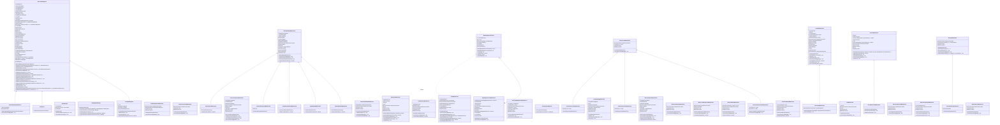

# core.colony (cont. 2)

43 classes, 16 internal relationships shown.

```mermaid
classDiagram
direction BT

class AbstractBuildingBuilderView {
  + AbstractBuildingBuilderView(IColonyView, BlockPos) 
  - String workerName
  + deserialize(FriendlyByteBuf) void
   String workerName
}
class AbstractBuildingView {
  # AbstractBuildingView(IColonyView, BlockPos) 
  - int buildingLevel
  - String customName
  - int buildingMaxLevel
  - int buildingDmPrio
  - int claimRadius
  - boolean isDeconstructed
  - BlockPos location
  - IColonyView colony
  - BuildingEntry buildingType
  - int rotation
  - BlockPos parent
  - int prestige
  + getRequesterDisplayName(IRequestManager, IRequest~?~) MutableComponent
  + getModuleView(int) IBuildingModuleView
  + hasWorkOrder() boolean
  + getOpenRequestsOfType(ICitizenDataView, Class~R~) ImmutableList~IRequest~R~~
  + deserialize(FriendlyByteBuf) void
  + getModuleViews(Class~T~) List~T~
  + hasModuleView(ModuleProducer) boolean
  + getOpenRequests(ICitizenDataView) ImmutableList~IRequest~?~~
  + registerModule(IBuildingModuleView) void
  + getModuleView(ModuleProducer~M, V~) V
  + onRequestedRequestCancelled(IRequestManager, IRequest~?~) void
  + getModuleViewByType(Class~T~) T
  - loadRequestSystemFromNBT(CompoundTag) void
  + onRequestedRequestComplete(IRequestManager, IRequest~?~) void
  + getBuildingMaxLevel() int
  + openGui(boolean) void
  + allowsAssignment() boolean
  + getOpenRequestsOfTypeFiltered(ICitizenDataView, Class~R~, Predicate~IRequest~R~~) ImmutableList~IRequest~R~~
  + getModuleViewMatching(Class~T~, Predicate~T~) T?
   IRequestSystemBuildingDataStore dataStore
   ImmutableList~IRequest~?~~ openRequestsOfBuilding
   boolean repairing
   Map~Integer, Collection~IToken~?~~~ openRequestsByCitizen
   int claimRadius
   BlockPos parent
   boolean isDeconstructed
   BlockPos ID
   IToken~?~ id
   boolean building
   boolean buildingMaxLevel
   boolean deconstructing
   BOWindow window
   String structurePath
   String customName
   Set~Integer~ allAssignedCitizens
   ILocation location
   IColonyView colony
   int rotation
   BlockPos position
   int buildingDmPrio
   String structurePack
   List~IBuildingModuleView~ allModuleViews
   List~BlockPos~ containers
   int prestige
   int currentWorkOrderLevel
   boolean mirrored
   ImmutableCollection~IToken~?~~ resolverIds
   Map~IToken~?~, Integer~ citizensByRequest
   BuildingEntry buildingType
   int buildingLevel
}
class ArcherSquireModuleView {
  + ArcherSquireModuleView() 
  + canBeHiredAs(JobEntry) boolean
}
class BuilderBucket {
  + BuilderBucket() 
  ~ int totalStacks
  + addOrAdjustResource(String, int) void
  + removeResources(String) void
   Map~String, Integer~ resourceMap
   int totalStacks
}
class BuildingBuilderResource {
  + BuildingBuilderResource(ItemStack, int, int) 
  + BuildingBuilderResource(ItemStack, int) 
  - int amountInDelivery
  + hashCode() int
  + equals(Object) boolean
  + toString() String
  + addAvailable(int) void
   String name
   RessourceAvailability availabilityStatus
   int missingFromPlayer
   int available
   int playerAmount
   int amountInDelivery
}
class BuildingDataManager {
  + BuildingDataManager() 
  + createViewFrom(IColonyView, BlockPos, FriendlyByteBuf) IBuildingView
  + createFrom(IColony, CompoundTag) IBuilding
  + openBuildingBrowser(Block) void
  + createFrom(IColony, AbstractTileEntityColonyBuilding) IBuilding
  + createFrom(IColony, BlockPos, ResourceLocation) IBuilding
}
class BuildingResourcesModuleView {
  + BuildingResourcesModuleView() 
  - HashMap~String, BuildingBuilderResource~ resources
  - int workOrderId
  - double progress
  - int totalStages
  + deserialize(FriendlyByteBuf) void
   ResourceLocation iconResourceLocation
   int totalStages
   BOWindow window
   int progress
   Map~String, BuildingBuilderResource~ resources
   int workOrderId
   int currentStage
   Component? desc
}
class BuildingStatisticsModuleView {
  + BuildingStatisticsModuleView() 
  + deserialize(FriendlyByteBuf) void
   ResourceLocation iconResourceLocation
   IStatisticsManager buildingStatisticsManager
   Component? desc
   BOWindow window
}
class ColonyConnectionModuleView {
  + ColonyConnectionModuleView() 
  + deserialize(FriendlyByteBuf) void
   ResourceLocation iconResourceLocation
   Component? desc
   BOWindow window
}
class CombinedHiringLimitModuleView {
  + CombinedHiringLimitModuleView() 
   boolean full
}
class CourierAssignmentModuleView {
  + CourierAssignmentModuleView() 
  - HiringMode hiringMode
  + addCitizen(ICitizenDataView) void
  + canAssign(ICitizenDataView) boolean
  + removeCitizen(ICitizenDataView) void
  + deserialize(FriendlyByteBuf) void
   int maxInhabitants
   HiringMode hiringMode
   ResourceLocation iconResourceLocation
   JobEntry jobEntry
   boolean full
   List~Integer~ assignedCitizens
   BOWindow window
   Component? desc
}
class CourierRequestTaskModuleView {
  + CourierRequestTaskModuleView() 
   List~IToken~?~~ tasks
}
class CrafterRequestTaskModuleView {
  + CrafterRequestTaskModuleView() 
   List~IToken~?~~ tasks
}
class CraftingModuleView {
  + CraftingModuleView() 
  - int maxRecipes
  - String id
  - int activeRecipes
  # List~IRecipeStorage~ recipes
  - JobEntry jobEntry
  + switchOrder(int, int, boolean) void
  + toggle(int) void
  + openCraftingGUI() void
  + deserialize(FriendlyByteBuf) void
  + isDisabled(IRecipeStorage) boolean
  + removeRecipe(int) void
  + canLearn(CraftingType) boolean
   List~IRecipeStorage~ recipes
   ResourceLocation iconResourceLocation
   boolean recipeAlterationAllowed
   JobEntry? jobEntry
   BOWindow window
   int maxRecipes
   boolean pageVisible
   int activeRecipes
   String id
   Component? desc
   Set~CraftingType~ supportedCraftingTypes
}
class DOCraftingModuleView {
  + DOCraftingModuleView(Supplier~OptionalPredicate~ItemStack~~) 
  + openCraftingGUI() void
   OptionalPredicate~ItemStack~ ingredientValidator
}
class EmptyView {
  + EmptyView(IColonyView, BlockPos) 
}
class EnchanterStationsModuleView {
  + EnchanterStationsModuleView() 
  + addWorker(BlockPos) void
  + removeWorker(BlockPos) void
  + deserialize(FriendlyByteBuf) void
   List~BlockPos~ buildingsToGatherFrom
   ResourceLocation iconResourceLocation
   Component? desc
   BOWindow window
}
class EntityListModuleView {
  + EntityListModuleView(String, Component, boolean) 
  - Component desc
  - boolean inverted
  - String id
  + isAllowedEntity(ResourceLocation) boolean
  + deserialize(FriendlyByteBuf) void
  + removeEntity(ResourceLocation) void
  + addEntity(ResourceLocation) void
  + clearEntities() void
   int size
   ResourceLocation iconResourceLocation
   String id
   boolean inverted
   Component? desc
   BOWindow window
}
class ExpeditionLogModuleView {
  + ExpeditionLogModuleView() 
  - ExpeditionLog log
  + deserialize(FriendlyByteBuf) void
  + checkAndResetUpdated() boolean
   ExpeditionLog log
   ResourceLocation iconResourceLocation
   boolean pageVisible
   Component? desc
   BOWindow window
}
class FieldsModuleView {
  + FieldsModuleView() 
  - int maxFieldCount
  + deserialize(FriendlyByteBuf) void
  + assignField(IBuildingExtension) void
  + getFieldWarningTooltip(IBuildingExtension) MutableComponent?
  + assignFieldManually() boolean
  # canAssignFieldOverride(IBuildingExtension) boolean
  + canAssignField(IBuildingExtension) boolean
  + freeField(IBuildingExtension) void
   List~IBuildingExtension~ ownedFields
   ResourceLocation iconResourceLocation
   List~IBuildingExtension~ fieldsInColony
   boolean assignFieldManually
   int maxFieldCount
   List~IBuildingExtension~ fields
   Component? desc
}
class FloristFlowerListModuleView {
  + FloristFlowerListModuleView() 
  + removeItem(ItemStorage) void
  + addItem(ItemStorage) void
}
class GraveyardManagementModuleView {
  + GraveyardManagementModuleView() 
  - List~String~ restingCitizen
  - List~BlockPos~ graves
  + cleanGraves() void
  + deserialize(FriendlyByteBuf) void
   ResourceLocation iconResourceLocation
   List~BlockPos~ graves
   List~String~ restingCitizen
   Component? desc
   BOWindow window
}
class GuardTypeDataManager {
  + GuardTypeDataManager() 
  + getFrom(ResourceLocation) GuardType
}
class ItemListModuleView {
  + ItemListModuleView(String, Component, boolean, Function~IBuildingView, Set~ItemStorage~~) 
  - String id
  - boolean inverted
  - Function~IBuildingView, Set~ItemStorage~~ allItems
  - Component desc
  + isAllowedItem(ItemStorage) boolean
  + addItem(ItemStorage) void
  + removeItem(ItemStorage) void
  + deserialize(FriendlyByteBuf) void
  + clearItems() void
   int size
   Function~IBuildingView, Set~ItemStorage~~ allItems
   ResourceLocation iconResourceLocation
   boolean inverted
   BOWindow window
   String id
   Component? desc
}
class KnightSquireBuildingModuleView {
  + KnightSquireBuildingModuleView() 
  + canBeHiredAs(JobEntry) boolean
}
class LivingBuildingModuleView {
  + LivingBuildingModuleView() 
  - HiringMode hiringMode
  + add(int) void
  + deserialize(FriendlyByteBuf) void
  + remove(int) void
   int max
   HiringMode hiringMode
   ResourceLocation iconResourceLocation
   List~Integer~ assignedCitizens
   BOWindow window
   boolean pageVisible
   Component? desc
}
class LivingBuildingView {
  + LivingBuildingView(IColonyView, BlockPos) 
  + addResident(int) void
  + removeResident(int) void
  - checkColonyMenu(IColonyView, int) boolean
   int max
   HiringMode hiringMode
   List~Integer~ residents
   String hoverWarningForLevel
}
class MinerAssignmentModuleView {
  + MinerAssignmentModuleView() 
  - HiringMode hiringMode
  + removeCitizen(ICitizenDataView) void
  + deserialize(FriendlyByteBuf) void
  + addCitizen(ICitizenDataView) void
  + canAssign(ICitizenDataView) boolean
   int maxInhabitants
   HiringMode hiringMode
   ResourceLocation iconResourceLocation
   JobEntry jobEntry
   boolean full
   List~Integer~ assignedCitizens
   BOWindow window
   Component? desc
}
class MinerGuardAssignModuleView {
  + MinerGuardAssignModuleView() 
  + deserialize(FriendlyByteBuf) void
   ResourceLocation iconResourceLocation
   Component? desc
   BOWindow window
}
class MinerLevelManagementModuleView {
  + MinerLevelManagementModuleView() 
  + deserialize(FriendlyByteBuf) void
  + doesWorkOrderExist(int) boolean
   ResourceLocation iconResourceLocation
   boolean pageVisible
   Component? desc
   BOWindow window
}
class MinimumStockModuleView {
  + MinimumStockModuleView() 
  + deserialize(FriendlyByteBuf) void
  + hasReachedLimit() boolean
   List~Tuple~ItemStorage, Integer~~ stock
   ResourceLocation iconResourceLocation
   Component? desc
   BOWindow window
}
class PupilBuildingModuleView {
  + PupilBuildingModuleView() 
  + canAssign(ICitizenDataView) boolean
}
class RequestTaskModuleView {
  + RequestTaskModuleView() 
  + deserialize(FriendlyByteBuf) void
   ResourceLocation iconResourceLocation
   List~IToken~?~~ tasks
   Component? desc
   BOWindow window
}
class RestaurantMenuModuleView {
  + RestaurantMenuModuleView() 
  - List~ItemStorage~ menu
  + deserialize(FriendlyByteBuf) void
  + hasReachedLimit() boolean
   ResourceLocation iconResourceLocation
   List~ItemStorage~ menu
   Component? desc
   BOWindow window
}
class SettingsModuleView {
  + SettingsModuleView() 
  + getSetting(ISettingKey~T~) T?
  + trigger(ISettingKey~?~) void
  + deserialize(FriendlyByteBuf) void
  + updateSetting(ISettingKey~?~, ISetting~?~, ServerPlayer) void
   ResourceLocation iconResourceLocation
   List~ISettingKey~ISetting~?~~~ settingsToShow
   Component? desc
   BOWindow window
}
class StudentBuildingModuleView {
  + StudentBuildingModuleView() 
  + canBeHiredAs(JobEntry) boolean
}
class ToolModuleView {
  + ToolModuleView(Item) 
  - Item tool
  + deserialize(FriendlyByteBuf) void
   ResourceLocation iconResourceLocation
   Item tool
   Component? desc
   BOWindow window
}
class TownHallSettingsModuleView {
  + TownHallSettingsModuleView() 
   boolean pageVisible
}
class UniversityResearchModuleView {
  + UniversityResearchModuleView() 
  + deserialize(FriendlyByteBuf) void
   ResourceLocation iconResourceLocation
   Component? desc
   BOWindow window
}
class WarehouseOptionsModuleView {
  + WarehouseOptionsModuleView() 
  + deserialize(FriendlyByteBuf) void
  + incrementStorageUpgrade() void
   int storageUpgradeLevel
   ResourceLocation iconResourceLocation
   Component? desc
   BOWindow window
}
class WarehouseRequestTaskModuleView {
  + WarehouseRequestTaskModuleView() 
  ~ List~IToken~?~~ tasks
  + deserialize(FriendlyByteBuf) void
   List~IToken~?~~ tasks
}
class WorkOrderListModuleView {
  + WorkOrderListModuleView() 
  + deserialize(FriendlyByteBuf) void
   ResourceLocation iconResourceLocation
   Component? desc
   BOWindow window
}
class WorkerBuildingModuleView {
  + WorkerBuildingModuleView() 
  - HiringMode hiringMode
  - int maxInhabitants
  - JobEntry jobEntry
  + deserialize(FriendlyByteBuf) void
  + addCitizen(ICitizenDataView) void
  + removeCitizen(ICitizenDataView) void
  + canAssign(ICitizenDataView) boolean
   Skill primarySkill
   int maxInhabitants
   String jobDisplayName
   HiringMode hiringMode
   ResourceLocation iconResourceLocation
   JobEntry jobEntry
   boolean full
   List~Integer~ assignedCitizens
   BOWindow window
   boolean pageVisible
   Skill secondarySkill
   Component? desc
}

AbstractBuildingBuilderView  -->  AbstractBuildingView 
ArcherSquireModuleView  -->  WorkerBuildingModuleView 
BuildingResourcesModuleView  ..>  BuildingBuilderResource : «create»
BuildingResourcesModuleView "1" *--> "resources *" BuildingBuilderResource 
CombinedHiringLimitModuleView  -->  WorkerBuildingModuleView 
CourierRequestTaskModuleView  -->  RequestTaskModuleView 
CrafterRequestTaskModuleView  -->  RequestTaskModuleView 
DOCraftingModuleView  -->  CraftingModuleView 
EmptyView  -->  AbstractBuildingView 
FloristFlowerListModuleView  -->  ItemListModuleView 
KnightSquireBuildingModuleView  -->  WorkerBuildingModuleView 
LivingBuildingView  -->  AbstractBuildingView 
PupilBuildingModuleView  -->  WorkerBuildingModuleView 
StudentBuildingModuleView  -->  WorkerBuildingModuleView 
TownHallSettingsModuleView  -->  SettingsModuleView 
WarehouseRequestTaskModuleView  -->  RequestTaskModuleView 
```
