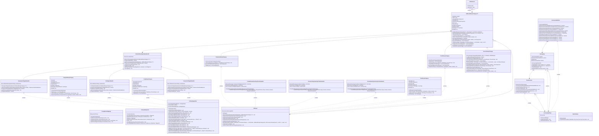

# core.compatibility

24 classes, 29 internal relationships shown.

```mermaid
classDiagram
direction BT

class AbstractTeachingGuiHandler~W~ {
  # AbstractTeachingGuiHandler(List~JobBasedRecipeCategory~?~~) 
  # isSupportedSlot(Slot) boolean
  # getRecipeCategory(AbstractBuildingView) JobBasedRecipeCategory~?~?
  # isSupportedCraftingModule(CraftingModuleView) boolean
  + register(IGuiHandlerRegistration) void
  # updateServer(W) void
  + getTargetsTyped(W, ITypedIngredient~I~, boolean) List~Target~I~~
  + onComplete() void
   Class~W~ windowClass
}
class BrewingCraftingGuiHandler {
  + BrewingCraftingGuiHandler(List~JobBasedRecipeCategory~?~~) 
  + getGuiClickableAreas(WindowBrewingstandCrafting, double, double) Collection~IGuiClickableArea~
  # isSupportedCraftingModule(CraftingModuleView) boolean
  # updateServer(WindowBrewingstandCrafting) void
  # isSupportedSlot(Slot) boolean
   Class~WindowBrewingstandCrafting~ windowClass
}
class ColonyBorderMapping {
  - ColonyBorderMapping() 
  + load(Journeymap, ResourceKey~Level~) void
  + unload(Journeymap, ResourceKey~Level~) void
  + updateChunk(Journeymap, ResourceKey~Level~, LevelChunk) void
  + updatePending(Journeymap, ResourceKey~Level~) void
   String currentColony
}
class ColonyDeathpoints {
  - ColonyDeathpoints() 
  - tryCreatingWaypoint(Journeymap, IColonyView, BlockPos) Waypoint?
  + updateGraves(Journeymap, IColonyView, Set~BlockPos~) void
  - loadIcon() MapImage
  + updateChunk(Journeymap, ResourceKey~Level~, ChunkAccess) void
  + clear() void
  + unload(Journeymap, ResourceKey~Level~) void
  - tryCreatingWaypoint(Journeymap, IColonyView, ChunkAccess, BlockPos) Waypoint?
}
class CompostRecipeCategory {
  + CompostRecipeCategory(IGuiHelper) 
  - String title
  - IDrawable icon
  - IDrawable background
  + findRecipes() List~CompostRecipe~
  + setRecipe(IRecipeLayoutBuilder, CompostRecipe, IFocusGroup) void
  + draw(CompostRecipe, IRecipeSlotsView, GuiGraphics, double, double) void
   Component title
   IDrawable background
   RecipeType~CompostRecipe~ recipeType
   IDrawable icon
}
class CraftingGuiHandler {
  + CraftingGuiHandler(List~JobBasedRecipeCategory~?~~) 
  # isSupportedCraftingModule(CraftingModuleView) boolean
  # updateServer(WindowCrafting) void
  + getGuiClickableAreas(WindowCrafting, double, double) Collection~IGuiClickableArea~
  # isSupportedSlot(Slot) boolean
   Class~WindowCrafting~ windowClass
}
class CraftingTagAuditor {
  - CraftingTagAuditor() 
  - writeItemHeaders(BufferedWriter) void
  - createFile(String, MinecraftServer, String, Writeable) boolean
  - doBlockTagTierAudit(BufferedWriter, MinecraftServer) void
  - doCompostAudit(BufferedWriter, MinecraftServer) void
  - doItemTagAudit(BufferedWriter, MinecraftServer) void
  - doBiomeTagAudit(BufferedWriter, MinecraftServer) void
  - writeItemData(BufferedWriter, ItemStack) void
  - writeCrafterValue(BufferedWriter, Map~Object, List~IGenericRecipe~~, Object?) void
  - writeItemStack(BufferedWriter, ItemStack) void
  + doRecipeAudit(MinecraftServer, CustomRecipeManager) void
  - doBlockTagAudit(BufferedWriter, MinecraftServer) void
  - doToolsAudit(BufferedWriter, MinecraftServer) void
  - doFoodAudit(BufferedWriter, MinecraftServer) void
  - doRecipeAudit(BufferedWriter, MinecraftServer, CustomRecipeManager) void
  - add(Map~ItemStorage, Map~Object, List~IGenericRecipe~~~, Object?, IGenericRecipe, ItemStack) void
  - doPathBlockTagAudit(BufferedWriter, MinecraftServer) void
  - add(CustomRecipeManager, Map~ItemStorage, Map~Object, List~IGenericRecipe~~~, Object?, IGenericRecipe) void
  - doDomumAudit(BufferedWriter, MinecraftServer) void
   List~ICraftingBuildingModule~ craftingModules
   List~ItemStack~ allItems
   List~AnimalHerdingModule~ herdingModules
}
class CropRecipeCategory {
  + CropRecipeCategory(IGuiHelper) 
  - IDrawable background
  - IDrawable icon
  + setRecipe(IRecipeLayoutBuilder, CropRecipe, IFocusGroup) void
  + findRecipes() List~CropRecipe~
   Component title
   IDrawable background
   RecipeType~CropRecipe~ recipeType
   IDrawable icon
}
class EventListener {
  + EventListener(Journeymap) 
  + onColonyChunkDataUpdated(ClientChunkUpdatedEvent) void
  + onClientTick(ClientTickEvent) void
  + onChunkLoaded(Load) void
  + onColonyViewUpdated(ColonyViewUpdatedModEvent) void
  + onUpdateEntityRadar(EntityRadarUpdateEvent) void
  + onPlayerLogout(LoggingOut) void
}
class FishermanRecipeCategory {
  + FishermanRecipeCategory(IGuiHelper) 
  + setRecipe(IRecipeLayoutBuilder, FishingRecipe, IFocusGroup) void
  # generateInfoBlocks(FishingRecipe) List~Component~
  + findRecipes() List~FishingRecipe~
}
class FloristRecipeCategory {
  + FloristRecipeCategory(IGuiHelper) 
  + findRecipes() List~FloristRecipe~
  + setRecipe(IRecipeLayoutBuilder, FloristRecipe, IFocusGroup) void
  - compactify(Set~ItemStorage~) List~List~ItemStack~~
  # generateInfoBlocks(FloristRecipe) List~Component~
  + draw(FloristRecipe, IRecipeSlotsView, GuiGraphics, double, double) void
}
class FurnaceCraftingGuiHandler {
  + FurnaceCraftingGuiHandler(List~JobBasedRecipeCategory~?~~) 
  + getGuiClickableAreas(WindowFurnaceCrafting, double, double) Collection~IGuiClickableArea~
  # isSupportedCraftingModule(CraftingModuleView) boolean
  # updateServer(WindowFurnaceCrafting) void
  # isSupportedSlot(Slot) boolean
   Class~WindowFurnaceCrafting~ windowClass
}
class GenericRecipeCategory {
  + GenericRecipeCategory(BuildingEntry, IJob~?~, IGuiHelper, IModIdHelper) 
  - isLootBasedRecipe(IGenericRecipe) boolean
  + addModule(ICraftingBuildingModule) void
  - setLootBasedRecipe(IRecipeLayoutBuilder, IGenericRecipe, IFocusGroup) void
  - getLootDrops(ResourceLocation) List~LootDrop~
  + findRecipes(Map~CraftingType, List~IGenericRecipe~~, List~Animal~, Level) List~IGenericRecipe~
  # generateInfoBlocks(IGenericRecipe) List~Component~
  + getTooltipStrings(IGenericRecipe, IRecipeSlotsView, double, double) List~Component~
  + setRecipe(IRecipeLayoutBuilder, IGenericRecipe, IFocusGroup) void
  + addModule(AnimalHerdingModule) void
  - setNormalRecipe(IRecipeLayoutBuilder, IGenericRecipe, IFocusGroup) void
  - createRecipeType(IJob~?~) RecipeType~IGenericRecipe~
  + draw(IGenericRecipe, IRecipeSlotsView, GuiGraphics, double, double) void
}
class JEIPlugin {
  + JEIPlugin() 
  - registerCategory(IRecipeCategoryRegistration, JobBasedRecipeCategory~?~) void
  + registerRecipeCatalysts(IRecipeCatalystRegistration) void
  + registerGuiHandlers(IGuiHandlerRegistration) void
  + onRuntimeAvailable(IJeiRuntime) void
  + registerRecipeTransferHandlers(IRecipeTransferRegistration) void
  + registerRecipes(IRecipeRegistration) void
  - addJobBasedRecipes(Map~CraftingType, List~IGenericRecipe~~, List~Animal~, JobBasedRecipeCategory~R~, BiConsumer~RecipeType~R~, List~R~~, Level) void
  + onRuntimeUnavailable() void
  + registerCategories(IRecipeCategoryRegistration) void
   ResourceLocation pluginUid
}
class JeiFakeLevel {
  + JeiFakeLevel() 
  + realLevel() Level
}
class JobBasedRecipeCategory~T~ {
  # JobBasedRecipeCategory(IJob~?~, RecipeType~T~, ItemStack, IGuiHelper) 
  - ItemStack catalyst
  # IJob~?~ job
  - IDrawableStatic background
  - IDrawable icon
  # addToolSlot(IRecipeLayoutBuilder, EquipmentTypeEntry, int, int, boolean) void
  - calculateInfoBlocks(T) List~InfoBlock~
  - createCitizenWithJob(IJob~?~) EntityCitizen?
  + draw(T, IRecipeSlotsView, GuiGraphics, double, double) void
  # getCatalyst(BuildingEntry) ItemStack
  + getTooltipStrings(T, IRecipeSlotsView, double, double) List~Component~
  # generateInfoBlocks(T) List~Component~
  + findRecipes(Map~CraftingType, List~IGenericRecipe~~, List~Animal~, Level) List~T~
  - breakLines(List~FormattedText~) List~FormattedText~
  - wordWrap(List~FormattedText~) List~FormattedText~
  - translateDescription(String[]) List~FormattedText~
   Component titleAsTextComponent
   IJob~?~ job
   Component title
   IDrawable background
   ItemStack catalyst
   RecipeType~T~ recipeType
   IDrawable icon
}
class Journeymap {
  + Journeymap(IClientAPI) 
  - JourneymapOptions options
  + saveData(Path, String, Codec~T~, T) boolean
  + loadData(Path, String, Codec~T~) Optional~T~
  + show(Displayable) void
  + getDataPath(ResourceKey~Level~) Path
   Optional~JourneymapOptions~ options
   IClientAPI api
   Optional~Journeymap~ instance
}
class JourneymapOptions {
  + JourneymapOptions() 
  + getShowColonistTooltip(Optional~JourneymapOptions~) boolean
  + getShowColonistNameFullscreen(Optional~JourneymapOptions~) boolean
  + getShowColonyName(Optional~JourneymapOptions~) boolean
  + getRaiderColor(Optional~JourneymapOptions~) RaiderColor
  + getShowColonistNameMinimap(Optional~JourneymapOptions~) boolean
  + getBorderMinimapStyle(Optional~JourneymapOptions~) BorderStyle
  + getBorderFullscreenStyle(Optional~JourneymapOptions~) BorderStyle
  + getDeathpoints(Optional~JourneymapOptions~) boolean
  + getShowColonistTeamColour(Optional~JourneymapOptions~) boolean
  + getShowVisitors(Optional~JourneymapOptions~) boolean
  + getShowGuards(Optional~JourneymapOptions~) boolean
  + getShowCitizens(Optional~JourneymapOptions~) boolean
}
class JourneymapPlugin {
  + JourneymapPlugin() 
  + initialize(IClientAPI) void
  + onEvent(ClientEvent) void
   String modId
}
class PrivateBrewingTeachingTransferHandler {
  + PrivateBrewingTeachingTransferHandler(IRecipeTransferHandlerHelper) 
  + transferRecipe(ContainerCraftingBrewingstand, IJeiBrewingRecipe, IRecipeSlotsView, Player, boolean, boolean) IRecipeTransferError?
   Optional~MenuType~ContainerCraftingBrewingstand~~ menuType
   RecipeType~IJeiBrewingRecipe~ recipeType
   Class~ContainerCraftingBrewingstand~ containerClass
}
class PrivateCraftingTeachingTransferHandler {
  + PrivateCraftingTeachingTransferHandler(IRecipeTransferHandlerHelper) 
  + transferRecipe(ContainerCrafting, CraftingRecipe, IRecipeSlotsView, Player, boolean, boolean) IRecipeTransferError?
   Optional~MenuType~ContainerCrafting~~ menuType
   RecipeType~CraftingRecipe~ recipeType
   Class~ContainerCrafting~ containerClass
}
class PrivateSmeltingTeachingTransferHandler {
  + PrivateSmeltingTeachingTransferHandler(IRecipeTransferHandlerHelper) 
  + transferRecipe(ContainerCraftingFurnace, SmeltingRecipe, IRecipeSlotsView, Player, boolean, boolean) IRecipeTransferError?
   Optional~MenuType~ContainerCraftingFurnace~~ menuType
   RecipeType~SmeltingRecipe~ recipeType
   Class~ContainerCraftingFurnace~ containerClass
}
class RenderHelper {
  + RenderHelper() 
  + renderBlock(PoseStack, BlockState, float, float, float, float, float, float) void
}
class ToolRecipeCategory {
  + ToolRecipeCategory(IGuiHelper) 
  - IDrawable icon
  - IDrawable background
  + draw(ToolUsage, IRecipeSlotsView, GuiGraphics, double, double) void
  + setRecipe(IRecipeLayoutBuilder, ToolUsage, IFocusGroup) void
  + findRecipes() List~ToolUsage~
   Component title
   IDrawable background
   RecipeType~ToolUsage~ recipeType
   IDrawable icon
}

AbstractTeachingGuiHandler~W~ "1" *--> "categories *" JobBasedRecipeCategory~T~ 
BrewingCraftingGuiHandler  -->  AbstractTeachingGuiHandler~W~ 
CraftingGuiHandler  -->  AbstractTeachingGuiHandler~W~ 
EventListener "1" *--> "jmap 1" Journeymap 
FishermanRecipeCategory  -->  JobBasedRecipeCategory~T~ 
FloristRecipeCategory  -->  JobBasedRecipeCategory~T~ 
FurnaceCraftingGuiHandler  -->  AbstractTeachingGuiHandler~W~ 
GenericRecipeCategory  -->  JobBasedRecipeCategory~T~ 
JEIPlugin  ..>  BrewingCraftingGuiHandler : «create»
JEIPlugin  ..>  CompostRecipeCategory : «create»
JEIPlugin  ..>  CraftingGuiHandler : «create»
JEIPlugin  ..>  CropRecipeCategory : «create»
JEIPlugin  ..>  FishermanRecipeCategory : «create»
JEIPlugin  ..>  FloristRecipeCategory : «create»
JEIPlugin  ..>  FurnaceCraftingGuiHandler : «create»
JEIPlugin  ..>  GenericRecipeCategory : «create»
JEIPlugin  ..>  PrivateBrewingTeachingTransferHandler : «create»
JEIPlugin  ..>  PrivateCraftingTeachingTransferHandler : «create»
JEIPlugin  ..>  PrivateSmeltingTeachingTransferHandler : «create»
JEIPlugin  ..>  ToolRecipeCategory : «create»
JEIPlugin "1" *--> "categories *" JobBasedRecipeCategory~T~ 
JobBasedRecipeCategory~T~  ..>  JeiFakeLevel : «create»
JobBasedRecipeCategory~T~ "1" *--> "FAKE_LEVEL 1" JeiFakeLevel 
Journeymap "1" *--> "options 1" JourneymapOptions 
JourneymapPlugin  ..>  EventListener : «create»
JourneymapPlugin  ..>  Journeymap : «create»
JourneymapPlugin  ..>  JourneymapOptions : «create»
JourneymapPlugin "1" *--> "jmap 1" Journeymap 
JourneymapPlugin "1" *--> "listener 1" EventListener 
```
