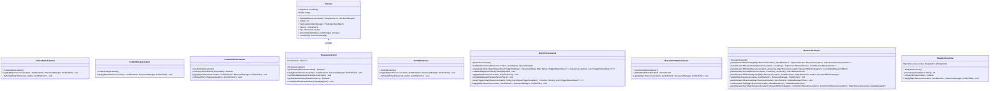

# core.datalistener

10 classes, 1 internal relationships shown.

```mermaid
classDiagram
direction BT

class CitizenNameListener {
  + CitizenNameListener() 
  # apply(Map~ResourceLocation, JsonElement~, ResourceManager, ProfilerFiller) void
  - tryParse(Entry~ResourceLocation, JsonElement~) void
}
class CrafterRecipeListener {
  + CrafterRecipeListener() 
  # apply(Map~ResourceLocation, JsonElement~, ResourceManager, ProfilerFiller) void
}
class CustomVisitorListener {
  + CustomVisitorListener() 
  + chanceCustomVisitors(IVisitorData) boolean
  # apply(Map~ResourceLocation, JsonElement~, ResourceManager, ProfilerFiller) void
  - tryParse(Entry~ResourceLocation, JsonElement~) void
}
class Disease {
  + Disease(ResourceLocation, Component, int, List~ItemStorage~) 
  + rarity() int
  + hasCureItem(ItemStorage) Predicate~ItemStack~
  + name() Component
  + id() ResourceLocation
  + isCureItem(ItemStack, ItemStorage) boolean
  + cureItems() List~ItemStorage~
   Component cureString
   Weight weight
}
class DiseasesListener {
  + DiseasesListener() 
  + getDisease(ResourceLocation) Disease?
  # apply(Map~ResourceLocation, JsonElement~, ResourceManager, ProfilerFiller) void
  + sendGlobalDiseasesPackets(ServerPlayer) void
  + getRandomDisease(RandomSource) Disease?
  + readGlobalDiseasesPackets(FriendlyByteBuf) void
   List~Disease~ diseases
}
class ItemNbtListener {
  + ItemNbtListener() 
  # apply(Map~ResourceLocation, JsonElement~, ResourceManager, ProfilerFiller) void
  - tryParse(Entry~ResourceLocation, JsonElement~) void
}
class QuestJsonListener {
  + QuestJsonListener() 
  + loadDataFromJson(ResourceLocation, JsonObject) IQuestTemplate
  - evaluate(IColony, Map~String, IQuestTriggerTemplate~, ExpressionNode, Map~String, ITriggerReturnData~?~~, ResourceLocation) List~ITriggerReturnData~?~~?
  + readGlobalQuestPackets(FriendlyByteBuf) void
  - apply(Map~ResourceLocation, JsonElement~) void
  + sendGlobalQuestPackets(ServerPlayer) void
  - parseTriggerOrder(ResourceLocation, String, List~IQuestTriggerTemplate~) Function~IColony, List~ITriggerReturnData~?~~~?
  # apply(Map~ResourceLocation, JsonElement~, ResourceManager, ProfilerFiller) void
}
class RecruitmentItemsListener {
  + RecruitmentItemsListener() 
  + getRandomRecruitCost(int) RecruitCost?
  # apply(Map~ResourceLocation, JsonElement~, ResourceManager, ProfilerFiller) void
}
class ResearchListener {
  + ResearchListener() 
  - parseRemoveResearches(Map~ResourceLocation, JsonElement~) Tuple~Collection~ResourceLocation~, Collection~ResourceLocation~~
  - parseResearchRequirements(ResourceLocation, JsonArray) Tuple~List~IResearchCost~, List~IResearchRequirement~~
  - parseResearchEffects(ResourceLocation, JsonArray, Map~ResourceLocation, ResearchEffectCategory~) List~GlobalResearchEffect~
  - parseResearchCosts(ResourceLocation, JsonArray, JsonArray) List~IResearchCost~
  - parseResearchEffectCategories(Map~ResourceLocation, JsonElement~) Map~ResourceLocation, ResearchEffectCategory~
  # apply(Map~ResourceLocation, JsonElement~, ResourceManager, ProfilerFiller) void
  - parseResearchBranches(Map~ResourceLocation, JsonElement~, IGlobalResearchTree) void
  - calcResearchTree(Map~ResourceLocation, GlobalResearch~) IGlobalResearchTree
  - parseResearches(Map~ResourceLocation, JsonElement~, Map~ResourceLocation, ResearchEffectCategory~, Collection~ResourceLocation~, Collection~ResourceLocation~) Map~ResourceLocation, GlobalResearch~
}
class StudyItemListener {
  + StudyItemListener() 
  - percentage(JsonObject, String) int
  + isStudyItem(ItemStack) boolean
  # apply(Map~ResourceLocation, JsonElement~, ResourceManager, ProfilerFiller) void
   Map~ResourceLocation, StudyItem~ allStudyItems
}

DiseasesListener  ..>  Disease : «create»
```
