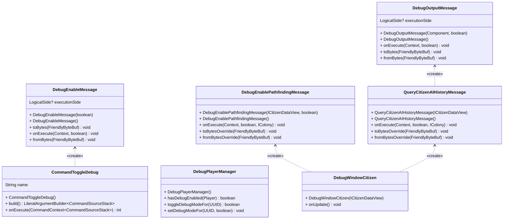

# core.debug

7 classes, 4 internal relationships shown.

```mermaid
classDiagram
direction BT

class CommandToggleDebug {
  + CommandToggleDebug() 
  + build() LiteralArgumentBuilder~CommandSourceStack~
  + onExecute(CommandContext~CommandSourceStack~) int
   String name
}
class DebugEnableMessage {
  + DebugEnableMessage(boolean) 
  + DebugEnableMessage() 
  + toBytes(FriendlyByteBuf) void
  + onExecute(Context, boolean) void
  + fromBytes(FriendlyByteBuf) void
   LogicalSide? executionSide
}
class DebugEnablePathfindingMessage {
  + DebugEnablePathfindingMessage(ICitizenDataView, boolean) 
  + DebugEnablePathfindingMessage() 
  + onExecute(Context, boolean, IColony) void
  + toBytesOverride(FriendlyByteBuf) void
  + fromBytesOverride(FriendlyByteBuf) void
}
class DebugOutputMessage {
  + DebugOutputMessage(Component, boolean) 
  + DebugOutputMessage() 
  + onExecute(Context, boolean) void
  + toBytes(FriendlyByteBuf) void
  + fromBytes(FriendlyByteBuf) void
   LogicalSide? executionSide
}
class DebugPlayerManager {
  + DebugPlayerManager() 
  + hasDebugEnabled(Player) boolean
  + toggleDebugModeFor(UUID) boolean
  + setDebugModeFor(UUID, boolean) void
}
class DebugWindowCitizen {
  + DebugWindowCitizen(ICitizenDataView) 
  + onUpdate() void
}
class QueryCitizenAIHistoryMessage {
  + QueryCitizenAIHistoryMessage(ICitizenDataView) 
  + QueryCitizenAIHistoryMessage() 
  + onExecute(Context, boolean, IColony) void
  + toBytesOverride(FriendlyByteBuf) void
  + fromBytesOverride(FriendlyByteBuf) void
}

CommandToggleDebug  ..>  DebugEnableMessage : «create»
DebugWindowCitizen  ..>  DebugEnablePathfindingMessage : «create»
DebugWindowCitizen  ..>  QueryCitizenAIHistoryMessage : «create»
QueryCitizenAIHistoryMessage  ..>  DebugOutputMessage : «create»
```
