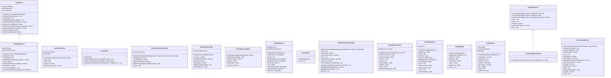

# core.entity

17 classes, 2 internal relationships shown.

```mermaid
classDiagram
direction BT

class AttackMoveAI~T~ {
  + AttackMoveAI(T, ITickRateStateMachine) 
  # tryAttack() IState
  + resetTarget() void
  # isInDistanceForAttack(LivingEntity) boolean
  - move() IState?
  # isInAttackDistance(LivingEntity) boolean
  + canAttack() boolean
  # doAttack(LivingEntity) void
  # moveInAttackPosition(LivingEntity) PathResult
   int attackDelay
   double attackDistance
}
class CavalryStrollGoal {
  + CavalryStrollGoal(CavalryHorseEntity, double) 
  + stop() void
  + start() void
  + canUse() boolean
  + canContinueToUse() boolean
   boolean freeToRoam
   Vec3? position
}
class CombatUtils {
  + CombatUtils() 
  + shootArrow(AbstractArrow, LivingEntity, float) void
  + createArrowForShooter(LivingEntity) AbstractArrow
  + notifyGuardsOfTarget(AbstractEntityCitizen, LivingEntity, int) void
}
class EntityAICitizenAvoidEntity {
  + EntityAICitizenAvoidEntity(EntityCitizen, Class~Entity~, float, double, double) 
  + isEntityClose() IState
  - updateMoving() boolean
  - performMoveAway() boolean
  - getMoveAwayDist(AbstractEntityCitizen) float
  + reset() void
   Entity closestToAvoid
}
class EntityAICitizenChild {
  + EntityAICitizenChild(EntityCitizen) 
  + canUse() boolean
  - searchEntityToFollow() boolean
  - visitHuts() IState
  - tryGrowUp() boolean
  - setDelayForNextAction() void
  - followingEntity() IState
   boolean readyForActivity
}
class EntityAICitizenWander {
  + EntityAICitizenWander(EntityCitizen, double) 
  - wanderAtLeisureSite() IState
  - goToLeisureSite() IState
  - decide() IState
  - readABook() IState
  + canUse() boolean
}
class EntityAIEatTask {
  + EntityAIEatTask(EntityCitizen) 
  - waitForFood() EatingState
  - reset() void
  - goToEatingPlace() EatingState
  - goToRestaurant() EatingState
  - hasFood() boolean
  - eat() IState
  - searchRestaurant() EatingState
  - findPlaceToEat() BlockPos?
  - goToHut() EatingState
   EatingState food
   EatingState foodYourself
}
class EntityAIFloat {
  + EntityAIFloat(Mob) 
  + tick() void
}
class EntityAIInteractToggleAble {
  + EntityAIInteractToggleAble(AbstractFastMinecoloniesEntity, ToggleAble[]) 
  + start() void
  - checkPath() boolean
  + canContinueToUse() boolean
  + tick() void
  - checkPathBlocksBelow() boolean
  + canUse() boolean
  - checkPathBlocksCollided(Path) void
  - checkPosAndAdd(Entity, Direction, BlockPos) void
  - isValidBlockState(BlockState) boolean
  - getHeightToCheck(Path, int) int
  - resetAll() void
}
class EntityAIMournCitizen {
  + EntityAIMournCitizen(EntityCitizen, double) 
  - walkToGraveyard() IState
  - walkToTownHall() IState
  - decide() IState
  + reset() void
  - walkToGrave() IState
  - wander() IState
  - stare() IState
  - wanderAtGraveyard() IState
   IBuilding mournLocation
}
class EntityAISickTask {
  + EntityAISickTask(EntityCitizen) 
  - applyCure() IState
  + start() void
  - goToHut() IState
  + wander() DiseaseState
  - findEmptyBed() DiseaseState
  - goToHospital() IState
  - cure() void
  - checkForCure() IState
  - waitForCure() IState
  - reset() void
  - searchHospital() IState
   boolean sick
}
class EntityAISleep {
  + EntityAISleep(EntityCitizen) 
  - findBedAndTryToSleep() void
  - findBed() boolean
  - goHome() void
  - checkSleep() IState
  - sleep() IState?
  - walkHome() IState
  + initAI() void
}
class EntityAIVisitor {
  + EntityAIVisitor(AbstractEntityCitizen) 
  - Entity target
  - shouldFight() boolean
  - resetLogic() void
  - doFight() boolean
  - decide() VisitorState
  - reduceTime() boolean
  - sit() boolean
  + stop() void
  - wander() boolean
   boolean entityLoaded
   Entity target
}
class LookAtEntityGoal {
  + LookAtEntityGoal(Mob, Class~LivingEntity~, float, float) 
  + LookAtEntityGoal(Mob, Class~LivingEntity~, float) 
  + LookAtEntityGoal(Mob, Class~LivingEntity~, float, float, boolean) 
  + start() void
  + stop() void
  + canUse() boolean
  + canContinueToUse() boolean
  + tick() void
}
class LookAtEntityInteractGoal {
  + LookAtEntityInteractGoal(Mob, Class~LivingEntity~, float, float) 
}
class ReturnToStableGoal {
  + ReturnToStableGoal(CavalryHorseEntity, double, double) 
  - validateHomeStable() void
  - nextAfterStallWalk() State
  - resolveStable() boolean
  + tick() void
  - canStillRun() boolean
  - walkToStable() boolean
  - handleAIException(RuntimeException) void
  + canContinueToUse() boolean
  + canUse() boolean
  - walkToStall() boolean
  + stop() void
  - nextAfterStableWalk() State
  - findStall() boolean
  + start() void
}
class TargetAI~T~ {
  + TargetAI(T, int, ITickRateStateMachine) 
  # onTargetDied(LivingEntity) void
  + resetTarget() void
  # onTargetChange(LivingEntity) void
  + isEntityValidTarget(LivingEntity) boolean
  # skipSearch(LivingEntity) boolean
  # isWithinPersecutionDistance(LivingEntity) boolean
  # isAttackableTarget(LivingEntity) boolean
  # checkForTarget() boolean
  # searchNearbyTarget() boolean
   int YSearchRange
   AABB searchArea
   int searchRange
}

AttackMoveAI~T~  -->  TargetAI~T~ 
LookAtEntityInteractGoal  -->  LookAtEntityGoal 
```
