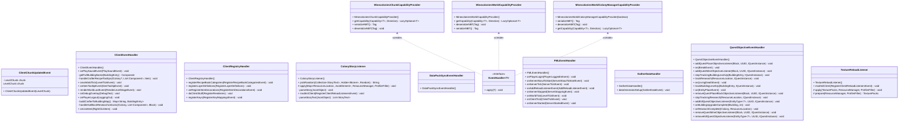

# core.event

13 classes, 3 internal relationships shown.

```mermaid
classDiagram
direction BT

class ClientChunkUpdatedEvent {
  + ClientChunkUpdatedEvent(LevelChunk) 
  - LevelChunk chunk
   LevelChunk chunk
}
class ClientEventHandler {
  + ClientEventHandler() 
  + onPlaySoundEvent(PlaySoundEvent) void
  - getFullBuildingName(BuildingEntry) Component
  - handleCrafterRecipeTooltips(IColony?, List~Component~, Item) void
  + onwWorldTick(LevelTickEvent) void
  + onItemTooltipEvent(ItemTooltipEvent) void
  + renderWorldLastEvent(RenderLevelStageEvent) void
  + onDebugOverlay(DebugText) void
  + onPlayerLogout(LoggingOut) void
  - buildCrafterToBuildingMap() Map~String, BuildingEntry~
  - handleHutBlockResearchUnlocks(IColony, List~Component~, Block) void
  + onUseItem(RightClickItem) void
}
class ClientRegistryHandler {
  + ClientRegistryHandler() 
  + registerRecipeBookCategories(RegisterRecipeBookCategoriesEvent) void
  + registerLayerDefinitions(RegisterLayerDefinitions) void
  + onRegisterItemDecorations(RegisterItemDecorationsEvent) void
  + doClientStuff(RegisterRenderers) void
  + registerKeys(RegisterKeyMappingsEvent) void
}
class ColonyStoryListener {
  + ColonyStoryListener() 
  + pickRandom(Collection~StoryText~, Holder~Biome~, Random) String
  # apply(Map~ResourceLocation, JsonElement~, ResourceManager, ProfilerFiller) void
  - parseStory(JsonObject) void
  + modInitClient(RegisterClientReloadListenersEvent) void
  - parseStoryText(JsonObject) List~StoryText~
}
class DataPackSyncEventHandler {
  + DataPackSyncEventHandler() 
}
class EventHandler~T~ {
<<Interface>>
  + apply(T) void
}
class FMLEventHandler {
  + FMLEventHandler() 
  + onPlayerLogin(PlayerLoggedInEvent) void
  + onServerAboutToStart(ServerAboutToStartEvent) void
  + onServerTick(ServerTickEvent) void
  + onAddReloadListenerEvent(AddReloadListenerEvent) void
  + onServerStopped(ServerStoppingEvent) void
  + onWorldTick(LevelTickEvent) void
  + onClientTick(ClientTickEvent) void
  + onServerStarted(ServerStartedEvent) void
}
class GatherDataHandler {
  + GatherDataHandler() 
  + dataGeneratorSetup(GatherDataEvent) void
}
class MinecoloniesChunkCapabilityProvider {
  + MinecoloniesChunkCapabilityProvider() 
  + getCapability(Capability~T~, Direction) LazyOptional~T~
  + serializeNBT() Tag
  + deserializeNBT(Tag) void
}
class MinecoloniesWorldCapabilityProvider {
  + MinecoloniesWorldCapabilityProvider() 
  + getCapability(Capability~T~, Direction) LazyOptional~T~
  + deserializeNBT(Tag) void
  + serializeNBT() Tag
}
class MinecoloniesWorldColonyManagerCapabilityProvider {
  + MinecoloniesWorldColonyManagerCapabilityProvider(boolean) 
  + serializeNBT() Tag
  + deserializeNBT(Tag) void
  + getCapability(Capability~T~, Direction) LazyOptional~T~
}
class QuestObjectiveEventHandler {
  + QuestObjectiveEventHandler() 
  + addQuestPlaceObjectiveListener(Block, UUID, IQuestInstance) void
  + on(BreakEvent) void
  + addQuestMineObjectiveListener(Block, UUID, IQuestInstance) void
  + stopTrackingBuildingLevelUp(BuildingEntry, IQuestInstance) void
  + trackResearch(ResourceLocation, IQuestInstance) void
  + on(LivingDeathEvent) void
  + trackBuildingLevelUp(BuildingEntry, IQuestInstance) void
  + on(EntityPlaceEvent) void
  + removeQuestPlaceBlockObjectiveListener(Block, UUID, IQuestInstance) void
  + stopTrackingResearch(ResourceLocation, IQuestInstance) void
  + addKillQuestObjectiveListener(EntityType~?~, UUID, IQuestInstance) void
  + onBuildingUpgradeComplete(IBuilding, int) void
  + onResearchComplete(IColony, ResourceLocation) void
  + removeQuestMineObjectiveListener(Block, UUID, IQuestInstance) void
  + removeKillQuestObjectiveListener(EntityType~?~, UUID, IQuestInstance) void
}
class TextureReloadListener {
  + TextureReloadListener() 
  + modInitClient(RegisterClientReloadListenersEvent) void
  # apply(TexturePacks, ResourceManager, ProfilerFiller) void
  # prepare(ResourceManager, ProfilerFiller) TexturePacks
}

EventHandler  ..>  MinecoloniesChunkCapabilityProvider : «create»
EventHandler  ..>  MinecoloniesWorldCapabilityProvider : «create»
EventHandler  ..>  MinecoloniesWorldColonyManagerCapabilityProvider : «create»
```
