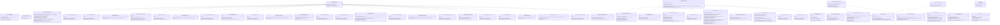

# core.generation

49 classes, 28 internal relationships shown.

```mermaid
classDiagram
direction BT

class CompostRecipeBuilder {
  + CompostRecipeBuilder(int) 
  + save(Consumer~FinishedRecipe~, ResourceLocation) void
  + strength(int) CompostRecipeBuilder
  + input(Ingredient) CompostRecipeBuilder
}
class CustomRecipeAndLootTableProvider {
  # CustomRecipeAndLootTableProvider(PackOutput) 
  # registerRecipes(Consumer~FinishedRecipe~) void
  # registerTables(LootTableRegistrar) void
  + run(CachedOutput) CompletableFuture~?~
}
class CustomRecipeProvider {
  + CustomRecipeProvider(PackOutput) 
  # registerRecipes(Consumer~FinishedRecipe~) void
  + run(CachedOutput) CompletableFuture~?~
}
class DataGeneratorConstants {
  + DataGeneratorConstants() 
}
class DatagenLootTableManager {
  + DatagenLootTableManager(ExistingFileHelper) 
  + getLootTable(ResourceLocation) LootTable
}
class DefaultAdvancementsProvider {
  + DefaultAdvancementsProvider(PackOutput, CompletableFuture~Provider~, ExistingFileHelper) 
  - createBuildRequest(BuildingEntry, int) CriterionTriggerInstance
  - placeStructure(BuildingEntry) CriterionTriggerInstance
  - makeHidden(FrameType, ItemLike, String) DisplayInfo
  - make(FrameType, ItemLike, String) DisplayInfo
  - addStandardAdvancements(Consumer~Advancement~, ExistingFileHelper) void
  - addProductionAdvancements(Consumer~Advancement~, ExistingFileHelper) void
  - item(ItemLike) ItemPredicate[]
  - completeBuildRequest(BuildingEntry, int) CriterionTriggerInstance
  - addMilitaryAdvancements(Consumer~Advancement~, ExistingFileHelper) void
}
class DefaultAlchemistCraftingProvider {
  + DefaultAlchemistCraftingProvider(PackOutput) 
  # registerRecipes(Consumer~FinishedRecipe~) void
   String name
}
class DefaultBakerCraftingProvider {
  + DefaultBakerCraftingProvider(PackOutput) 
  # registerRecipes(Consumer~FinishedRecipe~) void
   String name
}
class DefaultBiomeTagsProvider {
  + DefaultBiomeTagsProvider(PackOutput, CompletableFuture~Provider~, ExistingFileHelper?) 
  # addTags(Provider) void
}
class DefaultBlacksmithCraftingProvider {
  + DefaultBlacksmithCraftingProvider(PackOutput) 
  - netherite(Consumer~FinishedRecipe~, ItemLike, ItemLike) void
  - plate(Consumer~FinishedRecipe~, int, int, ItemLike) void
  # registerRecipes(Consumer~FinishedRecipe~) void
   String name
}
class DefaultBlockLootTableProvider {
  + DefaultBlockLootTableProvider(PackOutput) 
  - saveBlock(Block, LootTableRegistrar, Consumer~Builder~) void
  - saveBlock(Block, LootTableRegistrar) void
  - saveBlocks(List~T~, LootTableRegistrar) void
  - saveBannerBlock(Block, LootTableRegistrar) void
  # registerTables(LootTableRegistrar) void
   String name
}
class DefaultBlockTagsProvider {
  + DefaultBlockTagsProvider(PackOutput, CompletableFuture~Provider~, ExistingFileHelper?) 
  # addTags(Provider) void
}
class DefaultChefCraftingProvider {
  + DefaultChefCraftingProvider(PackOutput) 
  # registerRecipes(Consumer~FinishedRecipe~) void
   String name
}
class DefaultConcreteMixerCraftingProvider {
  + DefaultConcreteMixerCraftingProvider(PackOutput) 
  # registerRecipes(Consumer~FinishedRecipe~) void
   String name
}
class DefaultCrusherCraftingProvider {
  + DefaultCrusherCraftingProvider(PackOutput) 
  # registerRecipes(Consumer~FinishedRecipe~) void
  - crush(Consumer~FinishedRecipe~, String, ItemStack, ItemStack, Rule[]) void
   String name
}
class DefaultDamageTagsProvider {
  + DefaultDamageTagsProvider(PackOutput, CompletableFuture~Provider~, ExistingFileHelper) 
  # addTags(Provider) void
}
class DefaultDamageTypeProvider {
  + DefaultDamageTypeProvider(PackOutput, ExistingFileHelper) 
  - damage(String) DamageType
  - entityDamage(EntityType~?~) DamageType
   Map~ResourceLocation, DamageType~ damageTypes
}
class DefaultDyerCraftingProvider {
  + DefaultDyerCraftingProvider(PackOutput) 
  # registerRecipes(Consumer~FinishedRecipe~) void
   String name
}
class DefaultEnchanterCraftingProvider {
  + DefaultEnchanterCraftingProvider(PackOutput) 
  - enchantedBook(Enchantment, int) Builder~?~
  # registerRecipes(Consumer~FinishedRecipe~) void
  # registerTables(LootTableRegistrar) void
   String name
}
class DefaultEntityIconProvider {
  + DefaultEntityIconProvider(DataGenerator) 
  - generateIcon(PathProvider, ResourceLocation, IoSupplier~InputStream~, CachedOutput) CompletableFuture~?~
  - saveIcon(PathProvider, ResourceLocation, NativeImage, CachedOutput) void
  - createIconForSkin(NativeImage) NativeImage
  - IsEntitySkin(ResourceLocation) boolean
  + run(CachedOutput) CompletableFuture~?~
   String name
}
class DefaultEntityLootProvider {
  + DefaultEntityLootProvider(PackOutput) 
  # registerTables(LootTableRegistrar) void
  - registerLoot(LootTableRegistrar, EntityType~?~, Consumer~Builder~) void
   String name
}
class DefaultEntityTypeTagsProvider {
  + DefaultEntityTypeTagsProvider(PackOutput, CompletableFuture~Provider~, ExistingFileHelper?) 
  # addTags(Provider) void
}
class DefaultFarmerCraftingProvider {
  + DefaultFarmerCraftingProvider(PackOutput) 
  # registerRecipes(Consumer~FinishedRecipe~) void
   String name
}
class DefaultFishermanLootProvider {
  + DefaultFishermanLootProvider(PackOutput) 
  - getWeightForEntry(Builder~?~) int
  # registerTables(LootTableRegistrar) void
  - makeLoot(int, Builder~?~[]) Builder
  - registerBonusLoot(LootTableRegistrar) void
  - registerStandardLoot(LootTableRegistrar) void
  # validate(Map~ResourceLocation, LootTable~, ValidationContext) void
   String name
}
class DefaultFletcherCraftingProvider {
  + DefaultFletcherCraftingProvider(PackOutput) 
  # registerRecipes(Consumer~FinishedRecipe~) void
   String name
}
class DefaultGlassblowerCraftingProvider {
  + DefaultGlassblowerCraftingProvider(PackOutput) 
  # registerRecipes(Consumer~FinishedRecipe~) void
   String name
}
class DefaultItemModelProvider {
  + DefaultItemModelProvider(PackOutput, ExistingFileHelper) 
  # registerModels() void
}
class DefaultItemTagsProvider {
  + DefaultItemTagsProvider(PackOutput, CompletableFuture~Provider~, BlockTagsProvider, ExistingFileHelper?) 
  - getDomumExtra(ExtraBlockType[]) Item[]
  # addTags(Provider) void
}
class DefaultLuckyOreLootProvider {
  + DefaultLuckyOreLootProvider(PackOutput) 
  # registerTables(LootTableRegistrar) void
   String name
}
class DefaultLumberjackCraftingProvider {
  + DefaultLumberjackCraftingProvider(PackOutput) 
  # registerRecipes(Consumer~FinishedRecipe~) void
   String name
}
class DefaultMechanicCraftingProvider {
  + DefaultMechanicCraftingProvider(PackOutput) 
  # registerRecipes(Consumer~FinishedRecipe~) void
  - deoxidize(Consumer~FinishedRecipe~, Item, Item) void
   String name
}
class DefaultNetherWorkerLootProvider {
  + DefaultNetherWorkerLootProvider(PackOutput, DatagenLootTableManager) 
  - createAdventureToken(EntityType~?~, int, int) Builder~?~
  - createTripLoot(int) Builder
  # registerRecipes(Consumer~FinishedRecipe~) void
  - createBlocksPool(int) Builder
  - createMobsPool(int) Builder
  # registerTables(LootTableRegistrar) void
   String name
}
class DefaultPlanterCraftingProvider {
  + DefaultPlanterCraftingProvider(PackOutput) 
  # registerRecipes(Consumer~FinishedRecipe~) void
   String name
}
class DefaultRecipeLootProvider {
  + DefaultRecipeLootProvider(PackOutput) 
  # registerTables(LootTableRegistrar) void
   String name
}
class DefaultRecipeProvider {
  + DefaultRecipeProvider(PackOutput) 
  - registerHutRecipe3(Consumer~FinishedRecipe~, ItemLike, ItemLike) void
  - append(ResourceLocation, String, String) ResourceLocation
  # buildRecipes(Consumer~FinishedRecipe~) void
  - registerHutRecipe1(Consumer~FinishedRecipe~, ItemLike, TagKey~Item~) void
  - buildOtherBlocks(Consumer~FinishedRecipe~) void
  - append(ItemLike, String) ResourceLocation
  - hasAllOf(ItemPredicate[]) TriggerInstance
  - registerHutRecipe1x2(Consumer~FinishedRecipe~, ItemLike, ItemLike, String) void
  - registerHutRecipe1(Consumer~FinishedRecipe~, ItemLike, ItemLike) void
  - buildHutRecipes(Consumer~FinishedRecipe~) void
  - buildFood(Consumer~FinishedRecipe~) void
  - buildOtherItems(Consumer~FinishedRecipe~) void
  - hasAllOf(ItemLike[]) TriggerInstance
}
class DefaultRecruitmentItemsProvider {
  + DefaultRecruitmentItemsProvider(PackOutput) 
  - makeRecruitmentItem(CachedOutput, Item, int) CompletableFuture~?~
  + run(CachedOutput) CompletableFuture~?~
   String name
}
class DefaultResearchProvider {
  + DefaultResearchProvider(PackOutput) 
  + getCivilResearch(Collection~Research~) Collection~Research~
  + getCombatResearch(Collection~Research~) Collection~Research~
  + getAchievementResearch(Collection~Research~) Collection~Research~
  + getTechnologyResearch(Collection~Research~) Collection~Research~
   Collection~ResearchEffect~ researchEffectCollection
   Collection~Research~ researchCollection
   Collection~ResearchBranch~ researchBranchCollection
}
class DefaultSawmillCraftingProvider {
  + DefaultSawmillCraftingProvider(PackOutput) 
  # registerRecipes(Consumer~FinishedRecipe~) void
   String name
}
class DefaultSifterCraftingProvider {
  + DefaultSifterCraftingProvider(PackOutput, DatagenLootTableManager) 
  - mesh(Consumer~FinishedRecipe~, ResourceLocation, ItemLike, ItemLike, ResourceLocation) void
  # registerRecipes(Consumer~FinishedRecipe~) void
  # registerTables(LootTableRegistrar) void
   String name
}
class DefaultSoundProvider {
  + DefaultSoundProvider(PackOutput) 
  - addMusic(String, boolean, String[]) void
  + run(CachedOutput) CompletableFuture~?~
   String name
   Path path
   JsonObject defaultProperties
}
class DefaultStoneSmelteryCraftingProvider {
  + DefaultStoneSmelteryCraftingProvider(PackOutput) 
  # registerRecipes(Consumer~FinishedRecipe~) void
   String name
}
class DefaultStonemasonCraftingProvider {
  + DefaultStonemasonCraftingProvider(PackOutput) 
  # registerRecipes(Consumer~FinishedRecipe~) void
  - convert(Consumer~FinishedRecipe~, ItemLike, ItemLike, ItemLike) void
   String name
}
class DefaultStoriesProvider {
  + DefaultStoriesProvider(PackOutput) 
  + run(CachedOutput) CompletableFuture~?~
  - makeAbandonedStories(PathProvider, CachedOutput) CompletableFuture~?~
  - makeSupplyStories(PathProvider, CachedOutput) CompletableFuture~?~
   String name
}
class DefaultSupplyLootProvider {
  + DefaultSupplyLootProvider(PackOutput) 
  # registerTables(LootTableRegistrar) void
   String name
}
class IJsonSerializable {
<<Interface>>
  + serialize() JsonElement
  + deserialize(JsonElement) void
}
class ItemNbtCalculator {
  + ItemNbtCalculator(PackOutput, CompletableFuture~Provider~) 
  + run(CachedOutput) CompletableFuture~?~
  + createKeyFromNbt(String, CompoundTag) CheckedNbtKey
  + deSerializeKeyFromBuffer(FriendlyByteBuf) CheckedNbtKey
  + deserializeKeyFromJson(JsonObject) CheckedNbtKey
  + serializeKeyToBuffer(CheckedNbtKey, FriendlyByteBuf) void
  + serializeKeyToJson(CheckedNbtKey) JsonObject
   String name
}
class QuestTranslationProvider {
  + QuestTranslationProvider(PackOutput) 
  - processQuest(JsonObject, String, JsonObject) void
  + run(CachedOutput) CompletableFuture~?~
  - saveLanguage(CachedOutput, List~JsonObject~) CompletableFuture~?~
  - processObjective(JsonObject, String, JsonObject) void
   String name
}
class SimpleLootTableProvider {
  # SimpleLootTableProvider(PackOutput) 
  + itemStack(ItemStack) Builder~?~
  - make(ResourceLocation, LootContextParamSet, Builder) Pair~Supplier~Consumer~BiConsumer~ResourceLocation, Builder~~~, LootContextParamSet~
  # registerTables(LootTableRegistrar) void
  # validate(Map~ResourceLocation, LootTable~, ValidationContext) void
   List~SubProviderEntry~ tables
}
class SoundsJson {
  + SoundsJson() 
  + SoundsJson(Map~String[], List~String~~) 
  + ensureTreeMap(Map~K, V~) Map~K, V~
  + deserialize(JsonElement) void
  + createSoundJson(String, JsonObject, List~String~) JsonObject
  + serialize() JsonElement
}

DefaultAlchemistCraftingProvider  -->  CustomRecipeProvider 
DefaultBakerCraftingProvider  -->  CustomRecipeProvider 
DefaultBlacksmithCraftingProvider  -->  CustomRecipeProvider 
DefaultBlockLootTableProvider  -->  SimpleLootTableProvider 
DefaultChefCraftingProvider  -->  CustomRecipeProvider 
DefaultConcreteMixerCraftingProvider  -->  CustomRecipeProvider 
DefaultCrusherCraftingProvider  -->  CustomRecipeProvider 
DefaultDyerCraftingProvider  -->  CustomRecipeProvider 
DefaultEnchanterCraftingProvider  -->  CustomRecipeAndLootTableProvider 
DefaultEntityLootProvider  -->  SimpleLootTableProvider 
DefaultFarmerCraftingProvider  -->  CustomRecipeProvider 
DefaultFishermanLootProvider  -->  SimpleLootTableProvider 
DefaultFletcherCraftingProvider  -->  CustomRecipeProvider 
DefaultGlassblowerCraftingProvider  -->  CustomRecipeProvider 
DefaultLuckyOreLootProvider  -->  SimpleLootTableProvider 
DefaultLumberjackCraftingProvider  -->  CustomRecipeProvider 
DefaultMechanicCraftingProvider  -->  CustomRecipeProvider 
DefaultNetherWorkerLootProvider  -->  CustomRecipeAndLootTableProvider 
DefaultNetherWorkerLootProvider "1" *--> "lootTableManager 1" DatagenLootTableManager 
DefaultPlanterCraftingProvider  -->  CustomRecipeProvider 
DefaultRecipeLootProvider  -->  SimpleLootTableProvider 
DefaultSawmillCraftingProvider  -->  CustomRecipeProvider 
DefaultSifterCraftingProvider  -->  CustomRecipeAndLootTableProvider 
DefaultSifterCraftingProvider "1" *--> "lootTableManager 1" DatagenLootTableManager 
DefaultStoneSmelteryCraftingProvider  -->  CustomRecipeProvider 
DefaultStonemasonCraftingProvider  -->  CustomRecipeProvider 
DefaultSupplyLootProvider  -->  SimpleLootTableProvider 
SoundsJson  ..>  IJsonSerializable 
```
