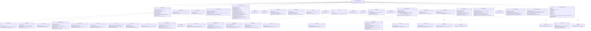

# core.items

51 classes, 36 internal relationships shown.

```mermaid
classDiagram
direction BT

class AbstractItemMinecolonies {
  + AbstractItemMinecolonies(String, Properties) 
}
class AbstractItemScroll {
  + AbstractItemScroll(String, Properties) 
  + finishUsingItem(ItemStack, Level, LivingEntity) ItemStack
  + getUseAnimation(ItemStack) UseAnim
  + useOn(UseOnContext) InteractionResult
  # getColony(ItemStack) IColony
  + getUseDuration(ItemStack) int
  # getColonyView(ItemStack) IColony
  # onItemUseSuccess(ItemStack, Level, ServerPlayer) ItemStack
  + use(Level, Player, InteractionHand) InteractionResultHolder~ItemStack~
  # needsColony() boolean
  - checkForCompound(ItemStack) CompoundTag
}
class ItemAdventureToken {
  + ItemAdventureToken(Properties) 
  + appendHoverText(ItemStack, Level?, List~Component~, TooltipFlag) void
  + getName(ItemStack) Component
}
class ItemAncientTome {
  + ItemAncientTome(Properties) 
  + isFoil(ItemStack) boolean
  + inventoryTick(ItemStack, Level, Entity, int, boolean) void
}
class ItemAssistantHammer {
  + ItemAssistantHammer(String, Properties, int) 
  + placeBlock(Player, IColony, IWorkOrder, BlockPos) void
  + useOn(UseOnContext) InteractionResult
  - tryBuildingBlockNearby(Player, IColony, IWorkOrder, BlockPos, List~IPlacementHandler~) BuildAttemptResult
  + useOnBlock(Player, BlockPos) void
  + use(Level, Player, InteractionHand) InteractionResultHolder~ItemStack~
  + appendHoverText(ItemStack, Level?, List~Component~, TooltipFlag) void
}
class ItemBannerRallyGuards {
  + ItemBannerRallyGuards(Properties) 
  + toggleBanner(ItemStack, Player) void
  + isActive(ItemStack) boolean
  - getColony(CompoundTag, Level) IColony?
  + isGuardBuilding(Level, BlockPos) boolean
  + onDroppedByPlayer(ItemStack, Player) boolean
  - handleRightClick(ItemStack, Player) void
  + checkForCompound(ItemStack) CompoundTag
  + isActiveForGuardTower(ItemStack, IGuardBuilding) boolean
  + getGuardBuildingView(Level, BlockPos) View?
  + removeGuardTowerAtLocation(ItemStack, ILocation) boolean
  + use(Level, Player, InteractionHand) InteractionResultHolder~ItemStack~
  + getGuardTowerLocations(ItemStack) ImmutableList~ILocation~
  + getGuardBuilding(Level, BlockPos) IGuardBuilding?
  + useOn(UseOnContext) InteractionResult
  + appendHoverText(ItemStack, Level?, List~Component~, TooltipFlag) void
  + broadcastPlayerToRally(ItemStack, Level, ILocation?) int
  + getGuardTowerViews(ItemStack, Level) List~Pair~ILocation, View~~
  + isFoil(ItemStack) boolean
}
class ItemBowlFood {
  + ItemBowlFood(Properties, int) 
  - int tier
  + appendHoverText(ItemStack, Level?, List~Component~, TooltipFlag) void
  + finishUsingItem(ItemStack, Level, LivingEntity) ItemStack
   int tier
}
class ItemBreadDough {
  + ItemBreadDough(Properties) 
}
class ItemBuildGoggles {
  + ItemBuildGoggles(String, Properties) 
  + appendHoverText(ItemStack, Level?, List~Component~, TooltipFlag) void
}
class ItemCakeBatter {
  + ItemCakeBatter(Properties) 
}
class ItemChiefSword {
  + ItemChiefSword(Properties) 
  + inventoryTick(ItemStack, Level, Entity, int, boolean) void
  + hurtEnemy(ItemStack, LivingEntity, LivingEntity) boolean
}
class ItemChorusBread {
  + ItemChorusBread(Properties) 
  + finishUsingItem(ItemStack, Level, LivingEntity) ItemStack
  + appendHoverText(ItemStack, Level?, List~Component~, TooltipFlag) void
}
class ItemClipboard {
  + ItemClipboard(Properties) 
  - checkForCompound(ItemStack) CompoundTag
  + useOn(UseOnContext) InteractionResult
  + use(Level, Player, InteractionHand) InteractionResultHolder~ItemStack~
  - openWindow(CompoundTag, Level, Player) void
}
class ItemColonyFlagBanner {
  + ItemColonyFlagBanner(Block, Block, Properties) 
  + ItemColonyFlagBanner(String, Properties) 
  + appendHoverText(ItemStack, Level?, List~Component~, TooltipFlag) void
  + useOn(UseOnContext) InteractionResult
}
class ItemColonyMap {
  + ItemColonyMap(Properties) 
  - checkForCompound(ItemStack) CompoundTag
  - openWindow(CompoundTag, Level, Player) void
  + useOn(UseOnContext) InteractionResult
  + use(Level, Player, InteractionHand) InteractionResultHolder~ItemStack~
}
class ItemColonySign {
  + ItemColonySign(Properties) 
  + useOn(UseOnContext) InteractionResult
  + appendHoverText(ItemStack, Level?, List~Component~, TooltipFlag) void
  # canPlace(BlockPlaceContext, BlockState) boolean
}
class ItemCompost {
  + ItemCompost(Properties) 
  - applyCompost(ItemStack, Level, BlockPos, Player) boolean
  + useOn(UseOnContext) InteractionResult
}
class ItemCookieDough {
  + ItemCookieDough(Properties) 
}
class ItemCrop {
  + ItemCrop(MinecoloniesCropBlock, Properties, TagKey~Biome~?) 
  + appendHoverText(ItemStack, Level?, List~Component~, TooltipFlag) void
  + canBePlantedIn(Holder~Biome~) boolean
  # canPlace(BlockPlaceContext, BlockState) boolean
}
class ItemFireArrow {
  + ItemFireArrow(Properties) 
  + hasCustomEntity(ItemStack) boolean
  + createEntity(Level, Entity, ItemStack) Entity?
  + createArrow(Level, ItemStack, LivingEntity) AbstractArrow
}
class ItemFood {
  + ItemFood(Properties, int) 
  - int tier
  + appendHoverText(ItemStack, Level?, List~Component~, TooltipFlag) void
   int tier
}
class ItemGate {
  + ItemGate(String, Block, Properties) 
  + appendHoverText(ItemStack, Level?, List~Component~, TooltipFlag) void
}
class ItemGoldenBread {
  + ItemGoldenBread(Properties) 
  + finishUsingItem(ItemStack, Level, LivingEntity) ItemStack
  + appendHoverText(ItemStack, Level?, List~Component~, TooltipFlag) void
}
class ItemIronScimitar {
  + ItemIronScimitar(Properties) 
}
class ItemLargeBottle {
  + ItemLargeBottle(Properties) 
  + use(Level, Player, InteractionHand) InteractionResultHolder~ItemStack~
  + interactLivingEntity(ItemStack, Player, LivingEntity, InteractionHand) InteractionResult
}
class ItemMagicPotion {
  + ItemMagicPotion(String, Properties) 
}
class ItemMilkyBread {
  + ItemMilkyBread(Properties) 
  + finishUsingItem(ItemStack, Level, LivingEntity) ItemStack
  + appendHoverText(ItemStack, Level?, List~Component~, TooltipFlag) void
}
class ItemMistletoe {
  + ItemMistletoe(Properties) 
}
class ItemPharaoScepter {
  + ItemPharaoScepter(Properties) 
  + customArrow(AbstractArrow) AbstractArrow
  + use(Level, Player, InteractionHand) InteractionResultHolder~ItemStack~
  + releaseUsing(ItemStack, Level, LivingEntity, int) void
   Predicate~ItemStack~ allSupportedProjectiles
}
class ItemPirateGear {
  + ItemPirateGear(String, ArmorMaterial, Type, Properties) 
}
class ItemPlateArmor {
  + ItemPlateArmor(String, ArmorMaterial, Type, Properties) 
}
class ItemQuestLog {
  + ItemQuestLog(Properties) 
  + use(Level, Player, InteractionHand) InteractionResultHolder~ItemStack~
  - openWindow(CompoundTag, Level, Player) void
  + useOn(UseOnContext) InteractionResult
  - checkForCompound(ItemStack) CompoundTag
}
class ItemRawPumpkinPie {
  + ItemRawPumpkinPie(Properties) 
}
class ItemResourceScroll {
  + ItemResourceScroll(Properties) 
  - getWorkOrderHash(IBuildingView) String
  + useOn(UseOnContext) InteractionResult
  + appendHoverText(ItemStack, Level?, List~Component~, TooltipFlag) void
  - openWindow(CompoundTag, Player) void
  - gatherWarehouseSnapshot(IBuildingView, BlockPos, String, Player) WarehouseSnapshot?
  + use(Level, Player, InteractionHand) InteractionResultHolder~ItemStack~
  - updateWarehouseSnapshot(BlockPos, CompoundTag, Player) void
}
class ItemSantaHead {
  + ItemSantaHead(String, ArmorMaterial, Type, Properties) 
}
class ItemScanAnalyzer {
  + ItemScanAnalyzer(String, Properties) 
  + ItemScanAnalyzer(Properties) 
  + use(Level, Player, InteractionHand) InteractionResultHolder~ItemStack~
  + saveStructure(Level, Player, AABB) Blueprint?
  + useOn(UseOnContext) InteractionResult
  + onAirRightClick(BlockPos, BlockPos, Level, Player, ItemStack) InteractionResult
  # checkTimeout(ItemStack, Level) void
  - openAreaBox(ItemStack) void
  + canAttackBlock(BlockState, Level, BlockPos, Player) boolean
   AbstractItemWithPosSelector registeredItemInstance
}
class ItemScepterBeekeeper {
  + ItemScepterBeekeeper(Properties) 
  + useOn(UseOnContext) InteractionResult
  + getOverlayBoxes(Level, Player, ItemStack) List~OverlayBox~
}
class ItemScepterGuard {
  + ItemScepterGuard(Properties) 
  + useOn(UseOnContext) InteractionResult
  - handleItemUsage(Level, BlockPos, CompoundTag, Player, ItemStack) InteractionResult
}
class ItemScepterLumberjack {
  + ItemScepterLumberjack(Properties) 
  + useOn(UseOnContext) InteractionResult
  - getBox(Level, CompoundTag) Box
  - getBox(Level, int, BlockPos, BlockPos?, BlockPos?) Box
  + canAttackBlock(BlockState, Level, BlockPos, Player) boolean
  + getOverlayBoxes(Level, Player, ItemStack) List~OverlayBox~
  + getDestroySpeed(ItemStack, BlockState) float
  - storeRestrictedArea(Player, CompoundTag, Level) void
}
class ItemScepterPermission {
  + ItemScepterPermission(Properties) 
  + appendHoverText(ItemStack, Level?, List~Component~, TooltipFlag) void
  - toggleItemMode(Player, CompoundTag) void
  - handleAddBlockType(Player, Level, BlockPos, IColonyView) InteractionResult
  + useOn(UseOnContext) InteractionResult
  + use(Level, Player, InteractionHand) InteractionResultHolder~ItemStack~
  - handleAddLocation(Player, Level, BlockPos, IColonyView) InteractionResult
  + getOverlayBoxes(Level, Player, ItemStack) List~OverlayBox~
  - handleItemAction(CompoundTag, Player, Level, BlockPos, IColonyView) InteractionResult
}
class ItemScrollBuff {
  + ItemScrollBuff(Properties) 
  # onItemUseSuccess(ItemStack, Level, ServerPlayer) ItemStack
  + appendHoverText(ItemStack, Level?, List~Component~, TooltipFlag) void
  # needsColony() boolean
  - addRegenerationWithParticles(LivingEntity) void
}
class ItemScrollColonyAreaTP {
  + ItemScrollColonyAreaTP(Properties) 
  # doTeleport(ServerPlayer, IColony, ItemStack) void
  + getUseDuration(ItemStack) int
  # onItemUseSuccess(ItemStack, Level, ServerPlayer) ItemStack
  + appendHoverText(ItemStack, Level?, List~Component~, TooltipFlag) void
  # needsColony() boolean
  - getAffectedPlayers(ServerPlayer) List~ServerPlayer~
  + onUseTick(Level, LivingEntity, ItemStack, int) void
}
class ItemScrollColonyTP {
  + ItemScrollColonyTP(Properties) 
  # onItemUseSuccess(ItemStack, Level, ServerPlayer) ItemStack
  # doTeleport(ServerPlayer, IColony, ItemStack) void
  # needsColony() boolean
  + onUseTick(Level, LivingEntity, ItemStack, int) void
  + appendHoverText(ItemStack, Level?, List~Component~, TooltipFlag) void
}
class ItemScrollGuardHelp {
  + ItemScrollGuardHelp(Properties) 
  + onUseTick(Level, LivingEntity, ItemStack, int) void
  # needsColony() boolean
  # onItemUseSuccess(ItemStack, Level, ServerPlayer) ItemStack
  + appendHoverText(ItemStack, Level?, List~Component~, TooltipFlag) void
  + useOn(UseOnContext) InteractionResult
}
class ItemScrollHighlight {
  + ItemScrollHighlight(Properties) 
  # onItemUseSuccess(ItemStack, Level, ServerPlayer) ItemStack
  + useOn(UseOnContext) InteractionResult
  # needsColony() boolean
  + appendHoverText(ItemStack, Level?, List~Component~, TooltipFlag) void
}
class ItemSifterMesh {
  + ItemSifterMesh(String, Properties) 
}
class ItemSpear {
  + ItemSpear(Properties) 
  + use(Level, Player, InteractionHand) InteractionResultHolder~ItemStack~
  + initializeClient(Consumer~IClientItemExtensions~) void
  + releaseUsing(ItemStack, Level, LivingEntity, int) void
  + canPerformAction(ItemStack, ToolAction) boolean
   int damage
}
class ItemSugaryBread {
  + ItemSugaryBread(Properties) 
  + appendHoverText(ItemStack, Level?, List~Component~, TooltipFlag) void
  + finishUsingItem(ItemStack, Level, LivingEntity) ItemStack
}
class ItemSupplyCampDeployer {
  + ItemSupplyCampDeployer(Properties) 
  + useOn(UseOnContext) InteractionResult
  - placeSupplyCamp(BlockPos?, Direction, ItemStack, InteractionHand) void
  - hasPlacePermission(Level, BlockPos, Player) boolean
  - checkIfSolidAndNotInColony(Level, BlockPos, List~PlacementError~, Player) void
  + use(Level, Player, InteractionHand) InteractionResultHolder~ItemStack~
  + canCampBePlaced(Level, BlockPos, List~PlacementError~, Player) boolean
}
class ItemSupplyChestDeployer {
  + ItemSupplyChestDeployer(Properties) 
  - checkFluidAndNotInColony(Level, BlockPos, List~PlacementError~, Player, BlockState) void
  + canShipBePlaced(Level, BlockPos, Blueprint, List~PlacementError~, Player) boolean
  + use(Level, Player, InteractionHand) InteractionResultHolder~ItemStack~
  + useOn(UseOnContext) InteractionResult
  - hasPlacePermission(Level, BlockPos, Player) boolean
  - placeSupplyShip(Level, BlockPos?, InteractionHand, ItemStack) void
}
class MineColoniesArmorMaterial {
  + MineColoniesArmorMaterial(String, int, Map~Type, Integer~, int, SoundEvent, float, float, Supplier~Ingredient~) 
  - float toughness
  - String name
  - float knockbackResistance
  - LazyLoadedValue~Ingredient~ repairIngredient
  - int enchantmentValue
  + getDurabilityForType(Type) int
  + getDefenseForType(Type) int
   int enchantmentValue
   String name
   float knockbackResistance
   float toughness
   SoundEvent equipSound
   Ingredient repairIngredient
}

AbstractItemScroll  -->  AbstractItemMinecolonies 
ItemAdventureToken  -->  AbstractItemMinecolonies 
ItemAncientTome  -->  AbstractItemMinecolonies 
ItemAssistantHammer  -->  AbstractItemMinecolonies 
ItemBannerRallyGuards  -->  AbstractItemMinecolonies 
ItemBreadDough  -->  AbstractItemMinecolonies 
ItemBuildGoggles  ..>  MineColoniesArmorMaterial : «create»
ItemCakeBatter  -->  AbstractItemMinecolonies 
ItemChorusBread  -->  ItemFood 
ItemClipboard  -->  AbstractItemMinecolonies 
ItemColonyMap  -->  AbstractItemMinecolonies 
ItemCompost  -->  AbstractItemMinecolonies 
ItemCookieDough  -->  AbstractItemMinecolonies 
ItemGoldenBread  -->  ItemFood 
ItemMagicPotion  -->  AbstractItemMinecolonies 
ItemMilkyBread  -->  ItemFood 
ItemMistletoe  -->  AbstractItemMinecolonies 
ItemPirateGear  ..>  MineColoniesArmorMaterial : «create»
ItemPlateArmor  ..>  MineColoniesArmorMaterial : «create»
ItemQuestLog  -->  AbstractItemMinecolonies 
ItemRawPumpkinPie  -->  AbstractItemMinecolonies 
ItemResourceScroll  -->  AbstractItemMinecolonies 
ItemSantaHead  ..>  MineColoniesArmorMaterial : «create»
ItemScepterBeekeeper  -->  AbstractItemMinecolonies 
ItemScepterGuard  -->  AbstractItemMinecolonies 
ItemScepterLumberjack  -->  AbstractItemMinecolonies 
ItemScepterPermission  -->  AbstractItemMinecolonies 
ItemScrollBuff  -->  AbstractItemScroll 
ItemScrollColonyAreaTP  -->  AbstractItemScroll 
ItemScrollColonyTP  -->  AbstractItemScroll 
ItemScrollGuardHelp  -->  AbstractItemScroll 
ItemScrollHighlight  -->  AbstractItemScroll 
ItemSifterMesh  -->  AbstractItemMinecolonies 
ItemSugaryBread  -->  ItemFood 
ItemSupplyCampDeployer  -->  AbstractItemMinecolonies 
ItemSupplyChestDeployer  -->  AbstractItemMinecolonies 
```
