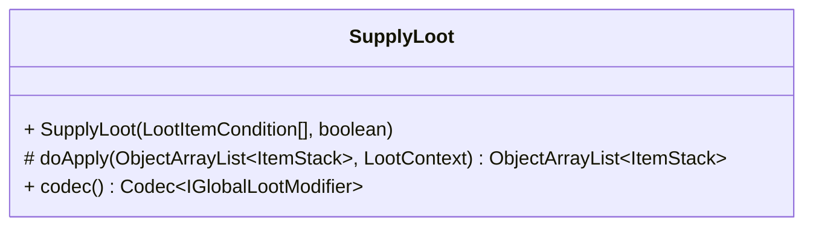

# core.loot

1 classes, 0 internal relationships shown.

```mermaid
classDiagram
direction BT

class SupplyLoot {
  + SupplyLoot(LootItemCondition[], boolean) 
  # doApply(ObjectArrayList~ItemStack~, LootContext) ObjectArrayList~ItemStack~
  + codec() Codec~IGlobalLootModifier~
}
```
