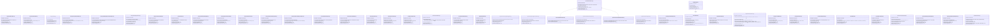

# core.network

42 classes, 3 internal relationships shown.

```mermaid
classDiagram
direction BT

class BlockParticleEffectMessage {
  + BlockParticleEffectMessage(BlockPos, BlockState, int) 
  + BlockParticleEffectMessage() 
  + toBytes(FriendlyByteBuf) void
  + fromBytes(FriendlyByteBuf) void
  + onExecute(Context, boolean) void
   LogicalSide? executionSide
}
class CircleParticleEffectMessage {
  + CircleParticleEffectMessage() 
  + CircleParticleEffectMessage(Vec3, SimpleParticleType, int) 
  + fromBytes(FriendlyByteBuf) void
  + toBytes(FriendlyByteBuf) void
  + onExecute(Context, boolean) void
   LogicalSide? executionSide
}
class ColonyListMessage {
  + ColonyListMessage() 
  + ColonyListMessage(List~IColony~) 
  + fromBytes(FriendlyByteBuf) void
  + onExecute(Context, boolean) void
  + toBytes(FriendlyByteBuf) void
}
class ColonyViewAnimalViewDataMessage {
  + ColonyViewAnimalViewDataMessage() 
  + ColonyViewAnimalViewDataMessage(IColony, Set~IAnimalData~, boolean) 
  + toBytes(FriendlyByteBuf) void
  + onExecute(Context, boolean) void
  + fromBytes(FriendlyByteBuf) void
   LogicalSide? executionSide
}
class ColonyViewBuildingExtensionsUpdateMessage {
  + ColonyViewBuildingExtensionsUpdateMessage(IColony, Collection~IBuildingExtension~) 
  + ColonyViewBuildingExtensionsUpdateMessage() 
  + onExecute(Context, boolean) void
  + fromBytes(FriendlyByteBuf) void
  + toBytes(FriendlyByteBuf) void
   LogicalSide? executionSide
}
class ColonyViewBuildingViewMessage {
  + ColonyViewBuildingViewMessage(IBuilding) 
  + ColonyViewBuildingViewMessage(IBuilding, boolean) 
  + ColonyViewBuildingViewMessage() 
  + onExecute(Context, boolean) void
  + fromBytes(FriendlyByteBuf) void
  + toBytes(FriendlyByteBuf) void
   LogicalSide? executionSide
}
class ColonyViewCitizenViewMessage {
  + ColonyViewCitizenViewMessage(Colony, ICitizenData) 
  + ColonyViewCitizenViewMessage() 
  + toBytes(FriendlyByteBuf) void
  + onExecute(Context, boolean) void
  + fromBytes(FriendlyByteBuf) void
   LogicalSide? executionSide
}
class ColonyViewMessage {
  + ColonyViewMessage(Colony, FriendlyByteBuf, boolean) 
  + ColonyViewMessage() 
  + fromBytes(FriendlyByteBuf) void
  + onExecute(Context, boolean) void
  + toBytes(FriendlyByteBuf) void
   LogicalSide? executionSide
}
class ColonyViewRemoveBuildingMessage {
  + ColonyViewRemoveBuildingMessage(Colony, BlockPos) 
  + ColonyViewRemoveBuildingMessage() 
  + fromBytes(FriendlyByteBuf) void
  + toBytes(FriendlyByteBuf) void
  + onExecute(Context, boolean) void
   LogicalSide? executionSide
}
class ColonyViewRemoveCitizenMessage {
  + ColonyViewRemoveCitizenMessage() 
  + ColonyViewRemoveCitizenMessage(Colony, int) 
  + toBytes(FriendlyByteBuf) void
  + fromBytes(FriendlyByteBuf) void
  + onExecute(Context, boolean) void
   LogicalSide? executionSide
}
class ColonyViewRemoveMessage {
  + ColonyViewRemoveMessage() 
  + ColonyViewRemoveMessage(int, ResourceKey~Level~) 
  + toBytes(FriendlyByteBuf) void
  + onExecute(Context, boolean) void
  + fromBytes(FriendlyByteBuf) void
   LogicalSide? executionSide
}
class ColonyViewRemoveWorkOrderMessage {
  + ColonyViewRemoveWorkOrderMessage(Colony, int) 
  + ColonyViewRemoveWorkOrderMessage() 
  + fromBytes(FriendlyByteBuf) void
  + toBytes(FriendlyByteBuf) void
  + onExecute(Context, boolean) void
   LogicalSide? executionSide
}
class ColonyViewResearchManagerViewMessage {
  + ColonyViewResearchManagerViewMessage() 
  + ColonyViewResearchManagerViewMessage(IColony, IResearchManager) 
  + toBytes(FriendlyByteBuf) void
  + fromBytes(FriendlyByteBuf) void
  + onExecute(Context, boolean) void
   LogicalSide? executionSide
}
class ColonyViewWorkOrderMessage {
  + ColonyViewWorkOrderMessage(Colony, List~IServerWorkOrder~) 
  + ColonyViewWorkOrderMessage() 
  + fromBytes(FriendlyByteBuf) void
  + toBytes(FriendlyByteBuf) void
  + onExecute(Context, boolean) void
   LogicalSide? executionSide
}
class ColonyVisitorViewDataMessage {
  + ColonyVisitorViewDataMessage(IColony, Set~IVisitorData~, boolean) 
  + ColonyVisitorViewDataMessage() 
  + fromBytes(FriendlyByteBuf) void
  + onExecute(Context, boolean) void
  + toBytes(FriendlyByteBuf) void
   LogicalSide? executionSide
}
class CompostParticleMessage {
  + CompostParticleMessage(BlockPos) 
  + CompostParticleMessage() 
  + fromBytes(FriendlyByteBuf) void
  + toBytes(FriendlyByteBuf) void
  + onExecute(Context, boolean) void
   LogicalSide? executionSide
}
class GlobalDiseaseSyncMessage {
  + GlobalDiseaseSyncMessage() 
  + GlobalDiseaseSyncMessage(FriendlyByteBuf) 
  + fromBytes(FriendlyByteBuf) void
  + toBytes(FriendlyByteBuf) void
  + onExecute(Context, boolean) void
   LogicalSide? executionSide
}
class GlobalQuestSyncMessage {
  + GlobalQuestSyncMessage() 
  + GlobalQuestSyncMessage(FriendlyByteBuf) 
  + fromBytes(FriendlyByteBuf) void
  + toBytes(FriendlyByteBuf) void
  + onExecute(Context, boolean) void
   LogicalSide? executionSide
}
class ItemParticleEffectMessage {
  + ItemParticleEffectMessage() 
  + ItemParticleEffectMessage(ItemStack, double, double, double, double, double, double) 
  + fromBytes(FriendlyByteBuf) void
  + toBytes(FriendlyByteBuf) void
  + onExecute(Context, boolean) void
   LogicalSide? executionSide
}
class LocalizedParticleEffectMessage {
  + LocalizedParticleEffectMessage(ItemStack, BlockPos) 
  + LocalizedParticleEffectMessage() 
  + fromBytes(FriendlyByteBuf) void
  + toBytes(FriendlyByteBuf) void
  + onExecute(Context, boolean) void
   LogicalSide? executionSide
}
class OpenBuildWindowMessage {
  # OpenBuildWindowMessage(BlockPos, String, String, Rotation, Mirror) 
  # OpenBuildWindowMessage() 
  + onExecute(Context, boolean) void
  # createWorkOrderMessage(BlockPos) IMessage
  + toBytes(FriendlyByteBuf) void
  + fromBytes(FriendlyByteBuf) void
   LogicalSide executionSide
}
class OpenBuildingUIMessage {
  + OpenBuildingUIMessage(IBuilding) 
  + OpenBuildingUIMessage() 
  + fromBytes(FriendlyByteBuf) void
  + onExecute(Context, boolean) void
  + toBytes(FriendlyByteBuf) void
   LogicalSide? executionSide
}
class OpenCantFoundColonyWarningMessage {
  + OpenCantFoundColonyWarningMessage(Component, BlockPos, boolean) 
  + OpenCantFoundColonyWarningMessage() 
  + onExecute(Context, boolean) void
  + toBytes(FriendlyByteBuf) void
  + fromBytes(FriendlyByteBuf) void
}
class OpenColonyFoundingCovenantMessage {
  + OpenColonyFoundingCovenantMessage() 
  + OpenColonyFoundingCovenantMessage(String, int, BlockPos) 
  + onExecute(Context, boolean) void
  + toBytes(FriendlyByteBuf) void
  + fromBytes(FriendlyByteBuf) void
}
class OpenDecoBuildWindowMessage {
  + OpenDecoBuildWindowMessage(BlockPos, String, String, Rotation, Mirror) 
  + OpenDecoBuildWindowMessage() 
  + createWorkOrderMessage(BlockPos) IMessage
}
class OpenDeleteAbandonColonyMessage {
  + OpenDeleteAbandonColonyMessage() 
  + OpenDeleteAbandonColonyMessage(BlockPos, String, BlockPos, int) 
  + fromBytes(FriendlyByteBuf) void
  + onExecute(Context, boolean) void
  + toBytes(FriendlyByteBuf) void
}
class OpenPlantationFieldBuildWindowMessage {
  + OpenPlantationFieldBuildWindowMessage(BlockPos, String, String, Rotation, Mirror) 
  + OpenPlantationFieldBuildWindowMessage() 
  # createWorkOrderMessage(BlockPos) IMessage
}
class OpenReactivateColonyMessage {
  + OpenReactivateColonyMessage() 
  + OpenReactivateColonyMessage(String, int, BlockPos) 
  + fromBytes(FriendlyByteBuf) void
  + onExecute(Context, boolean) void
  + toBytes(FriendlyByteBuf) void
}
class OpenSuggestionWindowMessage {
  + OpenSuggestionWindowMessage() 
  + OpenSuggestionWindowMessage(BlockState, BlockPos, ItemStack) 
  + fromBytes(FriendlyByteBuf) void
  + onExecute(Context, boolean) void
  + toBytes(FriendlyByteBuf) void
   LogicalSide? executionSide
}
class PlayAudioMessage {
  + PlayAudioMessage() 
  + PlayAudioMessage(SoundEvent, SoundSource) 
  + PlayAudioMessage(SoundEvent) 
  + onExecute(Context, boolean) void
  + toBytes(FriendlyByteBuf) void
  + sendToAll(IColony, boolean, boolean, PlayAudioMessage[]) void
  + fromBytes(FriendlyByteBuf) void
   LogicalSide? executionSide
}
class PlayMusicAtPosMessage {
  + PlayMusicAtPosMessage(SoundEvent, BlockPos, Level, float, float) 
  + PlayMusicAtPosMessage() 
  + toBytes(FriendlyByteBuf) void
  + fromBytes(FriendlyByteBuf) void
  + onExecute(Context, boolean) void
   LogicalSide? executionSide
}
class PlaySoundForCitizenMessage {
  + PlaySoundForCitizenMessage(int, SoundEvent, SoundSource, BlockPos, Level, int, int) 
  + PlaySoundForCitizenMessage() 
  + PlaySoundForCitizenMessage(int, SoundEvent, BlockPos, Level) 
  + PlaySoundForCitizenMessage(int, SoundEvent, SoundSource, BlockPos, Level) 
  + PlaySoundForCitizenMessage(int, SoundEvent, SoundSource, BlockPos, Level, float, float, int, int) 
  + toBytes(FriendlyByteBuf) void
  + onExecute(Context, boolean) void
  + fromBytes(FriendlyByteBuf) void
   LogicalSide? executionSide
}
class SaveStructureNBTMessage {
  + SaveStructureNBTMessage() 
  + SaveStructureNBTMessage(CompoundTag, String) 
  + fromBytes(FriendlyByteBuf) void
  + toBytes(FriendlyByteBuf) void
  + onExecute(Context, boolean) void
   LogicalSide? executionSide
}
class SleepingParticleMessage {
  + SleepingParticleMessage() 
  + SleepingParticleMessage(double, double, double) 
  + fromBytes(FriendlyByteBuf) void
  + toBytes(FriendlyByteBuf) void
  + onExecute(Context, boolean) void
   LogicalSide? executionSide
}
class StopMusicMessage {
  + StopMusicMessage() 
  + toBytes(FriendlyByteBuf) void
  + fromBytes(FriendlyByteBuf) void
  + onExecute(Context, boolean) void
   LogicalSide? executionSide
}
class StreamParticleEffectMessage {
  + StreamParticleEffectMessage(Vec3, Vec3, SimpleParticleType, int, int) 
  + StreamParticleEffectMessage() 
  + toBytes(FriendlyByteBuf) void
  + onExecute(Context, boolean) void
  + fromBytes(FriendlyByteBuf) void
   LogicalSide? executionSide
}
class SyncPathMessage {
  + SyncPathMessage() 
  + SyncPathMessage(Set~MNode~, Set~MNode~, Set~MNode~, Set~MNode~, Set~MNode~, Set~MNode~) 
  + onExecute(Context, boolean) void
  + fromBytes(FriendlyByteBuf) void
  + toBytes(FriendlyByteBuf) void
   LogicalSide? executionSide
}
class SyncPathReachedMessage {
  + SyncPathReachedMessage(Set~BlockPos~) 
  + SyncPathReachedMessage() 
  + fromBytes(FriendlyByteBuf) void
  + onExecute(Context, boolean) void
  + toBytes(FriendlyByteBuf) void
   LogicalSide? executionSide
}
class UpdateChunkCapabilityMessage {
  + UpdateChunkCapabilityMessage() 
  + UpdateChunkCapabilityMessage(IColonyTagCapability, int, int) 
  + UpdateChunkCapabilityMessage(ChunkCapData) 
  + fromBytes(FriendlyByteBuf) void
  + onExecute(Context, boolean) void
  + toBytes(FriendlyByteBuf) void
   LogicalSide? executionSide
}
class UpdateChunkRangeCapabilityMessage {
  + UpdateChunkRangeCapabilityMessage(Level, int, int, int, boolean) 
  + UpdateChunkRangeCapabilityMessage() 
  + fromBytes(FriendlyByteBuf) void
  + onExecute(Context, boolean) void
  + toBytes(FriendlyByteBuf) void
   LogicalSide? executionSide
}
class UpdateClientWithCompatibilityMessage {
  + UpdateClientWithCompatibilityMessage() 
  + UpdateClientWithCompatibilityMessage(boolean) 
  + onExecute(Context, boolean) void
  + fromBytes(FriendlyByteBuf) void
  + toBytes(FriendlyByteBuf) void
   LogicalSide? executionSide
}
class VanillaParticleMessage {
  + VanillaParticleMessage(double, double, double, SimpleParticleType) 
  + VanillaParticleMessage() 
  + fromBytes(FriendlyByteBuf) void
  + onExecute(Context, boolean) void
  - spawnParticles(SimpleParticleType, Level, double, double, double) void
  + toBytes(FriendlyByteBuf) void
   LogicalSide? executionSide
}

OpenDecoBuildWindowMessage  -->  OpenBuildWindowMessage 
OpenPlantationFieldBuildWindowMessage  -->  OpenBuildWindowMessage 
PlayAudioMessage  ..>  StopMusicMessage : «create»
```
