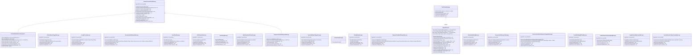

# core.network (cont. 3)

23 classes, 3 internal relationships shown.

```mermaid
classDiagram
direction BT

class AbstractBuildingServerMessage~T~ {
  + AbstractBuildingServerMessage(IBuildingView) 
  + AbstractBuildingServerMessage() 
  + AbstractBuildingServerMessage(ResourceKey~Level~, int, BlockPos) 
  # onExecute(Context, boolean, IColony, T) void
  + onExecute(Context, boolean, IColony) void
  # toBytesAbstractOverride(FriendlyByteBuf) void
  # fromBytesAbstractOverride(FriendlyByteBuf) void
  + errorIfCastFails() boolean
}
class AbstractColonyServerMessage {
  + AbstractColonyServerMessage() 
  + AbstractColonyServerMessage(ResourceKey~Level~, int) 
  + AbstractColonyServerMessage(IColony) 
  # toBytesOverride(FriendlyByteBuf) void
  # fromBytesAbstractOverride(FriendlyByteBuf) void
  # fromBytesOverride(FriendlyByteBuf) void
  + onExecute(Context, boolean) void
  + ownerOnly() boolean
  + permissionNeeded() Action?
  # toBytesAbstractOverride(FriendlyByteBuf) void
  + fromBytes(FriendlyByteBuf) void
  + toBytes(FriendlyByteBuf) void
  # onExecute(Context, boolean, IColony) void
   LogicalSide? executionSide
}
class ClickGuiButtonTriggerMessage {
  + ClickGuiButtonTriggerMessage() 
  + ClickGuiButtonTriggerMessage(String, ResourceLocation) 
  + onExecute(Context, boolean) void
  + fromBytes(FriendlyByteBuf) void
  + toBytes(FriendlyByteBuf) void
   LogicalSide? executionSide
}
class CreateColonyMessage {
  + CreateColonyMessage(BlockPos, boolean, String, String, String) 
  + CreateColonyMessage() 
  + onExecute(Context, boolean) void
  + fromBytes(FriendlyByteBuf) void
  + toBytes(FriendlyByteBuf) void
   LogicalSide? executionSide
}
class DecorationBuildRequestMessage {
  + DecorationBuildRequestMessage() 
  + DecorationBuildRequestMessage(WorkOrderType, BlockPos, String, String, ResourceKey~Level~, Rotation, boolean, BlockPos) 
  + onExecute(Context, boolean) void
  + toBytes(FriendlyByteBuf) void
  + fromBytes(FriendlyByteBuf) void
   LogicalSide? executionSide
}
class DirectPlaceMessage {
  + DirectPlaceMessage() 
  + DirectPlaceMessage(BlockState, BlockPos, ItemStack) 
  + fromBytes(FriendlyByteBuf) void
  + toBytes(FriendlyByteBuf) void
  + onExecute(Context, boolean) void
   LogicalSide? executionSide
}
class GetColonyInfoMessage {
  + GetColonyInfoMessage(BlockPos) 
  + GetColonyInfoMessage() 
  + fromBytes(FriendlyByteBuf) void
  + onExecute(Context, boolean) void
  + toBytes(FriendlyByteBuf) void
   LogicalSide? executionSide
}
class ItemSettingMessage {
  + ItemSettingMessage() 
  + toBytes(FriendlyByteBuf) void
  + fromBytes(FriendlyByteBuf) void
  + onExecute(Context, boolean) void
  + setSetting(String, int) void
}
class MarkStoryReadOnItemMessage {
  + MarkStoryReadOnItemMessage(InteractionHand) 
  + MarkStoryReadOnItemMessage() 
  + fromBytes(FriendlyByteBuf) void
  + toBytes(FriendlyByteBuf) void
  + onExecute(Context, boolean) void
   LogicalSide? executionSide
}
class NetworkChannel {
  + NetworkChannel(String) 
  - Map~Integer, NetworkingMessageEntry~?~~ messagesTypes
  - Cache~Integer, Map~Integer, byte[]~~ messageCache
  + sendToTrackingChunk(IMessage, LevelChunk) void
  + sendToDimension(IMessage, ResourceLocation) void
  - setupInternalMessages() void
  - registerMessage(int, Class~MSG~, Supplier~MSG~) void
  - handleSplitting(IMessage, Consumer~IMessage~) void
  + sendToOrigin(IMessage, Context) void
  + sendToTrackingEntity(IMessage, Entity) void
  + sendToPosition(IMessage, TargetPoint) void
  + registerCommonMessages() void
  + sendToEveryone(IMessage) void
  + sendToTrackingEntityAndSelf(IMessage, Entity) void
  + sendToPlayer(IMessage, ServerPlayer) void
  + sendToServer(IMessage) void
   Map~Integer, NetworkingMessageEntry~?~~ messagesTypes
   Cache~Integer, Map~Integer, byte[]~~ messageCache
}
class OpenGuiWindowTriggerMessage {
  + OpenGuiWindowTriggerMessage(ResourceLocation) 
  + OpenGuiWindowTriggerMessage() 
  + fromBytes(FriendlyByteBuf) void
  + onExecute(Context, boolean) void
  + toBytes(FriendlyByteBuf) void
   LogicalSide? executionSide
}
class PermissionsMessage {
  + PermissionsMessage() 
}
class PickupBlockMessage {
  + PickupBlockMessage(BlockPos) 
  + PickupBlockMessage() 
  + fromBytes(FriendlyByteBuf) void
  + onExecute(Context, boolean) void
  + toBytes(FriendlyByteBuf) void
   LogicalSide? executionSide
}
class PlantationFieldBuildRequestMessage {
  + PlantationFieldBuildRequestMessage() 
  + PlantationFieldBuildRequestMessage(WorkOrderType, BlockPos, String, String, ResourceKey~Level~, Rotation, boolean, BlockPos) 
  + onExecute(Context, boolean) void
  + toBytes(FriendlyByteBuf) void
  + fromBytes(FriendlyByteBuf) void
   LogicalSide? executionSide
}
class PlayerAssistantBuildRequestMessage {
  + PlayerAssistantBuildRequestMessage() 
  + PlayerAssistantBuildRequestMessage(IColony, int, BlockPos) 
  # fromBytesOverride(FriendlyByteBuf) void
  + permissionNeeded() Action?
  # toBytesOverride(FriendlyByteBuf) void
  # onExecute(Context, boolean, IColony) void
}
class ReactivateBuildingMessage {
  + ReactivateBuildingMessage(BlockPos) 
  + ReactivateBuildingMessage() 
  + onExecute(Context, boolean) void
  + fromBytes(FriendlyByteBuf) void
  + toBytes(FriendlyByteBuf) void
   LogicalSide? executionSide
}
class RemoveFromRallyingListMessage {
  + RemoveFromRallyingListMessage(ItemStack, ILocation) 
  + RemoveFromRallyingListMessage() 
  + toBytes(FriendlyByteBuf) void
  + onExecute(Context, boolean) void
  + fromBytes(FriendlyByteBuf) void
   LogicalSide? executionSide
}
class ResourceScrollSaveWarehouseSnapshotMessage {
  + ResourceScrollSaveWarehouseSnapshotMessage(BlockPos) 
  + ResourceScrollSaveWarehouseSnapshotMessage(BlockPos, Map~String, Integer~, String) 
  + ResourceScrollSaveWarehouseSnapshotMessage() 
  + fromBytes(FriendlyByteBuf) void
  + toBytes(FriendlyByteBuf) void
  + onExecute(Context, boolean) void
   LogicalSide? executionSide
}
class SplitPacketMessage {
  + SplitPacketMessage(int, int, boolean, int, byte[]) 
  + SplitPacketMessage() 
  + onExecute(Context, boolean) void
  + fromBytes(FriendlyByteBuf) void
  + toBytes(FriendlyByteBuf) void
}
class SwitchBuildingWithToolMessage {
  + SwitchBuildingWithToolMessage() 
  + SwitchBuildingWithToolMessage(ItemStack) 
  + toBytes(FriendlyByteBuf) void
  + fromBytes(FriendlyByteBuf) void
  + onExecute(Context, boolean) void
   LogicalSide? executionSide
}
class SwitchRecipeCraftingTeachingMessage {
  + SwitchRecipeCraftingTeachingMessage() 
  + onExecute(Context, boolean) void
  + toBytes(FriendlyByteBuf) void
  + fromBytes(FriendlyByteBuf) void
   LogicalSide? executionSide
}
class ToggleBannerRallyGuardsMessage {
  + ToggleBannerRallyGuardsMessage() 
  + ToggleBannerRallyGuardsMessage(ItemStack) 
  + toBytes(FriendlyByteBuf) void
  + onExecute(Context, boolean) void
  + fromBytes(FriendlyByteBuf) void
   LogicalSide? executionSide
}
class TransferRecipeCraftingTeachingMessage {
  + TransferRecipeCraftingTeachingMessage(Map~Integer, ItemStack~, boolean) 
  + TransferRecipeCraftingTeachingMessage() 
  + toBytes(FriendlyByteBuf) void
  + fromBytes(FriendlyByteBuf) void
  + onExecute(Context, boolean) void
   LogicalSide? executionSide
}

AbstractBuildingServerMessage~T~  -->  AbstractColonyServerMessage 
NetworkChannel  ..>  SplitPacketMessage : «create»
PlayerAssistantBuildRequestMessage  -->  AbstractColonyServerMessage 
```
