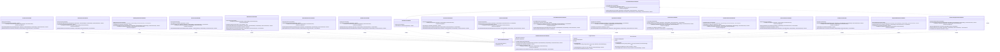

# core.placementhandlers

23 classes, 20 internal relationships shown.

```mermaid
classDiagram
direction BT

class BarracksTowerHandler {
  + BarracksTowerHandler() 
  + canHandle(Level, BlockPos, BlockState) boolean
  + handle(Level, BlockPos, BlockState, CompoundTag?, IPlacementContext) ActionProcessingResult
  + doesWorldStateMatchBlueprintState(BlockState, BlockState, Tuple~BlockEntity, CompoundTag~, IPlacementContext) boolean
  + getRequiredItems(Level, BlockPos, BlockState, CompoundTag?, IPlacementContext) List~ItemStack~
}
class BeehivePlacementHandler {
  + BeehivePlacementHandler() 
  + doesWorldStateMatchBlueprintState(BlockState, BlockState, Tuple~BlockEntity, CompoundTag~, IPlacementContext) boolean
  + canHandle(Level, BlockPos, BlockState) boolean
  + handle(Level, BlockPos, BlockState, CompoundTag?, IPlacementContext) ActionProcessingResult
  + getRequiredItems(Level, BlockPos, BlockState, CompoundTag?, IPlacementContext) List~ItemStack~
}
class BuilderIgnorePlacementHandler {
  + BuilderIgnorePlacementHandler() 
  + getRequiredItems(Level, BlockPos, BlockState, CompoundTag?, IPlacementContext) List~ItemStack~
  + canHandle(Level, BlockPos, BlockState) boolean
  + doesWorldStateMatchBlueprintState(BlockState, BlockState, Tuple~BlockEntity, CompoundTag~, IPlacementContext) boolean
  + handle(Level, BlockPos, BlockState, CompoundTag?, IPlacementContext) ActionProcessingResult
}
class DimensionFluidHandler {
  + DimensionFluidHandler() 
  + canHandle(Level, BlockPos, BlockState) boolean
  + getRequiredItems(Level, BlockPos, BlockState, CompoundTag?, IPlacementContext) List~ItemStack~
  + handle(Level, BlockPos, BlockState, CompoundTag?, IPlacementContext) ActionProcessingResult
  + doesWorldStateMatchBlueprintState(BlockState, BlockState, Tuple~BlockEntity, CompoundTag~, IPlacementContext) boolean
}
class DoBlockPlacementHandler {
  + DoBlockPlacementHandler() 
  + handle(Level, BlockPos, BlockState, CompoundTag?, IPlacementContext) ActionProcessingResult
  + handleRemoval(IStructureHandler, Level, BlockPos) void
  + doesWorldStateMatchBlueprintState(BlockState, BlockState, Tuple~BlockEntity, CompoundTag~, IPlacementContext) boolean
  + getCorrectDOItem(ItemStack, BlockState, boolean) ItemStack
  + getRequiredItems(Level, BlockPos, BlockState, CompoundTag?, IPlacementContext) List~ItemStack~
  + canHandle(Level, BlockPos, BlockState) boolean
}
class DoDoorBlockPlacementHandler {
  + DoDoorBlockPlacementHandler() 
  + canHandle(Level, BlockPos, BlockState) boolean
  + handle(Level, BlockPos, BlockState, CompoundTag?, IPlacementContext) ActionProcessingResult
  + doesWorldStateMatchBlueprintState(BlockState, BlockState, Tuple~BlockEntity, CompoundTag~, IPlacementContext) boolean
  + getRequiredItems(Level, BlockPos, BlockState, CompoundTag?, IPlacementContext) List~ItemStack~
}
class FieldPlacementHandler {
  + FieldPlacementHandler() 
  + canHandle(Level, BlockPos, BlockState) boolean
  + handle(Level, BlockPos, BlockState, CompoundTag?, IPlacementContext) ActionProcessingResult
  + getRequiredItems(Level, BlockPos, BlockState, CompoundTag?, IPlacementContext) List~ItemStack~
  + doesWorldStateMatchBlueprintState(BlockState, BlockState, Tuple~BlockEntity, CompoundTag~, IPlacementContext) boolean
}
class GatePlacementHandler {
  + GatePlacementHandler() 
  + canHandle(Level, BlockPos, BlockState) boolean
}
class GeneralBlockPlacementHandler {
  + GeneralBlockPlacementHandler() 
  + canHandle(Level, BlockPos, BlockState) boolean
  + handle(Level, BlockPos, BlockState, CompoundTag?, IPlacementContext) ActionProcessingResult
  + getRequiredItems(Level, BlockPos, BlockState, CompoundTag?, IPlacementContext) List~ItemStack~
  + doesWorldStateMatchBlueprintState(BlockState, BlockState, Tuple~BlockEntity, CompoundTag~, IPlacementContext) boolean
}
class GravePlacementHandler {
  + GravePlacementHandler() 
  + handle(Level, BlockPos, BlockState, CompoundTag?, IPlacementContext) ActionProcessingResult
  + canHandle(Level, BlockPos, BlockState) boolean
  + getRequiredItems(Level, BlockPos, BlockState, CompoundTag?, IPlacementContext) List~ItemStack~
  + doesWorldStateMatchBlueprintState(BlockState, BlockState, Tuple~BlockEntity, CompoundTag~, IPlacementContext) boolean
}
class HutPlacementHandler {
  + HutPlacementHandler() 
  + getRequiredItems(Level, BlockPos, BlockState, CompoundTag?, IPlacementContext) List~ItemStack~
  + canHandle(Level, BlockPos, BlockState) boolean
  + handle(Level, BlockPos, BlockState, CompoundTag?, IPlacementContext) ActionProcessingResult
  + doesWorldStateMatchBlueprintState(BlockState, BlockState, Tuple~BlockEntity, CompoundTag~, IPlacementContext) boolean
}
class InfestedBlocksPlacementHandler {
  + InfestedBlocksPlacementHandler() 
  + canHandle(Level, BlockPos, BlockState) boolean
  + getRequiredItems(Level, BlockPos, BlockState, CompoundTag?, IPlacementContext) List~ItemStack~
  + handle(Level, BlockPos, BlockState, CompoundTag?, IPlacementContext) ActionProcessingResult
  + doesWorldStateMatchBlueprintState(BlockState, BlockState, Tuple~BlockEntity, CompoundTag~, IPlacementContext) boolean
  - getExpectedBlockState(BlockState, boolean) BlockState?
}
class JigsawPlacementHandler {
  + JigsawPlacementHandler() 
  + getRequiredItems(Level, BlockPos, BlockState, CompoundTag?, IPlacementContext) List~ItemStack~
  + handle(Level, BlockPos, BlockState, CompoundTag?, IPlacementContext) ActionProcessingResult
  + canHandle(Level, BlockPos, BlockState) boolean
  + doesWorldStateMatchBlueprintState(BlockState, BlockState, Tuple~BlockEntity, CompoundTag~, IPlacementContext) boolean
}
class LecternPlacementHandler {
  + LecternPlacementHandler() 
  + getRequiredItems(Level, BlockPos, BlockState, CompoundTag?, IPlacementContext) List~ItemStack~
  + doesWorldStateMatchBlueprintState(BlockState, BlockState, Tuple~BlockEntity, CompoundTag~, IPlacementContext) boolean
  + handle(Level, BlockPos, BlockState, CompoundTag?, IPlacementContext) ActionProcessingResult
  + canHandle(Level, BlockPos, BlockState) boolean
  - getLectern(BlockPos, BlockState, CompoundTag?) LecternBlockEntity?
}
class NamedGravePlacementHandler {
  + NamedGravePlacementHandler() 
  + getRequiredItems(Level, BlockPos, BlockState, CompoundTag?, IPlacementContext) List~ItemStack~
  + canHandle(Level, BlockPos, BlockState) boolean
  + doesWorldStateMatchBlueprintState(BlockState, BlockState, Tuple~BlockEntity, CompoundTag~, IPlacementContext) boolean
  + handle(Level, BlockPos, BlockState, CompoundTag?, IPlacementContext) ActionProcessingResult
}
class NetherrackPlacementHandler {
  + NetherrackPlacementHandler() 
  + handle(Level, BlockPos, BlockState, CompoundTag?, IPlacementContext) ActionProcessingResult
  + getRequiredItems(Level, BlockPos, BlockState, CompoundTag?, IPlacementContext) List~ItemStack~
  + canHandle(Level, BlockPos, BlockState) boolean
  + doesWorldStateMatchBlueprintState(BlockState, BlockState, Tuple~BlockEntity, CompoundTag~, IPlacementContext) boolean
}
class PlacementHandlerInitializer {
  - PlacementHandlerInitializer() 
  + initHandlers() void
}
class RackPlacementHandler {
  + RackPlacementHandler() 
  + doesWorldStateMatchBlueprintState(BlockState, BlockState, Tuple~BlockEntity, CompoundTag~, IPlacementContext) boolean
  + handle(Level, BlockPos, BlockState, CompoundTag?, IPlacementContext) ActionProcessingResult
  + canHandle(Level, BlockPos, BlockState) boolean
  + getRequiredItems(Level, BlockPos, BlockState, CompoundTag?, IPlacementContext) List~ItemStack~
}
class SolidPlaceholderPlacementHandler {
  + SolidPlaceholderPlacementHandler() 
  - BlockState replacement
  + doesWorldStateMatchBlueprintState(BlockState, BlockState, Tuple~BlockEntity, CompoundTag~, IPlacementContext) boolean
  + canHandle(Level, BlockPos, BlockState) boolean
  - searchHandler(Level, BlockPos) void
  + handle(Level, BlockPos, BlockState, CompoundTag?, IPlacementContext) ActionProcessingResult
  + getRequiredItems(Level, BlockPos, BlockState, CompoundTag?, IPlacementContext) List~ItemStack~
   BlockState replacement
}
class SuppliesHandler {
  + SuppliesHandler() 
  + String ID
  + handle(Blueprint, String, String, boolean, Level, Player, BlockPos, PlacementSettings) void
  + canHandle(Blueprint, ClientLevel, Player, BlockPos, PlacementSettings) boolean
  - isFreeInstantPlacementMH(ServerPlayer) boolean
   Component displayName
   String ID
}
class SurvivalHandler {
  + SurvivalHandler() 
  + handle(Blueprint, String, String, boolean, Level, Player, BlockPos, PlacementSettings) void
  - isBlueprintInColony(Blueprint, IColony, BlockPos) boolean
  + canHandle(Blueprint, ClientLevel, Player, BlockPos, PlacementSettings) boolean
   Component displayName
   String id
}
class WayPointBlockPlacementHandler {
  + WayPointBlockPlacementHandler() 
  + doesWorldStateMatchBlueprintState(BlockState, BlockState, Tuple~BlockEntity, CompoundTag~, IPlacementContext) boolean
  + getRequiredItems(Level, BlockPos, BlockState, CompoundTag?, IPlacementContext) List~ItemStack~
  + canHandle(Level, BlockPos, BlockState) boolean
  + handle(Level, BlockPos, BlockState, CompoundTag?, IPlacementContext) ActionProcessingResult
}
class WeatheredCopperPlacementHandler {
  + WeatheredCopperPlacementHandler() 
  + doesWorldStateMatchBlueprintState(BlockState, BlockState, Tuple~BlockEntity, CompoundTag~, IPlacementContext) boolean
  + handle(Level, BlockPos, BlockState, CompoundTag?, IPlacementContext) ActionProcessingResult
  - getExpectedBlockState(Level, BlockPos, BlockState, boolean) BlockState?
  + getRequiredItems(Level, BlockPos, BlockState, CompoundTag?, IPlacementContext) List~ItemStack~
  + canHandle(Level, BlockPos, BlockState) boolean
}

GatePlacementHandler  -->  GeneralBlockPlacementHandler 
PlacementHandlerInitializer  ..>  BarracksTowerHandler : «create»
PlacementHandlerInitializer  ..>  BeehivePlacementHandler : «create»
PlacementHandlerInitializer  ..>  BuilderIgnorePlacementHandler : «create»
PlacementHandlerInitializer  ..>  DimensionFluidHandler : «create»
PlacementHandlerInitializer  ..>  DoBlockPlacementHandler : «create»
PlacementHandlerInitializer  ..>  DoDoorBlockPlacementHandler : «create»
PlacementHandlerInitializer  ..>  FieldPlacementHandler : «create»
PlacementHandlerInitializer  ..>  GatePlacementHandler : «create»
PlacementHandlerInitializer  ..>  GeneralBlockPlacementHandler : «create»
PlacementHandlerInitializer  ..>  GravePlacementHandler : «create»
PlacementHandlerInitializer  ..>  HutPlacementHandler : «create»
PlacementHandlerInitializer  ..>  InfestedBlocksPlacementHandler : «create»
PlacementHandlerInitializer  ..>  JigsawPlacementHandler : «create»
PlacementHandlerInitializer  ..>  LecternPlacementHandler : «create»
PlacementHandlerInitializer  ..>  NamedGravePlacementHandler : «create»
PlacementHandlerInitializer  ..>  NetherrackPlacementHandler : «create»
PlacementHandlerInitializer  ..>  RackPlacementHandler : «create»
PlacementHandlerInitializer  ..>  WayPointBlockPlacementHandler : «create»
PlacementHandlerInitializer  ..>  WeatheredCopperPlacementHandler : «create»
```
