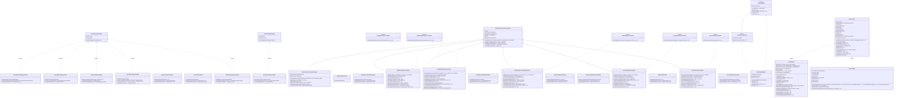

# core.quests

35 classes, 22 internal relationships shown.

```mermaid
classDiagram
direction BT

class BooleanTriggerReturnData {
  + BooleanTriggerReturnData(boolean) 
   Boolean content
   boolean positive
}
class BreakBlockObjectiveTemplate {
  + BreakBlockObjectiveTemplate(int, int, Block, int, List~Integer~) 
  + createObjectiveInstance() IObjectiveInstance
  + onWorldLoad(IQuestInstance) void
  - cleanupListener(IQuestInstance) void
  - buildDialogueTree(Block) DialogueElement
  + onCancellation(IQuestInstance) void
  + getProgressText(IQuestInstance, Style) Component
  + startObjective(IQuestInstance) IObjectiveInstance?
  + createObjective(JsonObject) IQuestObjectiveTemplate
  + onBlockBreak(IObjectiveInstance, IQuestInstance, Player) void
}
class BuildBuildingObjectiveTemplate {
  + BuildBuildingObjectiveTemplate(int, BuildingEntry, int, int, boolean, int, List~Integer~) 
  + createObjective(JsonObject) IQuestObjectiveTemplate
  + getProgressText(IQuestInstance, Style) Component
  - cleanupListener(IQuestInstance) void
  + startObjective(IQuestInstance) IObjectiveInstance?
  + onBuildingUpgrade(IObjectiveInstance, IQuestInstance, int) void
  + onWorldLoad(IQuestInstance) void
  + createObjectiveInstance() IObjectiveInstance
  - checkInitialObjectiveProgress(IQuestInstance, IObjectiveInstance) void
  + onCancellation(IQuestInstance) void
  - advanceIfFinished(IQuestInstance) boolean
  - buildDialogueTree(BuildingEntry, int, int, boolean) DialogueElement
}
class CitizenQuestTriggerTemplate {
  + CitizenQuestTriggerTemplate(JsonObject) 
  + createStateTrigger(JsonObject) CitizenQuestTriggerTemplate
  + canTriggerQuest(IColony) ITriggerReturnData
}
class CitizenTriggerReturnData {
  + CitizenTriggerReturnData(ICitizenData) 
   boolean positive
   ICitizenData content
}
class DeliveryObjectiveTemplateTemplate {
  + DeliveryObjectiveTemplateTemplate(int, ItemStack, int, int, List~Integer~, String) 
  + hasItem(Player, IQuestInstance) boolean
  - buildDialogueTrees() void
  + getProgressText(IQuestInstance, Style) Component
  + tryDiscountItem(Player, IQuestInstance) boolean
  + createObjective(JsonObject) IQuestObjectiveTemplate
   DialogueElement readyDialogueTree
   DialogueElement dialogueTree
}
class DialogueObjectiveTemplateTemplate {
  + DialogueObjectiveTemplateTemplate(int, DialogueElement, List~Integer~) 
  - int target
  - List~Integer~ rewardUnlocks
  - DialogueElement dialogueTree
  + getProgressText(IQuestInstance, Style) Component
  + startObjective(IQuestInstance) IObjectiveInstance?
  + createObjective(JsonObject) IQuestObjectiveTemplate
  + parseRewards(JsonObject) List~Integer~
   List~Integer~ rewardUnlocks
   int target
   DialogueElement dialogueTree
}
class HappinessRewardTemplate {
  + HappinessRewardTemplate(int, int, int) 
  + createReward(JsonObject) IQuestRewardTemplate
  + applyReward(IColony, Player, IQuestInstance) void
}
class IBreakBlockObjectiveTemplate {
<<Interface>>
  + onBlockBreak(IObjectiveInstance, IQuestInstance, Player) void
}
class IBuildingUpgradeObjectiveTemplate {
<<Interface>>
  + onBuildingUpgrade(IObjectiveInstance, IQuestInstance, int) void
}
class ICitizenQuestSideEffect {
<<Interface>>
  + applyToCitizen(ICitizenData) void
   ICitizenData citizenData
}
class IKillEntityObjectiveTemplate {
<<Interface>>
  + onEntityKill(IObjectiveInstance, IQuestInstance, Player) void
}
class IPlaceBlockObjectiveTemplate {
<<Interface>>
  + onBlockPlace(IObjectiveInstance, IQuestInstance, Player) void
}
class IQuestSideEffect {
<<Interface>>
  + serializeNBT() CompoundTag
  + onStart() void
  + deserializeNBT(CompoundTag) void
  + onFinish() void
  + onCancel() void
   ResourceLocation ID
}
class IResearchObjectiveTemplate {
<<Interface>>
  + onResearchCompletion(IQuestInstance) void
}
class ItemRewardTemplate {
  + ItemRewardTemplate(ItemStack) 
  + applyReward(IColony, Player, IQuestInstance) void
  + createReward(JsonObject) IQuestRewardTemplate
}
class KillEntityObjectiveTemplateTemplate {
  + KillEntityObjectiveTemplateTemplate(int, int, EntityType~?~, int, List~Integer~) 
  + createObjectiveInstance() IObjectiveInstance?
  + startObjective(IQuestInstance) IObjectiveInstance?
  + onCancellation(IQuestInstance) void
  - buildDialogueTree(EntityType~?~) DialogueElement
  + getProgressText(IQuestInstance, Style) Component
  + onWorldLoad(IQuestInstance) void
  + createObjective(JsonObject) IQuestObjectiveTemplate
  + onEntityKill(IObjectiveInstance, IQuestInstance, Player) void
  - cleanupListener(IQuestInstance) void
}
class PlaceBlockObjectiveTemplate {
  + PlaceBlockObjectiveTemplate(int, int, Block, int, List~Integer~) 
  + createObjectiveInstance() IObjectiveInstance?
  + startObjective(IQuestInstance) IObjectiveInstance?
  + getProgressText(IQuestInstance, Style) Component
  + onBlockPlace(IObjectiveInstance, IQuestInstance, Player) void
  - cleanupListener(IQuestInstance) void
  + onWorldLoad(IQuestInstance) void
  - buildDialogueTree(Block) DialogueElement
  + createObjective(JsonObject) IQuestObjectiveTemplate
  + onCancellation(IQuestInstance) void
}
class QuestInstance {
  + QuestInstance(ResourceLocation, IColony, List~ITriggerReturnData~?~~) 
  + QuestInstance(IColony) 
  - IColony colony
  - IObjectiveInstance currentObjectiveInstance
  - int questGiver
  - UUID assignedPlayer
  + onStart(Player, IColony) void
  + advanceObjective(Player) void
  + getParticipant(int) IQuestParticipant
  + onWorldLoad() void
  + onDeletion() void
  + advanceObjective(Player, int) IObjectiveInstance
  + onCompletion() void
  + serializeNBT() CompoundTag
  + deserializeNBT(CompoundTag) void
  + isValid(IColony) boolean
   int questTarget
   int objectiveIndex
   UUID assignedPlayer
   IQuestGiver questGiver
   IColony colony
   int questGiverId
   ResourceLocation id
   IObjectiveInstance? currentObjectiveInstance
   List~Integer~ participants
}
class QuestManager {
  + QuestManager(IColony) 
  - Map~ResourceLocation, Integer~ finishedQuests
  - Map~ResourceLocation, IQuestInstance~ inProgressQuests
  - Map~ResourceLocation, IQuestInstance~ availableQuests
  + onWorldLoad() void
  + serialize(FriendlyByteBuf, boolean) void
  + onColonyTick() void
  + serializeNBT() CompoundTag
  + alterReputation(double) void
  + markDirty() void
  + isUnlocked(ResourceLocation) boolean
  + getAvailableOrInProgressQuest(ResourceLocation) IQuestInstance?
  + completeQuest(ResourceLocation) void
  + attemptAcceptQuest(ResourceLocation, Player) boolean
  + deserialize(FriendlyByteBuf) void
  + unlockQuest(ResourceLocation) void
  + deleteQuest(ResourceLocation) void
  + deserializeNBT(CompoundTag) void
  + injectAvailableQuest(IQuestInstance) void
   List~IQuestInstance~ availableQuests
   double reputation
   List~IQuestInstance~ inProgressQuests
   List~FinishedQuest~ finishedQuests
}
class QuestParsingConstants {
  + QuestParsingConstants() 
}
class QuestReputationRewardTemplate {
  + QuestReputationRewardTemplate(double) 
  + createReward(JsonObject) IQuestRewardTemplate
  + applyReward(IColony, Player, IQuestInstance) void
}
class QuestReputationTriggerTemplate {
  + QuestReputationTriggerTemplate(double) 
  + createQuestReputationTrigger(JsonObject) QuestReputationTriggerTemplate
  + canTriggerQuest(IColony) ITriggerReturnData
}
class QuestTemplate {
  + QuestTemplate(ResourceLocation, Component, List~ResourceLocation~, int, Function~IColony, List~ITriggerReturnData~?~~~, List~IQuestObjectiveTemplate~, int, List~IQuestRewardTemplate~) 
  - List~ResourceLocation~ parents
  - Component name
  - int maxOccurrence
  - int questTimeout
  + attemptStart(IColony) IQuestInstance
  + getObjective(int) IQuestObjectiveTemplate
  + unlockQuestRewards(IColony, Player, IQuestInstance, List~Integer~) void
   int questTimeout
   List~ResourceLocation~ parents
   int maxOccurrence
   int objectiveCount
   Component name
}
class RaidAdjustmentRewardTemplate {
  + RaidAdjustmentRewardTemplate(int) 
  + createReward(JsonObject) IQuestRewardTemplate
  + applyReward(IColony, Player, IQuestInstance) void
}
class RandomQuestTriggerTemplate {
  + RandomQuestTriggerTemplate(int) 
  + createStateTrigger(JsonObject) RandomQuestTriggerTemplate
  + canTriggerQuest(IColony) ITriggerReturnData
}
class RelationshipRewardTemplate {
  + RelationshipRewardTemplate(int, int, String) 
  + createReward(JsonObject) IQuestRewardTemplate
  + applyReward(IColony, Player, IQuestInstance) void
}
class ResearchCompleteRewardTemplate {
  + ResearchCompleteRewardTemplate(ResourceLocation) 
  + createReward(JsonObject) IQuestRewardTemplate
  + applyReward(IColony, Player, IQuestInstance) void
}
class ResearchObjectiveTemplate {
  + ResearchObjectiveTemplate(int, ResourceLocation, int, List~Integer~) 
  + createObjective(JsonObject) IQuestObjectiveTemplate
  + startObjective(IQuestInstance) IObjectiveInstance?
  + getProgressText(IQuestInstance, Style) Component
  + onWorldLoad(IQuestInstance) void
  - advanceIfFinished(IQuestInstance) boolean
  + onResearchCompletion(IQuestInstance) void
  - cleanupListener(IQuestInstance) void
  - buildDialogueTree(ResourceLocation) DialogueElement
  + onCancellation(IQuestInstance) void
}
class SkillRewardTemplate {
  + SkillRewardTemplate(Skill, int, int) 
  + applyReward(IColony, Player, IQuestInstance) void
  + createReward(JsonObject) IQuestRewardTemplate
}
class StateQuestTriggerTemplate {
  + StateQuestTriggerTemplate(String[], JsonElement, int) 
  + canTriggerQuest(IColony) ITriggerReturnData
  + createStateTrigger(JsonObject) StateQuestTriggerTemplate
}
class UnlockQuestRewardTemplate {
  + UnlockQuestRewardTemplate(ResourceLocation) 
  + createReward(JsonObject) IQuestRewardTemplate
  + applyReward(IColony, Player, IQuestInstance) void
}
class UnlockQuestTriggerTemplate {
  + UnlockQuestTriggerTemplate() 
  + createUnlockTrigger(JsonObject) UnlockQuestTriggerTemplate
  + canTriggerQuest(ResourceLocation, IColony) ITriggerReturnData
  + canTriggerQuest(IColony) ITriggerReturnData
}
class WorkerIdleSideEffect {
  + WorkerIdleSideEffect(IQuestInstance) 
  - ICitizenData citizenData
  + onStart() void
  + onFinish() void
  + applyToCitizen(ICitizenData) void
  + onCancel() void
   ICitizenData citizenData
   ResourceLocation ID
}
class WorldDifficultyTriggerTemplate {
  + WorldDifficultyTriggerTemplate(Difficulty) 
  + createDifficultyTrigger(JsonObject) WorldDifficultyTriggerTemplate
  + canTriggerQuest(IColony) ITriggerReturnData
}

BreakBlockObjectiveTemplate  -->  DialogueObjectiveTemplateTemplate 
BreakBlockObjectiveTemplate  ..>  IBreakBlockObjectiveTemplate 
BuildBuildingObjectiveTemplate  -->  DialogueObjectiveTemplateTemplate 
BuildBuildingObjectiveTemplate  ..>  IBuildingUpgradeObjectiveTemplate 
CitizenQuestTriggerTemplate  ..>  CitizenTriggerReturnData : «create»
DeliveryObjectiveTemplateTemplate  -->  DialogueObjectiveTemplateTemplate 
ICitizenQuestSideEffect  -->  IQuestSideEffect 
KillEntityObjectiveTemplateTemplate  -->  DialogueObjectiveTemplateTemplate 
KillEntityObjectiveTemplateTemplate  ..>  IKillEntityObjectiveTemplate 
PlaceBlockObjectiveTemplate  -->  DialogueObjectiveTemplateTemplate 
PlaceBlockObjectiveTemplate  ..>  IPlaceBlockObjectiveTemplate 
QuestManager  ..>  QuestInstance : «create»
QuestReputationTriggerTemplate  ..>  BooleanTriggerReturnData : «create»
QuestTemplate  ..>  QuestInstance : «create»
RandomQuestTriggerTemplate  ..>  BooleanTriggerReturnData : «create»
ResearchObjectiveTemplate  -->  DialogueObjectiveTemplateTemplate 
ResearchObjectiveTemplate  ..>  IResearchObjectiveTemplate 
StateQuestTriggerTemplate  ..>  BooleanTriggerReturnData : «create»
UnlockQuestTriggerTemplate  ..>  BooleanTriggerReturnData : «create»
WorkerIdleSideEffect  ..>  ICitizenQuestSideEffect 
WorkerIdleSideEffect  ..>  IQuestSideEffect 
WorldDifficultyTriggerTemplate  ..>  BooleanTriggerReturnData : «create»
```
