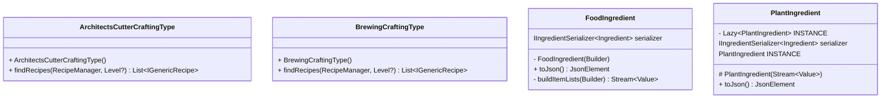

# core.recipes

4 classes, 0 internal relationships shown.

```mermaid
classDiagram
direction BT

class ArchitectsCutterCraftingType {
  + ArchitectsCutterCraftingType() 
  + findRecipes(RecipeManager, Level?) List~IGenericRecipe~
}
class BrewingCraftingType {
  + BrewingCraftingType() 
  + findRecipes(RecipeManager, Level?) List~IGenericRecipe~
}
class FoodIngredient {
  - FoodIngredient(Builder) 
  + toJson() JsonElement
  - buildItemLists(Builder) Stream~Value~
   IIngredientSerializer~Ingredient~ serializer
}
class PlantIngredient {
  # PlantIngredient(Stream~Value~) 
  - Lazy~PlantIngredient~ INSTANCE
  + toJson() JsonElement
   IIngredientSerializer~Ingredient~ serializer
   PlantIngredient INSTANCE
}
```
