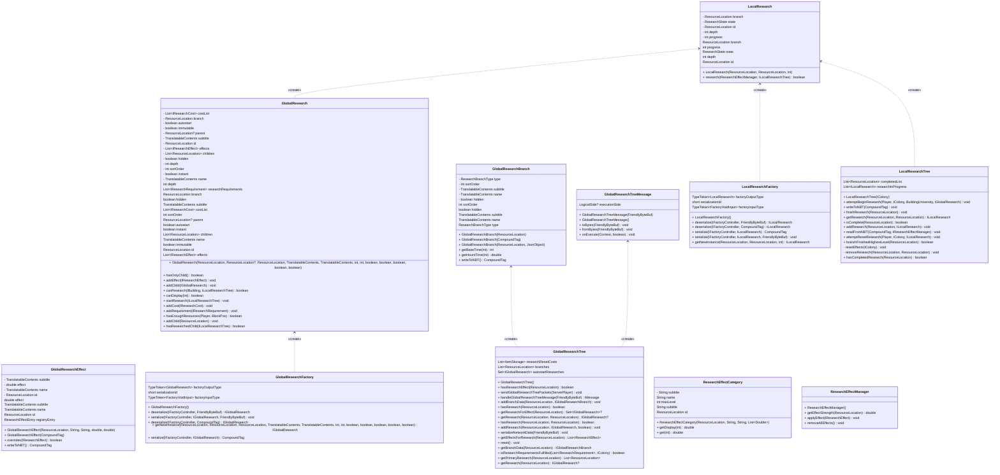

# core.research

11 classes, 6 internal relationships shown.

```mermaid
classDiagram
direction BT

class GlobalResearch {
  + GlobalResearch(ResourceLocation, ResourceLocation?, ResourceLocation, TranslatableContents, TranslatableContents, int, int, boolean, boolean, boolean, boolean, boolean) 
  - List~IResearchCost~ costList
  - ResourceLocation branch
  - boolean autostart
  - boolean immutable
  - ResourceLocation? parent
  - TranslatableContents subtitle
  - ResourceLocation id
  - List~IResearchEffect~ effects
  - List~ResourceLocation~ children
  - boolean hidden
  - int depth
  - int sortOrder
  - boolean instant
  - TranslatableContents name
  + hasOnlyChild() boolean
  + addEffect(IResearchEffect) void
  + addChild(IGlobalResearch) void
  + canResearch(IBuilding, ILocalResearchTree) boolean
  + canDisplay(int) boolean
  + startResearch(ILocalResearchTree) void
  + addCost(IResearchCost) void
  + addRequirement(IResearchRequirement) void
  + hasEnoughResources(Player, BlockPos) boolean
  + addChild(ResourceLocation) void
  + hasResearchedChild(ILocalResearchTree) boolean
   int depth
   List~IResearchRequirement~ researchRequirements
   ResourceLocation branch
   boolean hidden
   TranslatableContents subtitle
   List~IResearchCost~ costList
   int sortOrder
   ResourceLocation? parent
   boolean autostart
   boolean instant
   List~ResourceLocation~ children
   TranslatableContents name
   boolean immutable
   ResourceLocation id
   List~IResearchEffect~ effects
}
class GlobalResearchBranch {
  + GlobalResearchBranch(ResourceLocation) 
  + GlobalResearchBranch(CompoundTag) 
  + GlobalResearchBranch(ResourceLocation, JsonObject) 
  - ResearchBranchType type
  - int sortOrder
  - TranslatableContents subtitle
  - TranslatableContents name
  - boolean hidden
  + getBaseTime(int) int
  + getHoursTime(int) double
  + writeToNBT() CompoundTag
   int sortOrder
   boolean hidden
   TranslatableContents subtitle
   TranslatableContents name
   ResearchBranchType type
}
class GlobalResearchEffect {
  + GlobalResearchEffect(ResourceLocation, String, String, double, double) 
  + GlobalResearchEffect(CompoundTag) 
  - TranslatableContents subtitle
  - double effect
  - TranslatableContents name
  - ResourceLocation id
  + overrides(IResearchEffect) boolean
  + writeToNBT() CompoundTag
   double effect
   TranslatableContents subtitle
   TranslatableContents name
   ResourceLocation id
   ResearchEffectEntry registryEntry
}
class GlobalResearchFactory {
  + GlobalResearchFactory() 
  + deserialize(IFactoryController, FriendlyByteBuf) IGlobalResearch
  + serialize(IFactoryController, IGlobalResearch, FriendlyByteBuf) void
  + deserialize(IFactoryController, CompoundTag) IGlobalResearch
  + getNewInstance(ResourceLocation, ResourceLocation, ResourceLocation, TranslatableContents, TranslatableContents, int, int, boolean, boolean, boolean, boolean, boolean) IGlobalResearch
  + serialize(IFactoryController, IGlobalResearch) CompoundTag
   TypeToken~GlobalResearch~ factoryOutputType
   short serializationId
   TypeToken~FactoryVoidInput~ factoryInputType
}
class GlobalResearchTree {
  + GlobalResearchTree() 
  + hasResearchEffect(ResourceLocation) boolean
  + sendGlobalResearchTreePackets(ServerPlayer) void
  + handleGlobalResearchTreeMessage(FriendlyByteBuf) IMessage
  + addBranchData(ResourceLocation, IGlobalResearchBranch) void
  + hasResearch(ResourceLocation) boolean
  + getResearchForEffect(ResourceLocation) Set~IGlobalResearch~?
  + getResearch(ResourceLocation, ResourceLocation) IGlobalResearch?
  + hasResearch(ResourceLocation, ResourceLocation) boolean
  + addResearch(ResourceLocation, IGlobalResearch, boolean) void
  + serializeNetworkData(FriendlyByteBuf) void
  + getEffectsForResearch(ResourceLocation) List~IResearchEffect~
  + reset() void
  + getBranchData(ResourceLocation) IGlobalResearchBranch
  + isResearchRequirementsFulfilled(List~IResearchRequirement~, IColony) boolean
  + getPrimaryResearch(ResourceLocation) List~ResourceLocation~
  + getResearch(ResourceLocation) IGlobalResearch?
   List~ItemStorage~ researchResetCosts
   List~ResourceLocation~ branches
   Set~IGlobalResearch~ autostartResearches
}
class GlobalResearchTreeMessage {
  + GlobalResearchTreeMessage(FriendlyByteBuf) 
  + GlobalResearchTreeMessage() 
  + toBytes(FriendlyByteBuf) void
  + fromBytes(FriendlyByteBuf) void
  + onExecute(Context, boolean) void
   LogicalSide? executionSide
}
class LocalResearch {
  + LocalResearch(ResourceLocation, ResourceLocation, int) 
  - ResourceLocation branch
  - ResearchState state
  - ResourceLocation id
  - int depth
  - int progress
  + research(IResearchEffectManager, ILocalResearchTree) boolean
   ResourceLocation branch
   int progress
   ResearchState state
   int depth
   ResourceLocation id
}
class LocalResearchFactory {
  + LocalResearchFactory() 
  + deserialize(IFactoryController, FriendlyByteBuf) ILocalResearch
  + deserialize(IFactoryController, CompoundTag) ILocalResearch
  + serialize(IFactoryController, ILocalResearch) CompoundTag
  + serialize(IFactoryController, ILocalResearch, FriendlyByteBuf) void
  + getNewInstance(ResourceLocation, ResourceLocation, int) ILocalResearch
   TypeToken~LocalResearch~ factoryOutputType
   short serializationId
   TypeToken~FactoryVoidInput~ factoryInputType
}
class LocalResearchTree {
  + LocalResearchTree(IColony) 
  + attemptBeginResearch(Player, IColony, BuildingUniversity, IGlobalResearch) void
  + writeToNBT(CompoundTag) void
  + finishResearch(ResourceLocation) void
  + getResearch(ResourceLocation, ResourceLocation) ILocalResearch
  + isComplete(ResourceLocation) boolean
  + addResearch(ResourceLocation, ILocalResearch) void
  + readFromNBT(CompoundTag, IResearchEffectManager) void
  + attemptResetResearch(Player, IColony, ILocalResearch) void
  + branchFinishedHighestLevel(ResourceLocation) boolean
  - resetEffects(IColony) void
  - removeResearch(ResourceLocation, ResourceLocation) void
  + hasCompletedResearch(ResourceLocation) boolean
   List~ResourceLocation~ completedList
   List~ILocalResearch~ researchInProgress
}
class ResearchEffectCategory {
  + ResearchEffectCategory(ResourceLocation, String, String, List~Double~) 
  - String subtitle
  + getDisplay(int) double
  + get(int) double
   String name
   int maxLevel
   String subtitle
   ResourceLocation id
}
class ResearchEffectManager {
  + ResearchEffectManager() 
  + getEffectStrength(ResourceLocation) double
  + applyEffect(IResearchEffect) void
  + removeAllEffects() void
}

GlobalResearch  ..>  LocalResearch : «create»
GlobalResearchFactory  ..>  GlobalResearch : «create»
GlobalResearchTree  ..>  GlobalResearchBranch : «create»
GlobalResearchTree  ..>  GlobalResearchTreeMessage : «create»
LocalResearchFactory  ..>  LocalResearch : «create»
LocalResearchTree  ..>  LocalResearch : «create»
```
