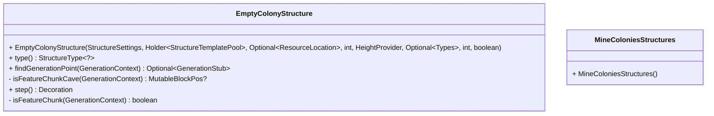

# core.structures

2 classes, 0 internal relationships shown.

```mermaid
classDiagram
direction BT

class EmptyColonyStructure {
  + EmptyColonyStructure(StructureSettings, Holder~StructureTemplatePool~, Optional~ResourceLocation~, int, HeightProvider, Optional~Types~, int, boolean) 
  + type() StructureType~?~
  + findGenerationPoint(GenerationContext) Optional~GenerationStub~
  - isFeatureChunkCave(GenerationContext) MutableBlockPos?
  + step() Decoration
  - isFeatureChunk(GenerationContext) boolean
}
class MineColoniesStructures {
  + MineColoniesStructures() 
}
```
