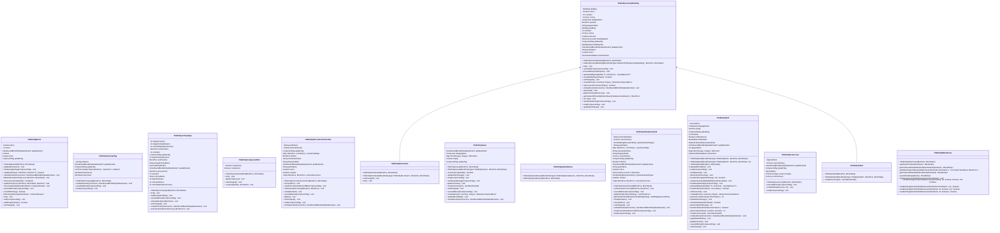

# core.tileentities

14 classes, 2 internal relationships shown.

```mermaid
classDiagram
direction BT

class TileEntityBarrel {
  + TileEntityBarrel(BlockPos, BlockState) 
  - boolean done
  - int items
  + updateBlock(Level) void
  + handleUpdateTag(CompoundTag) void
  + useBarrel(Player, ItemStack, Direction?) boolean
  + onDataPacket(Connection, ClientboundBlockEntityDataPacket) void
  - doBarrelCompostTick(Level, BlockPos, BlockState) void
  + retrieveCompost(double) ItemStack
  + updateTick(Level, BlockPos, BlockState, Random) void
  - consumeNeededItems(ItemStack, CompostRecipe) void
  + saveAdditional(CompoundTag) void
  + checkIfWorking() boolean
  - findCompostRecipe(ItemStack) CompostRecipe?
  + tick() void
  + load(CompoundTag) void
  + addItem(ItemStack) boolean
  + setChanged() void
   ClientboundBlockEntityDataPacket? updatePacket
   int items
   boolean done
   CompoundTag updateTag
}
class TileEntityColonyBuilding {
  + TileEntityColonyBuilding(BlockPos, BlockState) 
  + TileEntityColonyBuilding(BlockEntityType~AbstractTileEntityColonyBuilding~, BlockPos, BlockState) 
  - IBuilding building
  - boolean mirror
  - int colonyId
  - IColony colony
  + tick() void
  + saveAdditional(CompoundTag) void
  - processBlueprint(Blueprint) void
  + getCapability(Capability~T~, Direction?) LazyOptional~T~
  + isUsableByPlayer(Player) boolean
  + setChanged() void
  + createMenu(int, Inventory, Player) AbstractContainerMenu?
  + hasAccessPermission(Player) boolean
  + onDataPacket(Connection, ClientboundBlockEntityDataPacket) void
  + reactivate() void
  - updateColonyReferences() void
  + getPositionOfChestWithItemStack(Predicate~ItemStack~) BlockPos?
  + onLoad() void
  + handleUpdateTag(CompoundTag) void
  + load(CompoundTag) void
  + updateBlockState() void
   Component displayName
   BlockPos position
   String blueprintPath
   IBuilding building
   int colonyId
   IColony colony
   boolean mirrored
   ResourceLocation buildingName
   CompoundTag updateTag
   IBuildingView buildingView
   ClientboundBlockEntityDataPacket? updatePacket
   String packName
   boolean mirror
   StructurePackMeta structurePack
}
class TileEntityColonyFlag {
  + TileEntityColonyFlag(BlockPos, BlockState) 
  - ListTag patterns
  + onDataPacket(Connection, ClientboundBlockEntityDataPacket) void
  + saveAdditional(CompoundTag) void
  + load(CompoundTag) void
   ClientboundBlockEntityDataPacket? updatePacket
   CompoundTag updateTag
   List~Pair~Holder~BannerPattern~, DyeColor~~ patterns
   ItemStack itemServer
   ItemStack itemClient
}
class TileEntityColonySign {
  + TileEntityColonySign(BlockPos, BlockState) 
  - int targetColonyId
  - int targetColonyDistance
  - int cachedSignAboveColony
  - BlockPos nextPosition
  - int colonyId
  + tick() void
  + load(CompoundTag) void
  + saveAdditional(CompoundTag) void
  - calculateRotation(BlockPos) void
  + setChanged() void
  + onDataPacket(Connection, ClientboundBlockEntityDataPacket) void
  + setColonyAndAnchor(IColony, BlockPos?) void
   CompoundTag updateTag
   int targetColonyDistance
   BlockPos nextPosition
   String targetColonyName
   float relativeRotation
   ClientboundBlockEntityDataPacket? updatePacket
   BlockPos previousPos
   int colonyId
   String colonyName
   int targetColonyId
   int colonyDistance
   int cachedSignAboveColony
}
class TileEntityCompostedDirt {
  + TileEntityCompostedDirt(BlockPos, BlockState) 
  - boolean composted
  + tick() void
  - updateTick(Level) void
  + setChanged() void
  + compost(double, ItemStack) void
   boolean composted
}
class TileEntityDecorationController {
  + TileEntityDecorationController(BlockPos, BlockState) 
  - String packName
  - String schematicName
  + mirror(Mirror) void
  + readSchematicDataFromNBT(CompoundTag) void
  + setSchematicCorners(BlockPos, BlockPos) void
  + rotate(Rotation) void
  + saveAdditional(CompoundTag) void
  - update() void
  + setChanged() void
  + load(CompoundTag) void
  + onDataPacket(Connection, ClientboundBlockEntityDataPacket) void
   CompoundTag updateTag
   Map~BlockPos, List~String~~ positionedTags
   BlockPos tilePos
   String schematicName
   String blueprintPath
   ClientboundBlockEntityDataPacket? updatePacket
   String packName
   boolean mirror
   Rotation rotation
   Tuple~BlockPos, BlockPos~ schematicCorners
}
class TileEntityEnchanter {
  + TileEntityEnchanter(BlockPos, BlockState) 
  + TileEntityEnchanter(BlockEntityType~TileEntityEnchanter~, BlockPos, BlockState) 
  + setChanged() void
  + tick() void
}
class TileEntityGrave {
  + TileEntityGrave(BlockPos, BlockState) 
  + TileEntityGrave(BlockEntityType~TileEntityGrave~, BlockPos, BlockState) 
  + onColonyTick(double) boolean
  + updateItemStorage() void
  + load(CompoundTag) void
  + handleUpdateTag(CompoundTag) void
  - updateContent() void
  + createInventory(int) ItemStackHandler
  + setChanged() void
  + saveAdditional(CompoundTag) void
  + createMenu(int, Inventory, Player) AbstractContainerMenu?
  + updateBlockState() void
  + onDataPacket(Connection, ClientboundBlockEntityDataPacket) void
   ClientboundBlockEntityDataPacket? updatePacket
   Component displayName
   Map~ItemStorage, Integer~ allContent
   boolean empty
   CompoundTag updateTag
}
class TileEntityNamedGrave {
  + TileEntityNamedGrave(BlockEntityType~TileEntityNamedGrave~, BlockPos, BlockState) 
  + TileEntityNamedGrave(BlockPos, BlockState) 
}
class TileEntityPlantationField {
  + TileEntityPlantationField(BlockPos, BlockState) 
  - String schematicName
  - IColony currentColony
  - Set~BuildingExtensionEntry~ plantationFieldTypes
  - String packName
  + setSchematicCorners(BlockPos, BlockPos) void
  + saveAdditional(CompoundTag) void
  + getWorkingPositions(String) List~BlockPos~
  - getPlantationFieldEntryFromFieldTag(String) BuildingExtensionEntry
  + rotate(Rotation) void
  + mirror(Mirror) void
  + setChanged() void
  + onDataPacket(Connection, ClientboundBlockEntityDataPacket) void
  + readSchematicDataFromNBT(CompoundTag) void
  + load(CompoundTag) void
   Map~BlockPos, List~String~~ positionedTags
   String schematicName
   String blueprintPath
   IColony currentColony
   CompoundTag updateTag
   BlockPos tilePos
   ClientboundBlockEntityDataPacket? updatePacket
   String packName
   boolean mirror
   ResourceKey~Level~? dimension
   Set~BuildingExtensionEntry~ plantationFieldTypes
   Rotation rotation
   Tuple~BlockPos, BlockPos~ schematicCorners
}
class TileEntityRack {
  + TileEntityRack(BlockEntityType~TileEntityRack~, BlockPos, BlockState) 
  + TileEntityRack(BlockEntityType~TileEntityRack~, BlockPos, BlockState, int) 
  + TileEntityRack(BlockPos, BlockState) 
  - int freeSlots
  # updateBlockState() void
  + load(CompoundTag) void
  - invalidateCap() void
  - refreshTextureCache() void
  + hasItemStorage(ItemStorage, int) boolean
  + updateTextureDataWith(MaterialTextureData) void
  + handleUpdateTag(CompoundTag) void
  + getCapability(Capability~T~, Direction) LazyOptional~T~
  + hasItemStack(ItemStack, int, boolean) boolean
  + setRemoved() void
  + createMenu(int, Inventory, Player) AbstractContainerMenu?
  + getItemCount(Predicate~ItemStack~) int
  + updateItemStorage() void
  + hasSimilarStack(ItemStack) boolean
  + getCount(ItemStorage) int
  + hasItemStack(Predicate~ItemStack~) boolean
  + getCount(ItemStack, boolean, boolean) int
  + createInventory(int) ItemStackHandler
  + onDataPacket(Connection, ClientboundBlockEntityDataPacket) void
  + upgradeRackSize() void
  - updateContent() void
  + saveAdditional(CompoundTag) void
  + setChanged() void
   Component displayName
   boolean empty
   CompoundTag updateTag
   int freeSlots
   Boolean inWarehouse
   ModelData modelData
   MaterialTextureData textureData
   ClientboundBlockEntityDataPacket? updatePacket
   int upgradeSize
   Map~ItemStorage, Integer~ allContent
   AbstractTileEntityRack otherChest
}
class TileEntityScarecrow {
  + TileEntityScarecrow(BlockPos, BlockState) 
  - int[] fieldSize
  - IColony currentColony
  + saveAdditional(CompoundTag) void
  + setFieldSize(Direction, int) void
  + load(CompoundTag) void
   ClientboundBlockEntityDataPacket? updatePacket
   CompoundTag updateTag
   int[] fieldSize
   ScareCrowType scarecrowType
   IColony currentColony
}
class TileEntityStash {
  + TileEntityStash(BlockPos, BlockState) 
  + TileEntityStash(BlockEntityType~TileEntityStash~, BlockPos, BlockState) 
  + createInventory(int) ItemStackHandler
}
class TileEntityWareHouse {
  + TileEntityWareHouse(BlockPos, BlockState) 
  + getRackForStack(ItemStack) BlockEntity
  - getPositionOfChestWithSimilarItemStack(ItemStack) BlockEntity?
  + getMatchingItemStacksInWarehouse(Predicate~ItemStack~) List~Tuple~ItemStack, BlockPos~~
  - getPositionOfChestWithItemStack(ItemStack) BlockEntity?
  - searchMostEmptyRack() BlockEntity?
  + dumpInventoryIntoWareHouse(InventoryCitizen) void
  + hasMatchingItemStackInWarehouse(ItemStack, int, boolean, boolean, int) boolean
  + hasMatchingItemStackInWarehouse(Predicate~ItemStack~, int) boolean
  + hasMatchingItemStackInWarehouse(ItemStack, int, boolean, int) boolean
  + hasMatchingItemStackInWarehouse(ItemStack, int, boolean) boolean
}

TileEntityEnchanter  -->  TileEntityColonyBuilding 
TileEntityStash  -->  TileEntityColonyBuilding 
```
