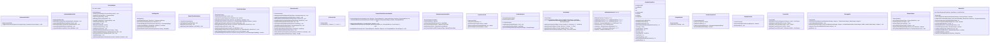

# core.util

22 classes, 0 internal relationships shown.

```mermaid
classDiagram
direction BT

class AdvancementUtils {
  + AdvancementUtils() 
  + TriggerAdvancementPlayersForColony(IColony, Consumer~ServerPlayer~) void
}
class AttributeModifierUtils {
  + AttributeModifierUtils() 
  + addModifier(LivingEntity, AttributeModifier, Attribute) void
  + removeHealthModifier(LivingEntity, String) void
  + addHealthModifier(LivingEntity, AttributeModifier) void
  + removeAllHealthModifiers(LivingEntity) void
  + removeModifier(LivingEntity, String, Attribute) void
}
class BackUpHelper {
  - BackUpHelper() 
  + markColonyDeleted(int, ResourceKey~Level~) void
  + loadNBTFromPath(File?) CompoundTag?
  + exportColony(IColony) String
  - getBackupSaveLocation(Date) File
  + saveNBTToPath(File?, CompoundTag) void
  + loadManagerBackup() void
  + saveColonies() void
  + backupColonyData() boolean
  + reclaimChunks(IColony) void
  + loadMissingColonies() void
  - getFolderForDimension(ResourceLocation) String
  - addFileToZipWithPath(String, ZipOutputStream, File) void
  - addToZipFile(String, ZipOutputStream, File) void
  + loadAllBackups() void
  + loadColonyBackup(int, ResourceKey~Level~, boolean, boolean) void
   File saveLocation
}
class BuildingUtils {
  - BuildingUtils() 
  + getAllowedJobs(Level, BlockPos) Predicate~JobEntry~
  + getRotationFromBlueprint(Level, BlockPos) int
  + commonBuildingFromPosition(Level, BlockPos) ICommonBuilding?
  + canAutoHire(IBuilding, HiringMode, JobEntry?) boolean
  + getRotationFromBlock(BlockState) int
  + getItemStackForHutFromInventory(Inventory, String) ItemStack
}
class ChunkClientDataHelper {
  + ChunkClientDataHelper() 
  + addCapData(ChunkCapData) void
  + applyLate(LevelChunk) void
  + applyCap(ChunkCapData, LevelChunk) void
}
class ChunkDataHelper {
  - ChunkDataHelper() 
  + loadChunk(LevelChunk, Level) void
  + canClaimChunksInRange(Level, BlockPos, int) boolean
  - buildingClaimInRange(IColony, boolean, int, BlockPos, boolean) void
  + tryClaim(Level, BlockPos, boolean, int, IChunkmanagerCapability, boolean) boolean
  + addStorageToChunk(LevelChunk, ChunkLoadStorage) void
  - buildingClaimBox(IColony, BlockPos, boolean, Tuple~BlockPos, BlockPos~) void
  + unloadChunk(LevelChunk, Level) void
  + claimColonyChunks(Level, boolean, int, BlockPos) void
  + claimBuildingChunks(IColony, boolean, BlockPos, int, Tuple~BlockPos, BlockPos~?) void
  + staticClaimInRange(int, boolean, BlockPos, int, Level, boolean) void
  + tryClaimBuilding(Level, BlockPos, boolean, IColony, BlockPos, IChunkmanagerCapability) boolean
}
class CitizenItemUtils {
  + CitizenItemUtils() 
  + damageItemInHand(AbstractEntityCitizen, InteractionHand, int) void
  + updateArmorDamage(AbstractEntityCitizen, double) void
  + hitBlockWithToolInHand(AbstractEntityCitizen, BlockPos?) void
  + breakBlockWithToolInHand(AbstractEntityCitizen, BlockPos?) void
  + setMainHeldItem(AbstractEntityCitizen, int) void
  + tryPickupItemEntity(AbstractEntityCitizen, ItemEntity) void
  + setHeldItem(AbstractEntityCitizen, InteractionHand, int) void
  + pickupItems(AbstractEntityCitizen) void
  + entityDropItem(AbstractEntityCitizen, ItemStack) ItemEntity
  + removeHeldItem(AbstractEntityCitizen) void
  + hitBlockWithToolInHand(AbstractEntityCitizen, BlockPos?, boolean) void
  + applyMending(AbstractEntityCitizen, double) double
}
class CollectorUtils {
  - CollectorUtils() 
  + toShuffledList() Collector~T, ?, List~T~~
}
class CreativeRaiderStructureHandler {
  + CreativeRaiderStructureHandler(Level, BlockPos, Future~Blueprint~, PlacementSettings, boolean, IColonyRaidEvent, int) 
  + CreativeRaiderStructureHandler(Level, BlockPos, Blueprint, PlacementSettings, boolean, IColonyRaidEvent, int) 
  + triggerSuccess(BlockPos, List~ItemStack~, boolean) void
  + loadAndPlaceStructure(Level, Blueprint, BlockPos, boolean, int, IColonyRaidEvent, ServerPlayer?) void
  + loadAndPlaceStructure(Level, Future~Blueprint~, BlockPos, boolean, int, IColonyRaidEvent, ServerPlayer?) void
}
class DomumOrnamentumUtils {
  - DomumOrnamentumUtils() 
  + isDoBlock(Block) boolean
  + getRequestedStack(IRequest~?~) ItemStack
  + getTextureData(ItemStack) MaterialTextureData
  + getBlock(ItemStack) IMateriallyTexturedBlock?
  + getTextureDataFromNBT(CompoundTag) MaterialTextureData
}
class ExperienceUtils {
  - ExperienceUtils() 
  + calculateLevel(double) int
  - getXPNeededForOnlyLevel(int) double
  + getPercentOfLevelCompleted(double, int) double
  + getXPNeededForNextLevel(int) double
}
class FurnaceRecipes {
  + FurnaceRecipes() 
  - FurnaceRecipes instance
  + loadRecipes(RecipeManager, Level) void
  + getSmeltingResult(ItemStack) ItemStack
  + getFirstSmeltingRecipeByResult(ItemStorage) RecipeStorage?
   FurnaceRecipes instance
}
class GsonHelper {
  + GsonHelper() 
  + getAsJsonArray(JsonObject, String, Supplier~JsonArray~) JsonArray
  + getAsResourceLocation(JsonObject, String, ResourceLocation) ResourceLocation
  + getAsJsonArray(JsonObject, String, Function~T, JsonArray~, T) JsonArray
  + getAsString(JsonObject, String, Function~T, String~, T) String
  + getAsString(JsonObject, String, Supplier~String~) String
  + getAsResourceLocation(JsonObject, String) ResourceLocation
}
class MultimapCollector~T, K, V~ {
  + MultimapCollector(Function~T, K~, Function~T, V~) 
  + toMultimap(Function~T, K~, Function~T, V~) MultimapCollector~T, K, V~
  + toMultimap(Function~T, K~) MultimapCollector~T, K, T~
  + finisher() Function~Multimap~K, V~, Multimap~K, V~~
  + characteristics() Set~Characteristics~
  + combiner() BinaryOperator~Multimap~K, V~~
  + accumulator() BiConsumer~Multimap~K, V~, T~
  + supplier() Supplier~Multimap~K, V~~
}
class MutableChunkPos {
  + MutableChunkPos(BlockPos) 
  + MutableChunkPos(long) 
  + MutableChunkPos(int, int) 
  + getChessboardDistance(MutableChunkPos) int
  + toString() String
  + equals(Object) boolean
  + getBlockX(int) int
  + toLong() long
  + toImmutable() ChunkPos
  + hashCode() int
  + from(ChunkPos) void
  + getChessboardDistance(ChunkPos) int
  + getBlockZ(int) int
   int regionLocalZ
   int minBlockZ
   int x
   int z
   int regionLocalX
   int regionZ
   int regionX
   int minBlockX
}
class RecipeHandler {
  - RecipeHandler() 
  + init(boolean, boolean) void
}
class SchemAnalyzerUtil {
  + SchemAnalyzerUtil() 
  + getScoreFor(Block) double
  + getBlockTier(Block) int
  + analyzeSchematic(Blueprint) SchematicAnalyzationResult
  - isExcludedBlock(BlockState) boolean
}
class SchemFixerUtil {
  + SchemFixerUtil() 
  - fixSchematicNameAndCorners(Blueprint) boolean
  + fixSchematics() void
}
class ServerUtils {
  - ServerUtils() 
  + getPlayersFromPermPlayer(List~Player~, Level) List~Player~
  + getPlayerFromUUID(UUID?, Level) Player?
  + getPlayerFromPermPlayer(Player, Level) Player?
  + getPlayerFromUUID(Level, UUID) Player?
  + getPlayersFromUUID(Level?, Collection~UUID~) List~Player~
}
class SortingUtils {
  - SortingUtils() 
  - calcRequiredSlots(Map~ExactMatchItemStorage, Integer~) Tuple~AtomicInteger, Map~Integer, Integer~~
  + sort(CombinedItemHandler) void
  - pushIntoInv(AtomicInteger, Entry~ExactMatchItemStorage, Integer~, CombinedItemHandler, AtomicInteger, double, double, Map~Integer, Integer~) void
  - compare(Entry~ExactMatchItemStorage, Integer~, Entry~ExactMatchItemStorage, Integer~) int
  - getId(Item) int
}
class TeleportHelper {
  - TeleportHelper() 
  + colonyTeleport(ServerPlayer, IColony, BlockPos) void
  + homeTeleport(ServerPlayer) void
  + surfaceTeleport(ServerPlayer) void
  + colonyTeleport(ServerPlayer, IColony) void
  + teleportCitizen(AbstractEntityCitizen, Level, BlockPos) boolean
  + colonyTeleportByID(ServerPlayer, int, ResourceKey~Level~) void
}
class WorkerUtil {
  - WorkerUtil() 
  + hasTooManyExternalItemsInInv(IRecipeStorage, InventoryCitizen) boolean
  + getBestToolForBlock(BlockState, float, AbstractBuilding, BlockGetter, BlockPos) EquipmentTypeEntry
  + getCorrectHarvestLevelForBlock(BlockState) int
  + isThereCompostedLand(BuildingFlorist, Level) boolean
  + getLastLadder(BlockPos, Level) int
  + faceBlock(BlockPos?, AbstractEntityCitizen) void
  + isPartOfRecipe(ItemStack, IRecipeStorage) boolean
  + updateLevelSign(Level, MinerLevel, int) void
  + setSpawnPoint(BlockPos?, AbstractEntityCitizen) boolean
  + isPathBlock(Block) boolean
  + findFirstLevelSign(Blueprint, BlockPos) BlockPos?
   List~Tuple~EquipmentTypeEntry, ItemStack~~ orInitTestTools
}
```
