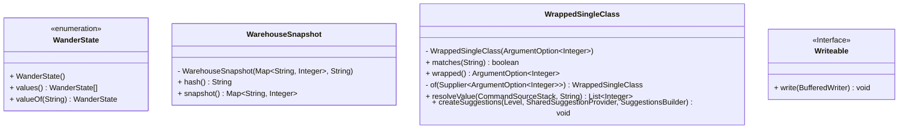

# external.dependencies (part 4)

4 classes, 0 internal relationships shown.

```mermaid
classDiagram
direction BT

class WanderState {
<<enumeration>>
  + WanderState() 
  + values() WanderState[]
  + valueOf(String) WanderState
}
class WarehouseSnapshot {
  - WarehouseSnapshot(Map~String, Integer~, String) 
  + hash() String
  + snapshot() Map~String, Integer~
}
class WrappedSingleClass {
  - WrappedSingleClass(ArgumentOption~Integer~) 
  + matches(String) boolean
  + wrapped() ArgumentOption~Integer~
  - of(Supplier~ArgumentOption~Integer~~) WrappedSingleClass
  + resolveValue(CommandSourceStack, String) List~Integer~
  + createSuggestions(Level, SharedSuggestionProvider, SuggestionsBuilder) void
}
class Writeable {
<<Interface>>
  + write(BufferedWriter) void
}
```
